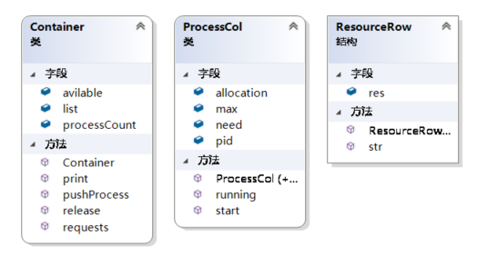
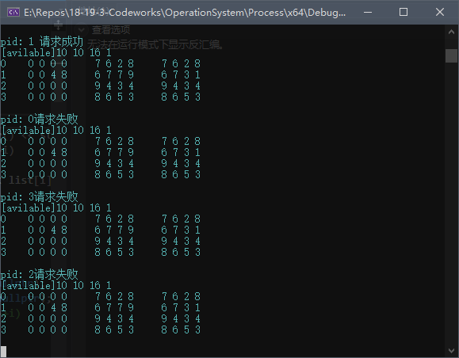

>  Ps:就是拿自己写的报告

一、基本信息

| 实验题目         | 完成人姓名 | 学号 | 报告日期  |
| ---------------- | ---------- | ---- | --------- |
| 银行家算法的实现 | Hanyuu     | None | 2019/0525 |

## 二、实验目的

通过实验，加深对多实例资源分配系统中死锁避免方法——银行家算法的理解，掌握 Windows 环境下银行家算法的实现方法，同时巩固利用 Windows API进行共享数据互斥访问和多线程编程的方法。

## 三、实验内容

1. 在 Windows 操作系统上，利用 Win32 API 编写多线程应用程序实现银行家算法。
2. 创建 n 个线程来申请或释放资源，只有保证系统安全，才会批准资源申请。
3. 通过 Win32 API 提供的信号量机制，实现共享数据的并发访问

## 四、实验步骤，主要数据结构和说明

### 设计思路

#### 设计




 系统的各种资源类型被收纳在ResourceRow中，每个程序都有自己的allocation，max，need的resourceRow对象以表示其对应资源的数量。Container为每个注册的进程分配一个全局唯一的pid。启动进程通过调用start函数调起running工作线程。Container保持对资源的调配，所有线程需要资源都要向container发起请求，使用完毕后要向container声明释放资源。

### 流程图

``` sequence
Process->Container:Register process
note left of Process:Initialize the container
Process->Container:Register max,allocated
Note left of Process:Request some resources
Process->Container:Request some resources
Container->ResourceCols:Check if the resource remained\n is enough to support all process
ResourceCols->Container:Return the results
Container->ResourceCols:Modify the resource list
Container->Process:Return the results of \nthe request(Permit/Forbid)
Note left of Process:Relsase some resources
Process->Container:Testify the release of the resource
Container->ResourceCols:Modify the resource list
```

五、程序运行的结果




### 六、实验体会

构建一个相对完整的运行体系比纯粹实现一个单独的功能相对要复杂不少。但是拥有良好的可扩展性和易于修改的特性。

## 七、源代码

ProcessRow.h

``` c++
#pragma once
#include<string>
#include<sstream>

const unsigned ROW_COUNT = 4;
const unsigned MAX_PROCESS = 512;

struct ResourceRow
{
public:
	unsigned res[ROW_COUNT];
	ResourceRow()
	{
		for (unsigned i = 0; i < ROW_COUNT; ++i)
		{
			res[i] = 0;
		}
	}
	ResourceRow(unsigned* input)
	{
		for (int i = 0; i < ROW_COUNT; ++i)
		{
			res[i] = input[i];
		}
	}
	std::string str()
	{
		std::stringstream res;
		for (unsigned i = 0; i < ROW_COUNT; ++i)
		{
			res << this->res[i] << " ";
		}
		return res.str();
	}
};
bool operator>=(const ResourceRow& a, const ResourceRow& b);
```

ProcessRow.cpp

``` c++
#include"resourceRow.h"
bool operator>=(const ResourceRow& a, const ResourceRow& b)
{
	for (int i = 0; i < ROW_COUNT; ++i)
	{
		if (a.res[i] < b.res[i])
			return false;
	}
	return true;
}
```

ProcessCol.h

``` c++
#pragma once
#include <process.h>
#include <Windows.h>
#include"resourceRow.h"
//#include "Container.h"
//#include "banker.h"


//extern const unsigned ROW_COUNT = 4;
//extern const unsigned MAX_PROCESS = 512;
//extern HANDLE mutex;
//extern HANDLE Rmutex;
//extern class Container;
//extern Container* container;

class ProcessCol
{
public:
	unsigned pid;
	ResourceRow allocation;
	ResourceRow max;
	ResourceRow need;
	static DWORD WINAPI running(LPVOID lpThreadParemeter);
	HANDLE start();
	ProcessCol(unsigned pid);
	ProcessCol();
};
```

ProcessCol.cpp

``` c++
#pragma once
#include <process.h>
#include <Windows.h>
#include"resourceRow.h"
//#include "Container.h"
//#include "banker.h"


//extern const unsigned ROW_COUNT = 4;
//extern const unsigned MAX_PROCESS = 512;
//extern HANDLE mutex;
//extern HANDLE Rmutex;
//extern class Container;
//extern Container* container;

class ProcessCol
{
public:
	unsigned pid;
	ResourceRow allocation;
	ResourceRow max;
	ResourceRow need;
	static DWORD WINAPI running(LPVOID lpThreadParemeter);
	HANDLE start();
	ProcessCol(unsigned pid);
	ProcessCol();
};
#pragma once
#include <process.h>
#include <Windows.h>
#include"resourceRow.h"
//#include "Container.h"
//#include "banker.h"


//extern const unsigned ROW_COUNT = 4;
//extern const unsigned MAX_PROCESS = 512;
//extern HANDLE mutex;
//extern HANDLE Rmutex;
//extern class Container;
//extern Container* container;

class ProcessCol
{
public:
	unsigned pid;
	ResourceRow allocation;
	ResourceRow max;
	ResourceRow need;
	static DWORD WINAPI running(LPVOID lpThreadParemeter);
	HANDLE start();
	ProcessCol(unsigned pid);
	ProcessCol();
};
#pragma once
#include <process.h>
#include <Windows.h>
#include"resourceRow.h"
//#include "Container.h"
//#include "banker.h"


//extern const unsigned ROW_COUNT = 4;
//extern const unsigned MAX_PROCESS = 512;
//extern HANDLE mutex;
//extern HANDLE Rmutex;
//extern class Container;
//extern Container* container;

class ProcessCol
{
public:
	unsigned pid;
	ResourceRow allocation;
	ResourceRow max;
	ResourceRow need;
	static DWORD WINAPI running(LPVOID lpThreadParemeter);
	HANDLE start();
	ProcessCol(unsigned pid);
	ProcessCol();
};
#pragma once
#include <process.h>
#include <Windows.h>
#include"resourceRow.h"
//#include "Container.h"
//#include "banker.h"


//extern const unsigned ROW_COUNT = 4;
//extern const unsigned MAX_PROCESS = 512;
//extern HANDLE mutex;
//extern HANDLE Rmutex;
//extern class Container;
//extern Container* container;

class ProcessCol
{
public:
	unsigned pid;
	ResourceRow allocation;
	ResourceRow max;
	ResourceRow need;
	static DWORD WINAPI running(LPVOID lpThreadParemeter);
	HANDLE start();
	ProcessCol(unsigned pid);
	ProcessCol();
};

```

Container.h

``` c++
#pragma once
#include"processCol.h"

class Container
{
public:
	ProcessCol list[MAX_PROCESS];
	unsigned processCount;
	ResourceRow avilable;

	void print();
	Container();
	bool pushProcess(ProcessCol* process);
	void release(unsigned pid);
	void requests(unsigned pid, ResourceRow request);
};
```

Container.cpp

``` c++
#pragma once
#include<iostream>
#include"Container.h"

Container* container;
extern HANDLE mutex;
extern HANDLE Rmutex;
void Container::print()
{
	std::cout << "[avilable]" << avilable.str() << std::endl;
	for (unsigned i = 0; i < processCount; ++i)
	{
		std::cout << list[i].pid << "    " << list[i].allocation.str() << "    " << list[i].max.str() << "    " << list[i].need.str() << std::endl;
	}
	std::cout << std::endl;
}
Container::Container()
{
	processCount = 0;
	mutex = CreateSemaphore(nullptr, 1, 1, nullptr);
	Rmutex = CreateSemaphore(nullptr, 1, 1, nullptr);
	//for (unsigned i = 0; i < MAX_PROCESS; ++i)
	//{
	//	list[i] = nullptr;
	//}
}
bool Container::pushProcess(ProcessCol* process)
{
	if (processCount >= MAX_PROCESS - 1)
	{
		return false;
	}
	process->pid = processCount;
	list[processCount] = *process;
	processCount += 1;
	return true;
}
void Container::release(unsigned pid)
{
	WaitForSingleObject(mutex, INFINITE);
	for (unsigned i = 0; i < ROW_COUNT; ++i)
	{
		avilable.res[i] += list[pid].allocation.res[i];
		list[pid].allocation.res[i] = 0;
		list[pid].need.res[i] = list[pid].max.res[i];
	}
	std::cout << "pid: " << pid << " 已释放" << std::endl;
	container->print();
	ReleaseSemaphore(mutex, 1, nullptr);
}
void Container::requests(unsigned pid, ResourceRow request)
{
	WaitForSingleObject(mutex, INFINITE);
	ResourceRow newAvilable;
	for (int i = 0; i < ROW_COUNT; ++i)
	{
		newAvilable.res[i] = avilable.res[i];
	}
	unsigned count = this->processCount;
	bool* flag = new bool[count];
	for (unsigned i = 0; i < count; ++i)
	{
		flag[i] = false;
	}
	while (count > 0)
	{
		bool key = false;
		for (unsigned i = 0; i < this->processCount; ++i)
		{
			if (flag[i] == false)
			{
				if (newAvilable.res >= list[i].need)
				{
					for (unsigned j = 0; j < ROW_COUNT; ++j)
					{
						newAvilable.res[i] += list[i].allocation.res[i];
					}
					flag[i] = true;
					key = true;
					count -= 1;
				}
			}
		}
		if (count == 0)
		{
			std::cout << "pid: " << pid << " 请求成功" << std::endl;
			for (unsigned i = 0; i < ROW_COUNT; ++i)
			{
				list[pid].allocation.res[i] += request.res[i];
				list[pid].need.res[i] -= request.res[i];
				avilable.res[i] -= request.res[i];
			}
			container->print();
			ReleaseSemaphore(mutex, 1, nullptr);
			return;
		}
		if (key == false)
		{
			std::cout << "pid: " << pid << "请求失败" << std::endl;
			container->print();
			ReleaseSemaphore(mutex, 1, nullptr);
			return;
		}
	}
	for (int i = 0; i < ROW_COUNT; ++i)
	{
		avilable.res[i] -= request.res[i];
		list[pid].allocation.res[i] += request.res[i];
		list[pid].need.res[i] = list[pid].max.res[i] - list[pid].allocation.res[i];
	}
	//ReleaseSemaphore(mutex, 1, nullptr);
}

```

Banker.h

``` c++
#pragma once
#include <iostream>
#include <Windows.h>
#include <process.h>
#include <iostream>
#include <stdlib.h>
#include <string>
#include <sstream>
#include <time.h>
#include"Container.h"
#include"processCol.h"

```

Banker.cpp

``` c++
#include"banker.h"
extern Container* container;

int main()
{
	srand((int)time(0));
	container = new Container();
	for (unsigned i = 0; i < 4; ++i)
		container->pushProcess(new ProcessCol());
	container->avilable.res[0] = 10;
	container->avilable.res[1] = 10;
	container->avilable.res[2] = 20;
	container->avilable.res[3] = 9;
	HANDLE* hdl = new HANDLE[container->processCount];
	for (unsigned i = 0; i < container->processCount; ++i)
	{
		hdl[i] = container->list[i].start();
	}
	for (unsigned i = 0; i < container->processCount; ++i)
	{
		WaitForSingleObject(hdl[i],INFINITE);
	}
	Sleep(40000);
}
```


