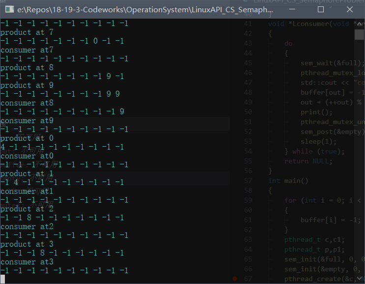

> Ps:就是拿自己写的报告

### 一、实验目的

通过实验，掌握Windows 和 Linux 环境下互斥锁和信号量的实现方法，加 深对临界区问题和进程同步机制的理解，同时熟悉利用Windows API 和 Pthread API 进行多线程编程的方法

### 二、实验内容

1.  在Windows 操作系统上，利用 Win32 API 提供的信号量机制，编写应用
    程序实现生产者——消费者问题。
2.  在 Linux 操作系统上，利用 Pthread API 提供的信号量机制，编写应用程
    序实现生产者——消费者问题。
3.  两种环境下，生产者和消费者均作为独立线程，并通过 empty、full、mutex 三个信号量实现对缓冲进行插入与删除。
4.  通过打印缓冲区中的内容至屏幕，来验证应用程序的正确性。

### 三、实验环境

*   windows 10 1903

*   Windows API

    *   Visual Studio 2019

*   Pthread API

    *   WIndows Subsystem for Linux

        *   Ubuntu 4.4.0-18362-Microsoft #1-Microsoft Mon Mar 18 12:02:00 PST 2019 x86_64 x86_64 x86_64 GNU/Linux
        *   g++ 7.4.0

        * GNU gdb 8.1.0.20180409-git
        * visual studio code 1.33.1

### 四、实验步骤

* 思路

  * Shared data

    * Semaphore
      * full	//指示缓冲区中已有内容数目，防止消费者尝试从空的缓冲区中读取内容
      * empty //指示缓冲区中可用内容数目，方式生产者尝试向已满的缓冲区中存放内容
      * mutex //访问锁，保证同一时刻至多只有一个用户在访问buffer
    * initially
      * full=0
      * empty = n
      * mutex = 1

  * Producer Process

    ``` c++
    do
    {
      // Produce an item in nextp
      wait(empty);
      wait(mutex);
      // add nextp to buffer
      signal(mutex);
      signal(full);
    }while(1);
    ```


  * Consumer Process

    ``` c++
    do
    {
      wait(full);
      wait(mutex);
      // remove nextp to buffer
      signal(mutex);
      signal(empty);
    }while(1);
    ```


### 五、主要数据结构及说明

* 信号量
  * full
    * 指示缓冲区中已有内容数目，防止消费者尝试从空的缓冲区中读取内容
  * empty
    * 指示缓冲区中可用内容数目，方式生产者尝试向已满的缓冲区中存放内容
  * mutex
    * 访问锁，保证同一时刻至多只有一个用户在访问buffer
* 缓冲区
  * 实现结构
    * 定长数组
  * 逻辑结构
    * 循环队列

### 六、程序运行的初值和运行结果

* Windows API

  * 初值

    

    

  * 运行结果

    

    

* Pthread API

  * 初值

  

  

  * 运行结果

    

    

### 七、实验体会

#### 问题和解决方法

* Q
  * g++编译失败，找不到Pthread链接
* A
  * 编译路径中不含Pthread,需添加-lpthread

#### 体会和收获

* g++ gdb多线程调试经验
* windows API调试Pthread调试经验

### 八、源代码

* source code

  * windows API

    ``` c++
    #include <iostream>
    #include <Windows.h>
    #include <process.h>
    #include <iostream>
    #include <stdlib.h>
    #include <time.h>

    constexpr unsigned BUFFER = 10;

    HANDLE empty;
    HANDLE full;
    HANDLE mutex;
    int in = 0, out = 0;
    int buffer[BUFFER];

    void print()
    {
    	for (int i = 0; i < BUFFER; ++i)
    	{
    		std::cout << buffer[i]<<' ';
    	}
    	std::cout << std::endl;
    }
    HANDLE WINAPI producer(LPVOID lpParameter)
    {
    	do
    	{
    		WaitForSingleObject(empty, INFINITE);
    		WaitForSingleObject(mutex, INFINITE);
    		buffer[in] = rand() % BUFFER;
    		in = (++in) % BUFFER;
    		std::cout << "product at " << in << std::endl;
    		print();
    		ReleaseSemaphore(mutex, 1, nullptr);
    		ReleaseSemaphore(full, 1, nullptr);
    		Sleep(200);
    	} while (true);
    	return 0L;
    }
    HANDLE WINAPI consumer(LPVOID lpParameter)
    {
    	do
    	{
    		WaitForSingleObject(full, INFINITE);
    		WaitForSingleObject(mutex, INFINITE);
    		buffer[out] = -1;
    		out = (out + 1) % BUFFER;
    		std::cout << "consume at " << out << std::endl;
    		print();
    		ReleaseSemaphore(mutex, 1, nullptr);
    		ReleaseSemaphore(empty, 1, nullptr);
    		Sleep(200);
    	} while (true);
    	return 0L;
    }

    int main()
    {
    	srand((unsigned)time);
    	for (int i = 0; i < BUFFER; ++i)
    	{
    		buffer[i] = -1;
    	}
    	DWORD	DW;
    	empty = CreateSemaphore(nullptr, BUFFER, BUFFER, nullptr);
    	full = CreateSemaphore(nullptr, 0, BUFFER, nullptr);
    	mutex = CreateSemaphore(nullptr, 1, 1, nullptr);
    	HANDLE p = CreateThread(nullptr, 0, (LPTHREAD_START_ROUTINE)producer, nullptr, 0L, nullptr);
    	HANDLE c = CreateThread(nullptr,0, (LPTHREAD_START_ROUTINE)consumer, nullptr, 0L, nullptr);
    	HANDLE p1 = CreateThread(nullptr, 0, (LPTHREAD_START_ROUTINE)producer, nullptr, 0L, nullptr);
    	HANDLE c1 = CreateThread(nullptr, 0, (LPTHREAD_START_ROUTINE)consumer, nullptr, 0L, nullptr);
    	WaitForSingleObject(p, INFINITE);
    	WaitForSingleObject(c, INFINITE);
    	WaitForSingleObject(p1, INFINITE);
    	WaitForSingleObject(c1, INFINITE);
    	return 0;
    }
    ```

  * Pthread API

    ``` c++
    #include <stdio.h>
    #include <pthread.h>
    #include <iostream>
    #include <stdlib.h>
    #include <unistd.h>
    #include <semaphore.h>
    #include <time.h>

    const int BUFFER = 10;

    sem_t empty, full;
    pthread_mutex_t mutex;
    int in = 0;
    int out = 0;
    int buffer[BUFFER];

    void print()
    {
    	for (int i = 0; i < BUFFER; ++i)
    	{
    		printf("%d ", buffer[i]);
    	}
    	printf("\n");
    }
    void *Lproducer(void *arg)
    {
    	do
    	{
    		sem_wait(&empty);
    		pthread_mutex_lock(&mutex);
    		std::cout << "product at " << in<<std::endl;
    		buffer[in] = rand() % BUFFER;
    		in = (++in) % BUFFER;
    		print();
    		pthread_mutex_unlock(&mutex);
    		sem_post(&full);
    		sleep(1);
    	} while (true);
    	return NULL;
    }
    void *Lconsumer(void *arg)
    {
    	do
    	{
    		sem_wait(&full);
    		pthread_mutex_lock(&mutex);
    		std::cout << "consumer at" << out<<std::endl;
    		buffer[out] = -1;
    		out = (++out) % BUFFER;
    		print();
    		pthread_mutex_unlock(&mutex);
    		sem_post(&empty);
    		sleep(1);
    	} while (true);
    	return NULL;
    }
    int main()
    {
    	for (int i = 0; i < BUFFER; ++i)
    	{
    		buffer[i] = -1;
    	}
    	pthread_t c,c1;
    	pthread_t p,p1;
    	sem_init(&full, 0, 0);
    	sem_init(&empty, 0, BUFFER);
    	pthread_create(&c, NULL, Lconsumer, NULL);
    	pthread_create(&c, NULL, Lconsumer, NULL);
    	pthread_create(&p, NULL, Lproducer, NULL);
    	pthread_create(&p, NULL, Lproducer, NULL);
    	pthread_join(c, NULL);
    	pthread_join(p, NULL);
    	pthread_join(c1, NULL);
    	pthread_join(p1, NULL);
    	return 0;
    }
    ```
