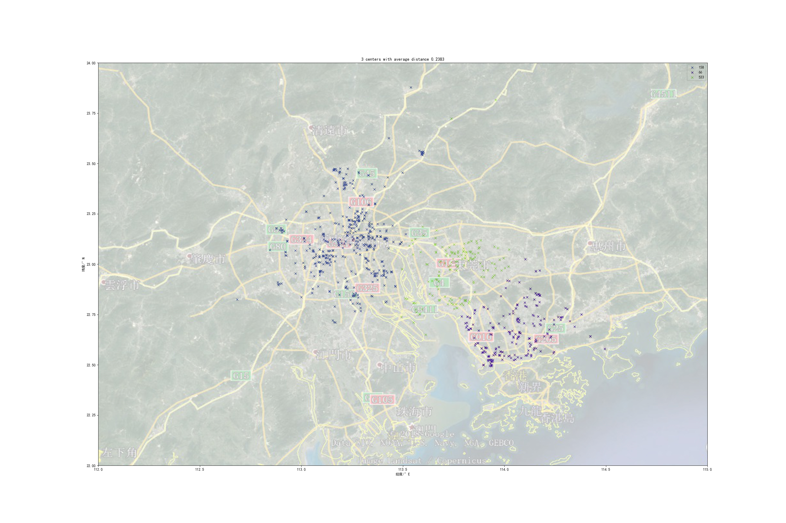

> 本文来自于笔者在肝数模过程中的亲身实践，如果仅仅是了解可以直接观看，如果想要复现可以戳[实践环境](https://github.com/HanyuuFurude/MCM-2019-College/tree/master/%E5%9B%BD%E8%B5%9B%E8%AE%AD%E7%BB%83/2019%E5%9F%B9%E8%AE%AD4/code)获得开发环境（处于安全考虑，在2019年国赛打完之前此链接的仓库为private，请谅解）

# 场景概述

笔者需要对一个excel数据表中的记录（含有经纬度信息），表格字段如下

| A        | B           | C           | D        | E            |
| -------- | ----------- | ----------- | -------- | ------------ |
| 任务号码 | 任务gps纬度 | 任务gps经度 | 任务标价 | 任务执行情况 |

我们现在需要将字段B和C中的经纬度提取为坐标并将这些坐标分类，在这里我们使用k-means方法来大致观察坐标并分类（手动实现没用轮子.jpg）
# 实验环境
* python 3(笔者使用python 3.6)

# 基本原理
## k-means
k-means的大致思路
* 在数据集中随机挑选x个数据作为中心点（x为聚类数量）；
* 每个数据挑选最近的中心点，围绕这个中心点的所有数据点成为一个聚类。（此处我们的距离使用欧氏距离）；
* 完成！
## 一些不尽如人意的地方和问题
* 数据集本身位置，事先未必能较为准确的预估聚类的个数（甚至大致范围也难以确定）；
* 由于挑选聚类是随机的，可能这些点选择的不尽人意。
* 如何评估随机生成的聚类中心的质量？

# 成果预览

> P.S. 此处展示了聚类为3的输出，地图是后期通过其他方式贴合上去的，至于贴合方法……有缘更新吧……




# 解决方案&实现

### 聚类逻辑代码
``` python
from math import sqrt
from random import randint, random

import matplotlib.pyplot as plt

from dataReader import dataReader


class Classifier:
    # 初始化、读入数据库、标定数据范围
    def __init__(self):
        # 原始数据
        self.rawData = dataReader()[0]
        # 下标下限
        self.LOWER_LIMIT = 0
        # 下标上限
        self.UPPER_LIMIT = len(self.rawData) - 1

    # 产生一组不重复的随机中心
    def generateRandomCenter(self, typeCount: int):
        # 随机中心（聚类）数
        self.typeCount = typeCount
        # 随机中心编号列表
        self.coreList = list()
        while len(self.coreList) < self.typeCount:
            key = randint(self.LOWER_LIMIT, self.UPPER_LIMIT)
            if key in self.coreList:
                continue
            self.coreList.append(key)
        # print('[center]%s' % str(self.coreList))

    # 聚类计算
    def calc(self):
        # 聚类列表
        self.classList = [list() for _ in range(self.typeCount)]
        for i in self.rawData:
            key = float('inf')
            ptr = -1
            for j in self.coreList:
                distance = dis(i, self.rawData[j])
                if key > distance:
                    ptr = self.coreList.index(j)
                    key = distance
            self.classList[ptr].append(i)
        # print('[info] calc finished 😂')

    # 绘制聚类图
    def draw(self):
        plt.rcParams['font.sans-serif'] = ['SimHei']
        plt.rcParams['axes.unicode_minus'] = False
        plt.figure(figsize=(30, 20), dpi=100)
        plt.xlim(112, 115)
        plt.ylim(22, 24)
        plt.xlabel('经度/°E')
        plt.ylabel('纬度/°N')
        plt.title(
            '%d centers with average distance %.4f'
            % (self.typeCount, self.totalAverage)
        )
        # print(str(self.coreList))
        handerList = list()
        for i in self.classList:
            col = (random(), random(), random())
            handerList.append(
                plt.plot([x[2] for x in i], [x[1] for x in i],
                     'x', color=col)
            )
        # plt.text(112.74, 23.8, str(self.coreList), ha='left', fontsize=8)
        plt.legend(self.coreList)
        plt.draw()
        # plt.show()
        # plt.text(4, 1, t, ha='left', rotation=15, wrap=True)
        plt.savefig('resPic\%s.jpg' % str(self.typeCount))

    # 计算得分（平均距离）
    def score(self):
        # 每个分组的平均距离
        self.averageList = list()
        try:
            for key in range((len(self.coreList))):
                self.averageList.append(
                    sum([dis(x, self.rawData[self.coreList[key]])
                         for x in self.classList[key]]) /
                    len(self.classList[key])
                )
        except Exception:
            Exception("bad center!")
        # print('[average]')
        self.totalAverage = 0
        # 加权平均
        for i in self.averageList:
            self.totalAverage +=  \
                i*len(self.classList[self.averageList.index(i)])
            # print('\t[group %d]\t%f' % (self.averageList.index(i), i))
        self.totalAverage /= len(self.rawData)
        # print('\t[total]\t\t%f' % self.totalAverage)
        return self.totalAverage

    # 单次运行
    def run(self):
        self.generateRandomCenter(10)
        self.calc()
        self.score()

    # 给定聚类数多次随机取表现较好值
    def des(self, typeCount: int):
        # 最优结果、得分暂存变量
        score = float('inf')
        resList = None
        # 连续conn次没有得到更优化的结果的次数
        conn = 0
        # 尝试次数计数器
        counter = 0
        while (conn < 100):
            counter += 1
            # print('[attempt %d with %d times better]' % (counter, conn))
            self.generateRandomCenter(typeCount)
            self.calc()
            try:
                tempScore = self.score()
            except Exception:
                print("[ERROR]\tbad center occured skip.")
                continue
            if tempScore < score:
                resList = self.coreList
                score = tempScore
                conn = 0
            else:
                conn += 1
        # 还原最佳聚类现场以便后续画图
        self.coreList = resList
        self.calc()
        print('[info]\tdes finish with best score %f' % score)
        print(resList)
        return resList


def dis(obj1: list, obj2: list):
    assert isinstance(obj1, list), \
        '[ERROR] 第一个参数应当为list,输入的参数类型为$s' % str(type(obj1))
    assert isinstance(obj2, list), \
        '[ERROR] 第二个参数应当为list,输入的参数类型为$s' % str(type(obj2))
    return sqrt((obj1[1] - obj2[1]) ** 2 + (obj1[2] - obj2[2]) ** 2)


if __name__ == '__main__':
    exp = Classifier()
    for i in range(3, 20):
        print('[center counter]\t%d' % i)
        exp.des(i)
        exp.draw()

```
### 数据处理和读入代码
``` python
import xlrd
import sys
# import datetime


def dataConverter(src: list)->list:
    res = list()
    res.append(src[0])
    for i in range(1, 4):
        res.append(src[i])
    res.append(int(src[4]))
    return res


def dataReader():
    fileName = None
    try:
        fileName = sys.argv[-1]
        print('[fileName]%s' % fileName)
    except Exception:
        print('no file name')
    data = list()
    try:
        workbook = xlrd.open_workbook(filename=fileName)
        for i in range(workbook.nsheets):
            data.append(list())
            rangeRow = workbook.sheet_by_index(i).nrows
            sheet = workbook.sheet_by_index(i)
            for x in range(rangeRow):
                temp = sheet.row_values(x)
                if temp[0] == '任务号码':
                    continue
                data[i].append(dataConverter(temp))
    except Exception as e:
        print('bad data file')
        print('\t[Exception]\t%s' % str(e))
        exit()
    # for i in data:
    #     for x in i:
    #         print(x)
    print('😀[info]\tdata fetched successfully')
    return data


if __name__ == '__main__':
    data = dataReader()
    for sheet in data:
        for x in sheet:
            print(x)
```