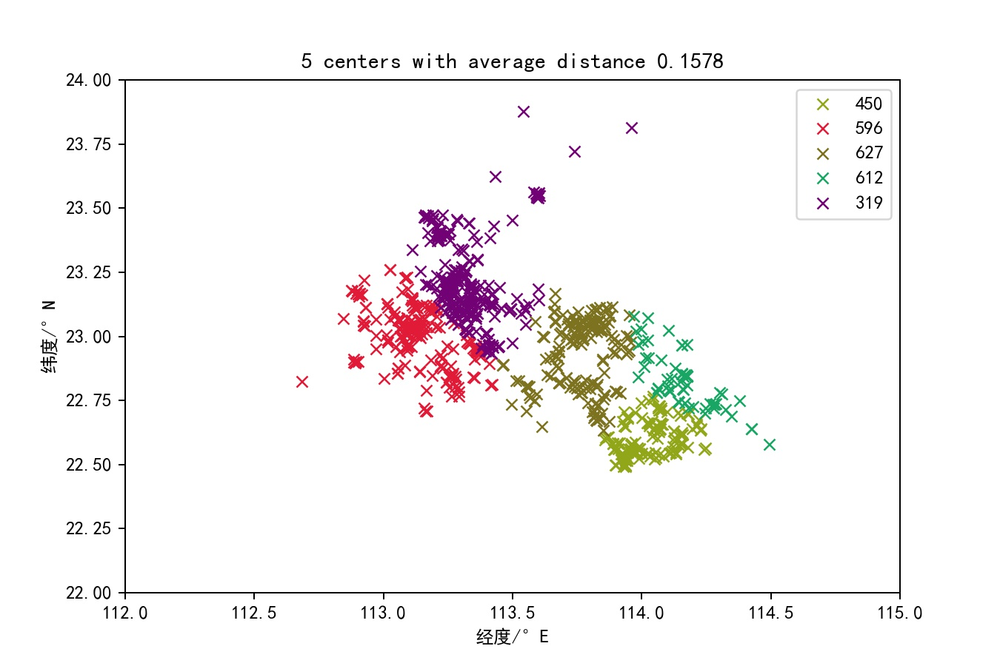
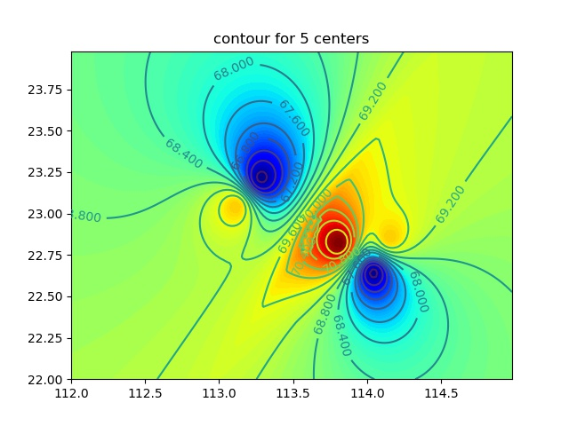
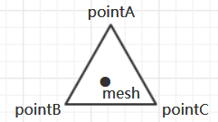

---

title: 非标准数据简单网格化的一种方法
date: 2019-07-22 00:00:00
tags: 
	- mesh
	- matplotlib
	- python
---
# 场景概述

有些时候为了让坐标数据可视化，当我们有需要绘制等高线图之类的场景时，我们需要根据现有的分布不规则的数据点映射到网格点上，比如我们有如下坐标点，每个坐标点都有自己的价格属性，我们需要画一张价格位于地理位置的分布图。此处的不同颜色点是因为做了k-means聚类分析，与本话题无关暂且不表，之前有讨论如何做简单的k-means聚类分析。根据聚类的价格分布，我们最终得到一张地形图如下，具体操作方法见下文。



# 一般方法

此处使用的方法借鉴了地理方向GIS系统绘制等高线地形图的一种较为简单的实现的方案。在若干坐标点中，必定能找到包裹每个网格点的最小三角形（mesh）是待赋值的网格点，pointA，B，C是既有不规则坐标点。对坐标点mesh的高度（价格）赋值我们可以从A，B，C三点中赋值，此处为了简化计算，我的赋值策略是按mesh点到各个point的距离倒数的加权赋值

$$Height_{mesh} = \rho_A\times Height_A+ \rho_B\times Height_B+ \rho_C\times Height_C$$

$$\rho_A = \frac{1}{distance(mesh,A)\times K}$$

$\rho_B,\rho_C$同理

$$K=\frac{1}{distance(mesh,A)}+\frac{1}{distance(mesh,B)}+\frac{1}{distance(mesh,C)}$$

# 具体实现

相关实现如下，（非相关其他文件未给出）

``` python
# countour.py
# 等高线绘制
from core import const
import os
import re
import sys
from json import loads

import matplotlib.pyplot as plt
import numpy as np

sys.path.append('.\\')


def pri(x, y, points: dict):
    '''
    - x,y is the position of the mesh point
    - points is a list of the nearest three data points
    '''
    minList = list()
    for i in points:
        if i is not None:
            dis = (i['E'] - x) ** 2 + (i['N'] - y) ** 2
            if len(minList) < 3:
                minList.append([dis, i])
                continue
            if dis < max([x[0] for x in minList]):
                minList.sort(key=lambda x: x[0])
                del (minList[-1])
                minList.append([dis, i])
    pri = 0
    for i in minList:
        pri += i[1]['price'] / i[0] / sum([1 / x[0] for x in minList])
    return pri


def draw(points: dict):
    delta = 0.02
    x = np.arange(
        const.LONGITUDE_LOWER,
        const.LONGITUDE_UPPER,
        delta
    )
    y = np.arange(
        const.LATITUDE_LOWER,
        const.LATITUDE_UPPER,
        delta
    )
    X, Y = np.meshgrid(x, y)
    row = list()
    for j in y:
        line = list()
        for i in x:
            line.append(pri(i, j, points))
        row.append(line)
    Z = np.array(row)
    fig, ax = plt.subplots()
    CS = ax.contour(X, Y, Z, 20)
    ax.clabel(CS, inline=True)
    ax.contourf(X, Y, Z, 100, cmap=plt.cm.jet)
    ax.set_title('contour for %d centers' % len(points))

    fileName = os.path.join(
        const.OUTPUT_PATH, 'P01contour%d.jpg' % len(points))
    plt.savefig(fileName)


if __name__ == '__main__':
    for folder, subFolder, fileNameList in os.walk(const.OUTPUT_PATH):
        if folder == const.OUTPUT_PATH:
            for fileName in fileNameList:
                # 匹配坐标文件
                if re.match('^P01point\d+\.json$', fileName):
                    f = os.path.join(folder, fileName)
                    print(f)
                    with open(f, 'r') as w:
                        f = w.read()
                    rawData = loads(f)
                    for key, item in enumerate(rawData):
                        if item is not None:
                            rawData[key] = {
                                'price': sum([x['no'] for x in item]) /
                                len([x['no']for x in item]),
                                'E': item[0]['E'],
                                'N': item[0]['N']
                            }
                    draw(rawData)

```


