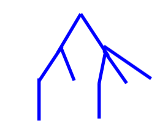
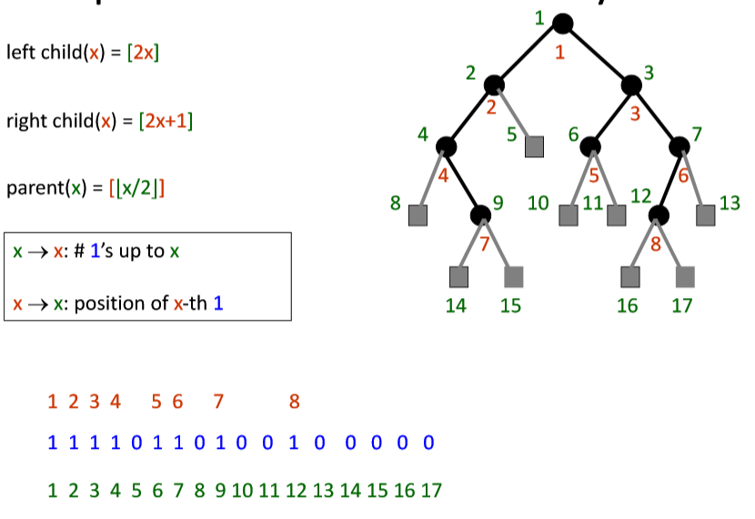
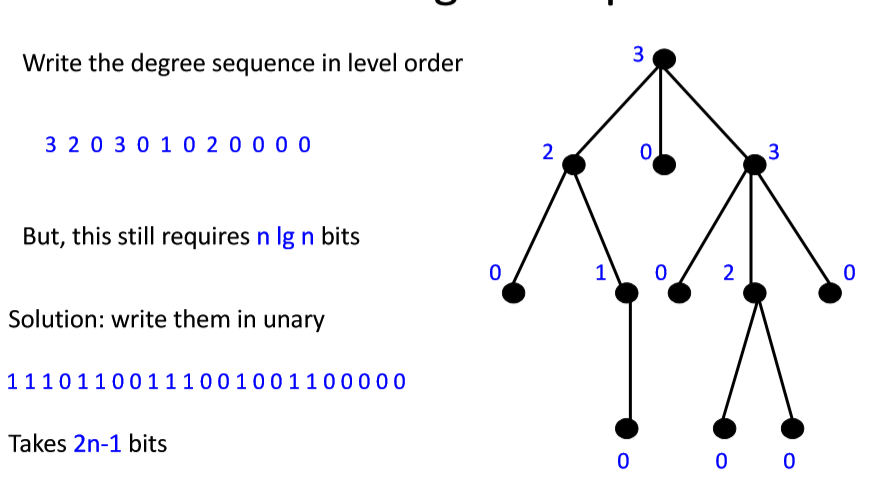
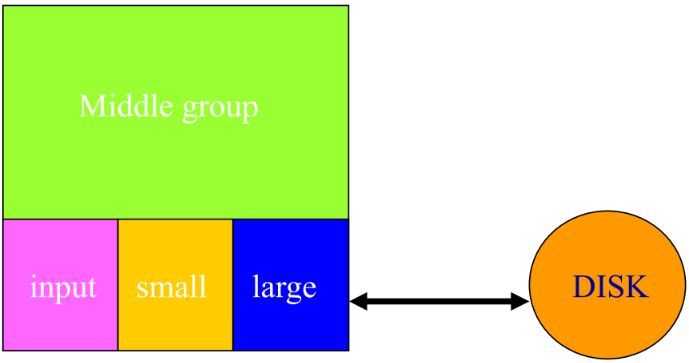

# 平摊分析与基本思路

## Aggregate method （聚集分析）

### Potential Function

$P(i)=amortizedCost(i)-actualCost(i)+P(i-1)$

$\sum(P(i)-P(i-1))=\sum(amortizedCost(i)-actualCost(i))$

$P(n)-P(0)=\sum(amortizedCost(i)-actualCost(i))$

$P(n)-P(0)\geq 0$

When P(0)=0,P(i) is the amount by which the first i operations have been over charged

## Accounting method (记账分析)

Guess that the amortized cost of an increment is 2

Now show that P(m)-P(0) >= 0 is all for m 

1^st^ increment:

* one unit of amortized cost is used to pay for the change in bit 0 from 0 to 1
* the other unit remains as a credit on bit and is used later to pay for the time when bit 0 changes form 1 to 0

n^th^creament

​	…

$P(m)-P(0)=\sum(amotyizedCost(i)-actualCost(i))$

= amount by which the first m increments have been over charged

=number of credits

= number of 1s

$\geq 0$

## Potential method (势能法)

Guess a suitable potential funciton for whtich $P(n)-P(0) \geq 0$ for all n 

Derive amortized cost for i^th^ operation usting $\Delta P = P(i)-P(i-1)=amortizedCost  - actualCost$

$amortizedCost  = acutalCost + \Delta P$

# 数据结构、二叉树与树

* Arbitrary Ordered Trees

  *  Use parenthesis notation to represent the tree

  *  As the binary string(((())())((())()())): traverse tree as “(“ for node, then subtrees, then “)” 

  * 2 Bits per node

    

    

* Heap-like notation

  

  

* Orded threes

  * parent
  * first child
  * next sibling
  * degree
  * subtree size

* Level-order degree sequence

  

  

# 外排序

## 缓冲使用策略，原因和方法

*   Reason
    
*   not feasible to input n records, sort and output in sorted order
    
*   ALU-main memory-disk

*   prefetch

    

    

* 3 input/output buffers
  * input, small, large
  * middle
  * fill middle group from disk
  * if next record $\leq$ middle-min- send to small
  * if next record $\geq$ middle-max- send to large
  * else remove middle-min- or middle-max from middle and add new record to middle group
  *  fill input buffer when it gets empty 
  * write small/large buffer when full        
  * write middle group in sorted order when done
  * double-ended priority queue
  
* Internal Merge Sort
  * create initial sorted segments   
  * merge pairs of sorted segmetns in merge passes, until only 1 segment remains
  
* External Merge Sort
  * run generation
    *  a run is a sorted sequence of records
  * run merging
  
* Run generation

  *   loser tree																																																																																																																								

*   Tournament Trees
*   Huffman trees
*   Double-ended priority queues
*   Buffering

# 红黑树

# 最小最大堆

### 插入

只需要将节点插在二叉树的最后一个叶子结点位置，然后比较它对它父亲节点的大小，如果大则停止；如果小则交换位置，然后对父亲节点递归该过程直至根节点。复杂度为$O(log(n))$。

一般来说，插入的位置可以不是最后一个叶子节点，可以作为任意中间节点的孩子节点插入，将这个叶子节点变为中间节点后，按上文所说的方法调整节点顺序以保证维持堆特性不变。     

### 删除

要从堆中删除一个节点，用最后一个节点替换掉要删除的节点，然后调整节点顺序以维持堆特性。

# 设计数据结构与算法

# Review

-   Amoritized analysis
-   Succinct data structures
-   Function for bit vectors
    -   BInary trees
    -   Ordered tree
-   String matching
    -   BM
-   Double ended priority
-   External Sort
    -   buffer management
-   Red-black trees
-   augmenting data structures