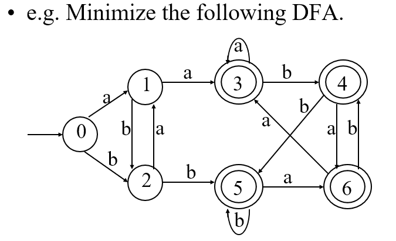
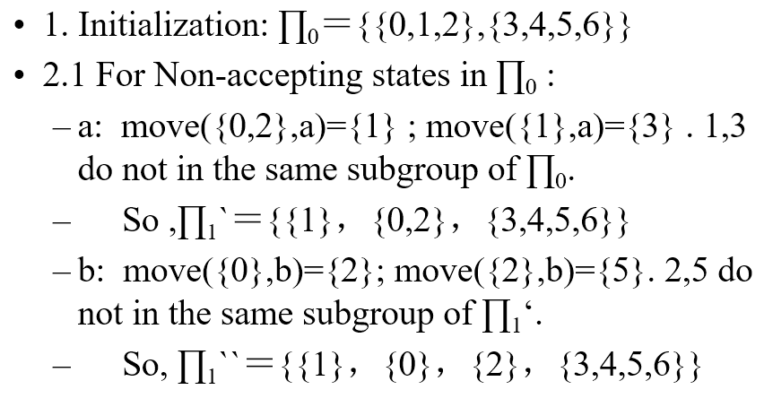
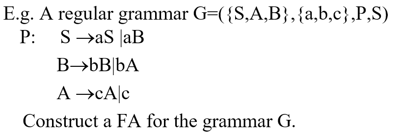
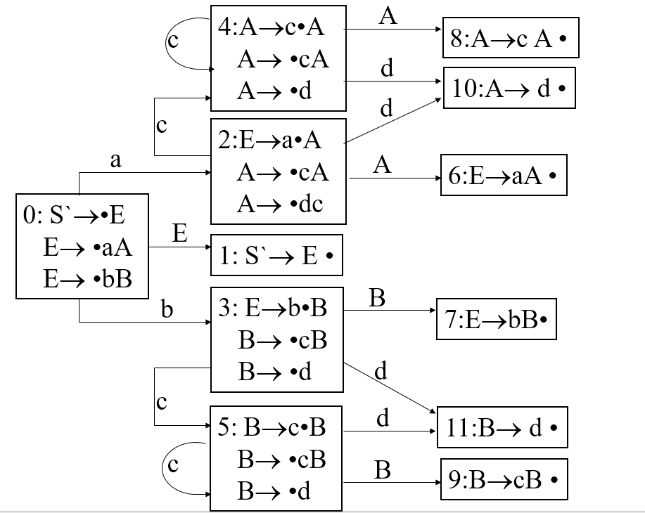

[TOC]
# Chapter 1

>   None

# Chapter 2 Language & Syntax Description

## Language & syntax description

>   1.  Alphabet
>
>     Non-empty set of symbols，usually expressed in $\Sigma$、$V$ or Other Upper-case Greece Letter
>
>   2.  Symbol (Character)
>
>     Elements in alphabet, finest elements in a language
>
>   3.  String
>
>     Finite sequence of symbols in the Alphabet.
>
>     Notes: Null-string is string without any symbol, written as e。
>
>   > 1. A = {$\alpha_1$,$\alpha_2$,…} B ={$\beta_1$,$\beta_2$}
>   >
>   >    AB = $\{\alpha\beta|\alpha\in A\ and\ \beta \in B\}$
>   >
>   >    $A^0=\{\varepsilon\}$
>   >
>   > 2. Closure
>   >
>   >    $A^*=A^0\cup A^1\cup A^2...$
>   >
>   > 3. Positive closure
>   >
>   >    $A^+=A^1\cup A^2 \cup A^3...$
>
>   4.  Sentence
>
>      A set of strings based on symbols in the Alphabet in  certain construction rules
>
>   5.  Language
>
>      Sets of sentences in the Alphabet.
>
>      Notes: By convention, a symbol is expressed as a,b,c,…；a string is expressed as $\alpha$,$\beta$,$\gamma$…；a set of strings is expressed in A,B,C….

* Grammar
  * Grammar(G)
  * None-terminal symbol($V_N$)
  * Terminal symbol($V_T$)
  * Start symbol(S)
  * Production(P)
    * <Sentence>→<subject><Predicate>
    * $A\rightarrow \alpha$
  * Derivation(Leftmost & Rightmost)
  * Reduction
  * Sentential form,  Sentence & Language
  * Recursive definition of grammar rules
  * Extended notations of grammar rules
* Formal definition
  * Grammar
    * **quadruple** ($V_N,V_T,P,S$)
  * Catalog of grammars
    * 0-type grammar (Phrase grammar or grammar without limitation)
      * to any production $\alpha\rightarrow\beta$ in P $(\alpha\in V^+,\beta\in V^*)$ ,there is at least  a non-terminal symbol in $\alpha$
    * 1-type grammar (context-sensitive grammar or length-added grammar)
      * to any production $\alpha\rightarrow\beta$ in P, there is the limitation of $|\beta|\ge|\alpha|$ **expect for $S\rightarrow\varepsilon$,if $S\rightarrow\varepsilon$, S can not appear in the right side for any production.
      * for any production $\alpha\rightarrow\beta$ in P, $\alpha A\beta\rightarrow\alpha\gamma\beta\ (\alpha,\beta\in V^*)$ expect for $S\rightarrow\varepsilon$
    * 2-type grammar (context-free grammar)
      * Every production in P is of the form $A\rightarrow\beta$ where $A\in V_N,\beta\in V^*$
    * 3-type grammar (Regular grammar, right-linear grammar or left-linear grammar)
      * Every production in P is of the form $A\rightarrow\alpha B,A\rightarrow\alpha$, or $A\rightarrow B\alpha$,$A\rightarrow\alpha$,where $A$,$B\in V_N,\alpha\in V_T^*$
* Grammar Simplification
  * delete productions like $P\rightarrow P$
  * delete productions who can not be used in the derivations
  * delete productions who can not derive a terminal string
* Construct context-free grammar without ε-production
  * it should follow conditions as followings
    * If there is the production S→ε of the form in P, S should not appear in right-side of any production, where S is the start symbol of the grammar;
    * There are no other ε-productions in P
  * How to construct
    * $G=(V_N,V_T,P,S)\rightarrow G'=(V'_N,V'_T,P',S')$
    * find out all non-terminal symbols that can derive ε after some steps, and put them into the set $V_0$
    *   construct the P’s set of productions of G’ as following steps:
      1. If an symbol in $V_0$ appears in the right side of a production, change the production into two production respectively; put the new productions into P
      2. put the productions relating to the symbol into P’ except for ε-production relating to the symbol
      3. if there exists the production of the form $S\rightarrow \varepsilon$ in P,change the production into $S’\rightarrow \varepsilon |S$ and put them into  $P’$,let $S’$ be the start symbol of $G’$, let $V’_N=V_N\cup \{S'\}$
* Syntax tree and ambiguity of a grammar
  * Basic terms in a syntax tree
    * Sub-tree
    * Pruning sub-tree
    * Sentential form

# Chapter 3 Lexical analysis

## Approaches to implement a lexical analyzer

* Simple approach

  * Construct a diagram that illustrates the structure of the tokens of the source language , and then to hand-translate the diagram into a program for finding tokens

    >  Efficient lexical analyzers can be produced in this manner

* Pattern-directed programming approach

  * Pattern Matching technique

  * Specify and design program that execute actions triggered by patterns in strings

  * Introduce a pattern-action language called Lex for specifying lexical analyzers

    - Patterns are specified by regular expressions
- A compiler for Lex can generate an efficient finite automation recognizer for the regular expressions

## The role of the lexical analyzer

* First phase of a compiler

  1. Main task

     * To read the input characters 
     * To produce a sequence of tokens used by the parser for syntax analysis
     * As an assistant of parser

  2. Interaction of lexical analyzer with parser

     

     

3. 、Processes in lexical analyzers

   *　Scanning
     *　Pre-processing
       * Strip out comments and white space
       * Macro functions
   *　Correlating error messages from compiler with source program
     *　A line number can be associated with an error message
   *　Lexical analysis

4. Terms of the lexical analyzer

   1. Token 
      * Types of words in source program
      * Keywords, operators, identifiers, constants, literal strings, punctuation symbols(such as commas,semicolons)
   2. Lexeme
      1. Actual words in source program
   3. Pattern
      1. A rule describing the set of lexemes that can represent a particular token in source program
      2. **Relation** {<.<=,>,>=,==,<>}

5. Attributes for Token

   1. A pointer to the symbol-table entry in which the information about the token is kept

   >  E.g E=M*C**2

    <**id**, pointer to symbol-table entry for E>

    <**assign_op**,>

   <**id**, pointer to symbol-table entry for M>

   <**multi_op**,>

   <**id**, pointer to symbol-table entry for C>

   <**exp_op**,>

   <**num**,integer value 2>
   
6. Lexical Errors

    *   Deleting an extraneous character
    *   Inserting a missing character
    *   Replacing an incorrect character by a correct character
    *   Transposing two adjacent characters(such as , fi=>if)
    *   Pre-scanning 

7.  Input Buffering
    *   Two-buffer input scheme to look ahead on the input and identify tokens
    *   Buffer pairs
    *   Sentinels(Guards)

## Specification of tokens

1. Regular definition of tokens
   1. regular expression (RE)
2. regular language`L(r)`
3. rule of regular expression over alphabet $\Sigma$
   1. $\varepsilon \rightarrow \{\varepsilon \}$
   2. $\alpha|\beta$
   3. $\alpha \beta$
   4. $\alpha*$
   5. $\alpha+$
   6. $\alpha ?$
   7. $[a-z]$

## Recognition of tokens

1. task of recognition of token in a lexical analyzer

   1. Isolate the lexeme for the next token in the input buffer

   2. produce output pair like <id,pointer to table entry>

      >A example translation table
      >
      >| RE   | Token | Attribute-value        |
      >| ---- | ----- | ---------------------- |
      >| if   | if    | -                      |
      >| id   | id    | Pointer to table entry |
      >| <    | relop | LT                     |

   3.  method to recognition of token

      * Transition diagram(Stylized flowchart)

        

        * each state gets a segment of code
        * use nextchar() to read a character and move to next state

2. FA ( Finite Automation )

   1. Deterministic or non-deterministic FA

      1. ＮFA contains more than one transition out of a state may possible on the same input symbol while DFA not.

   2. DFA

      1. quintuple $M(S,\Sigma,move,s_0,F)$

         * $S$: a set of states

         * $\Sigma$: the input symbol alphabet

         * $move$: a transition function, mapping from $S\times \Sigma$ to $S$, $move(s,a)=S’$

         * $s_0$: the start state

         * $F$: a set of states $F$ distinguished as accepting states

           > $F\subseteq S,s_0 \in S$

      2. note

         1. no state has an $\varepsilon$
         2. for each state s and input symbol a, there is at most one edge labeled a leaving s
         3. transition graph are used to describe a FA
         4. A DFA accepts an input string x if and only if there is some path in the transition graph from start state to some accepting state

   3. NFA

      1. quintuple $M(S,\Sigma,move,s_0,F)$

         * $S$: a set of states

         * $\Sigma$: the input symbol alphabet

         * $move$: a transition function, mapping from $S\times \Sigma$ to $S$, $move(s,a)=2^S$

         * $s_0$: the start state

         * $F$: a set of states $F$ distinguished as accepting states

           > $2^S\subseteq S, F\subseteq S,s_0 \in S$

      2. note

         1. $\epsilon$ is a legal input symbol

   4. Convert of an NFA to a DFA

      >  avoid ambiguity

      * Obtain ε-closure(T)

      * push all states in T onto stack

      * initialize ε-closure(T) to T;

        > while stack is not empty do{
        >
        > ​	pop the top element of the stack into t;
        >
        > ​	for each state u with an edge from t to u labeled ε do{
        >
        > ​		if u is not in ε-closure(T){
        >
        > ​			add u to ε-closure(T)
        >
        > ​			push u into stack
        >
        > ​		}
        >
        > ​	}
        >
        > }

      * Input
        
      * 	NFA $N = (S,\Sigma,move,S_0,Z)$
        
      *   Output
      
          * 	DFA $D = (Q,\Sigma,\delta,I_0,F)$
      
      *   Subset construciton
      
        1. $I_0 = \epsilon-clousure(S_0),I_0\in Q$
        2.
        $$
        foreach\ I_i,I_i \in Q \
        \ let I_t = \epsilon-clousure(move(I_i,a) \
        \ if\ I_t\notin Q\ then\ put\ I_t\ into Q
        $$

        3. repeat step2 until there is no new state to put into $Q$
        
        4. $let F = \{I|I\in Q,I \cap Z<>\Phi\}$
        
           
        
           
   
   3. minimizing the number of states of a DNA
   
      * Input
   
        * DFA $M = \{S,\Sigma,move,s_0,F\}$
   
      * Output
   
        * DFA $M'$ accepting the same language as M and having as few states as possible
   
      * Algorithm
   
        1. Construct an initial partition ∏ of the set of states with two groups: the accepting states *F* and the non-accepting states *S-F.* ∏0＝{I01,I02}
        2. For each group *I* of *∏**i* ,partition *I* into subgroups such that two states *s* and *t* of *I* are in the same subgroup if and only if for all input symbols *a*, states *s* and *t* have transitions on *a* to states in the same group of *∏**i* ; replace *I* in *∏**i+1_*by the set of subgroups formed.
        3. If *∏**i+1* =*∏**i* ,let *∏**final* =*∏**i+1* and continue with step (4). Otherwise,repeat step (2) with *∏**i+1* 
        4. Choose one state in each group of the partition *∏**final* as the representative for that group. The representatives will be the states of the reduced DFA M’. Let *s* and *t* be representative states for *s*’s and *t*’s group respectively, and suppose on input *a* there is a transition of *M* from *s* to *t*. Then *M’* has a transition from *s* to *t* on *a*.
        5. If M’ has a dead state(a state that is not accepting and that has transitions to itself on all input symbols),then remove it. Also remove any states not reachable from the start state.
   
        
   
        
   
        
   
        
   
   4. RE to NFA
   
      * Method
        * Parse r into its constituent sub-expressions
        * ε
          * 
        * $a\in \Sigma$
          * 
        * 
   
   5. FA to RE
   
   6. Regular Grammar to NFA (Right linear grammar to FA)
   
      * Input $G = (V_N,V_T,P,S)$
   
      * Output FA $M = (Q,\Sigma,move,q_0,Z)$
   
      * Method
   
        * Consider each non-terminal symbol in G as a state, and add a new state T as an accepting state.
        * Let $Q=V_N\cup\{T\} , S ＝ V_T , q_0 ＝S$; if there is the production $S\rightarrow \varepsilon$, then $Z=\{S,T\}, else Z=\{T\}$ 
        * For the productions similar as A1 → aA2，construct move(A1,a)= A2
        * For the productions similar as A1 → a, construct move(A1,a)= T
        * For each *a* in Σ, move(T,a)=ψ, that means the accepting states do not recognize any terminal symbol.
   
        
   
        
   
   7. FA to Right-linear grammar
   
      * Input $M=(S,\Sigma,f,s_0,Z)$
      * Output $R_g = (V_N,V_T,P,s_0)$
      * Method
        * if $s_0\notin Z$
          * For the mapping $f(A_i,a)=A_j$ in M $A_i\rightarrow aA_j$
        * if $s_0\in Z$
          * add a new production $A_i\rightarrow a$,$A_i=\rightarrow a|aA_j$

## design of a lexical analyzer generator


* Lex specification

  * declaration
  * translation rules
  * auxiliary procedures

* Declaration

  ``` lex
%{
   /*definitions of manifest constants
 LT,LE,EQ,GT,GE,IF,THEN,ELSE,ID*/
  %}
/*regular expression*/
  delim [\t\n]
ws   {delim}+
  letter  [A-Za-z]
digit  [0-9]  
  id    {letter}({letter}|{digit})*
  ```
  
* model

  

# Chapter 4 Syntax analysis

## approaches to implement a syntax analyzer

## roles of the parser

* main task
  * Obtain a string of tokens from the lexical analyzer
  * Verify that the string can be generated by the grammar of related programming language
  * Report any syntax errors in an intelligible fashion
  * Recover from commonly occurring errors so that it can continue processing the remainder of its input

* position 

  

* methods

  * universal parsing method
  * top-down method
    * Build parse trees from the top(root) to the bottom(leaves) 
    * The input is scanned from left to right
    * LL(1) grammars (often implemented by hand)
  * bottom-up method
    * Start from the leaves and work up to the root
    * The input is scanned from left to right
    * LR grammars(often constructed by automated tools)

* Syntax error handling
  * error levels
  * simple-to-state goals of the error handler
  * error-recovery strategies
    * panic mode
    * phrase level
  * error-recovery strategies

## top-down parsing

* ideas
  * Find a leftmost derivation for an input string
  * Construct a parse tree for the input starting from the root and creating the nodes of the parse tree in preorder

* main methods

  * Predictive parsing (no backtracking)*
  * Recursive descent (involve backtracking)

* left recursion

  * Immediate recursion $P\rightarrow P\alpha|\beta$

  * Indirect recursion $P\rightarrow Aa,A\rightarrow Pb$

  * solve

    * convert left recursion to right recursion

  $$
  P\rightarrow P\alpha|\beta \
  P\rightarrow \beta\alpha* \
  P\rightarrow \beta P'\
  P'\rightarrow \alpha P'|\varepsilon
  $$
  
  

* eliminating ambiguity of a grammar
  * rewriting the grammar
    * stmt→if expr then stmt|if expr then stmt else stmt|other
    * stmt→matched-stmt|unmatched-stmt
    * matched-stmt→if expr then matched-stmt else matched-stmt|other
    * unmatched-stmt→if expr then stmt|if expr then matched-stmt else unmatched-stmt

* Left factoring

  * rewrite the production to defer the decision until we have seen enough of the input to make right choice
  * $A\rightarrow \delta \beta_1|\delta \beta_2|\delta \cdot\cdot\cdot \beta_n$
  * $A\rightarrow \delta A',A'\rightarrow \beta_1|beta_2|\cdot\cdot\cdot|\beta_n$

* predictive parsers methods

  * Transition diagram based predictive parser
  * Non-recursive predictive parser

* transition diagram based predictive parsers

  * transition diagram
    * create an initial and final state
    * for each production $A\rightarrow X_1X_2...X_n$,create a path from initial to the final state,with edge labeled $X_1,X_2,...,X_n$

* non-recursive predictive parsing

  * the determining the production to be applied for a non-terminal

  * table-driven and use stack 

    

  * predictive parsing program

    * X: the symbol on top of the stack
    * a: the current input symbol
    * If X=a=$, the parser halts and announces successful completion of parsing
    * If X=a!=$, the parser pops X off the stack and advances the input pointer to the next input symbol
    * If X is a non-terminal, the program consults entry M[X,a] of the parsing table M. This entry will be either an X-production of the grammar or an error entry.

  * First

    * If a is any string of grammar symbols, let *FIRST(**a**)* be the set of terminals that begin the string derived from a

    * If a→e, then e is also in *FIRST(**a**)* 

    * $\alpha\in V^*,First(\alpha) = \{a|\alpha \rightarrow a....,a\in V_T\}$

    * Compute

      * If x is terminal,then First(x)={x}

      * If x→ε, add ε to First(x)

      * If x in non-terminal, and X→Y1Y2…Yk,Yj∈(VN∪VT),1≤j≤k,then

        ```
        {     
        j=1; FIRST(X)={}; //initiate 
               while ( j<k and ε∈ FIRST(Yj)) { 
                   FIRST(X)=FIRST(X)∪(FIRST(Yj)-{ε})
                   j=j+1
               }
               IF (j=k and ε∈ FIRST(Yk)) 
                   FIRST(X)=FIRST(X) ∪ {ε}
           }
        
        ```

        

  * Follow

    * For non-terminal *A*, to be the set of terminals *a* that can appear immediately to the right of *A* in some sentential form. 
    * $Follow(A) = \{a|S\rightarrow ...Aa...,a\in V_T\}$
    *  If $S\rightarrow ...A,then\ \$\in Follow(A)$
    * Compute
      * Place \$ in FOLLOW(S), where S is the start symbol and ​\$ is the input right end-marker
      * If there is A→aBb in G, then add (First(b)-ε) to Follow(B)
      * If there is A→aB, or A→aBb where FIRST(b) contains ε，then add Follow(A) to Follow(B).

  * PPT ( Predictive Parsing Tables )

    * Input Grammar G
    * Output Parsing table M
    * method
      * For each production A→a , do steps 2 and 3
      * For each terminal *a* in FIRST(a), add A→a to M[A,*a*]
      * If ε is in FIRST(a), add A→a to M[A,*b*] for each terminal *b* in FOLLOW(A). If e is in FIRST(a) and \$ is in FOLLOW(A), add A→a to M[A,\$]Make each undefined entry of M be **error**. 
      * Make each undefined entry of M be **error**. 


* LL(1) Grammars

  * Definition

    * A grammar whose parsing table has no multiply-defined entries is said to be LL(1)

    * The first “L” stands for scanning the input from left to right

    * The second “L” stands for producing a leftmost derivation

    * “1” means using one input symbol of look-ahead

      > s.t each step to make parsing action decisions.

    * Note

      * No ambiguous can be LL(1)
      * Left-recursive grammar cannot be LL(1)
      * A grammar G is LL(1) if and only if whenever A→a | b are two distinct productions of G

  * transform a grammar to LL(1) grammar

    * Eliminating all left recursion
    * Left factoring

## bottom-up parsing

* Shift-reduce parsing

  * handles

  * handle pruning

    

  * Definition of operator grammar
    * The grammar has the property that no production right side is e or has two adjacent non-terminals

* LR parsing

  * An efficient, bottom-up syntax analysis technique that can be used to parse a large class of context-free grammars

  * LR(K)

    * L: left-to-right scan
    * R:construct a rightmost derivation in reverse
    * k:the number of input symbols of look ahead

  * advantages

    * It can recognize virtually all programming language constructs for which context-free grammars can be written
    * It is the most general non backtracking shift-reduce parsing method 
    * It can parse more grammars than predictive parsers can
    * It can detect a syntactic error as soon as it is possible to do so on a left-to-right scan of the input

  * SLR

    * Simple LR

  * LR(1)

    * canonical LR

  * LRLR

    * look ahead LR

      

  * note

    1. The driver program is the same for all LR parsers; only the parsing table changes from one parser to another
    2. The parsing program reads characters from an input buffer one at a time
    3. Si is a state, each state symbol summarizes the information contained in the stack below it
    4. Each state symbol summarizes the information contained in the stack
    5. The current input symbol are used to index the parsing table and determine the shift-reduce parsing decision
    6. In an implementation, the grammar symbols need not appear on the stack 

  * Parsing table

    * Action
      * Action[S,a]: S represent the state currently on top of the stack, and a represent the current input symbol. So Action[S,a] means the parsing action for S and a
      * Shift
        * The next input symbol is shifted onto the top of the stack
        * Shift S, where S is a state
      * Reduce
        * The parser knows the right end of the handle is at the top of the stack, locates the left end of the handle within the stack and decides what non-terminal to replace the handle. Reduce by a grammar production A→a
      * Accept
        * The parser announces successful completion of parsing
      * Error
        * The parser discovers that a syntax error has occurred and calls an error recovery routine.
    * Action conflict
      * Shift/reduce conflict
        * Cannot decide whether to shift or to reduce
      * Reduce/reduce conflict
        * Cannot decide which of several reductions to make
    * Goto
      * a goto function that takes a state and grammar symbol as arguments and produces a state

  * Algorithm

    * The next move of the parser is determined by reading the current input symbol *a*, and the state *S* on top of the stack,and then consulting the parsing action table entry *action[**S,a**]*.
    * If action[Sm,ai]=shift S,the parser executes a shift move ,enter the S into the stack,and the next input symbol ai+1 become the current symbol.
    * If action[Sm,ai]=reduce A→a, then the parser executes a reduce move. If the length of a is g, then delete g states from the stack, so that the state at the top of the stack is Sm- g . Push the state S’=GOTO[Sm- g,A] and non-terminal A into the stack. The input symbol does not change.
    * If *action[**S**m**,a**i**]*=accept, parsing is completed.
    * If *action[**S**m**,a**i**]*=error, the parser has discovered an error and calls an error recovery routine.

  * Sj   means shift and stack state j, and the top of the stack change into（j,a）

  * rj   means reduce by production numbered j

  * Accept  means accept

  * blank    means error

  * 

    

    

    

  * Canonical LR(0)

    * An LR(0) item of a grammar G is a production of G with a dot at some position of the right side

      * •Such as: A → XYZ yields the four items:

        –A→•XYZ . We hope to see a string derivable from XYZ next on the input.

        –A→X•YZ . We have just seen on the input a string derivable from X and that we hope next to see a string derivable from YZ next on the input. 

        –A→XY•Z

        –A→X YZ•

      * •The production A®e generates only one item, A®•.

      * •Each of this item is a viable prefixes

    * Construct LR(0) collection

      * Define a *augmented grammar*

        * If G is a grammar with start symbol S,the augmented grammar G’ is G with a new start symbol S’, and production S’ ®S

          •The purpose of the augmented grammar is to indicate to the parser when it should stop parsing and announce acceptance of the input

      * the Closure Operation

        * •If I is a set of items for a grammar G, then closure(I) is the set of items constructed from I by the two rules:

      * the Goto Operation

        * •Form: goto(I,X),I is a set of items and X is a grammar symbol

    * The Sets-of-Items Construction

      ```
      void ITEMSETS-LR0()
      {    C:={CLOSURE(S` →•S)}      /*initial*/
            do 
        {  for (each set of items I in C and each grammar symbol X )
              IF  (Goto(I,X) is not empty and not in C)
                  {add Goto(I,X) to C}
         }while  C is still extending
      }
      
      ```

      

* SLR(1) Parsing Table Algorithm 

  * Input. An augmented grammar G
  * Output. The SLR parsing table functions *action* and *goto* for G`
  * Method.
    * Construct C={I0,I1,…In}, the collection of sets of LR(0) items for G`.
    * State *i* is constructed from Ii. The parsing actions for state *i* are determined as follows:
      *  If [A®a•ab] is in Ii and goto(Ii,a)= Ij, then set ACTION[i,a]=“Shift j”, here a must be a terminal.
      * If [A®a• ]ÎIk, then set *ACTION[**k,a**]=**r**j* for all *a* in *follow(A)*; here *A* may not be S`, and j is the No. of production A®a .
    * The goto transitions for state I are constructed for all non terminals A using the rule: if goto (Ii,A)= Ij, then goto[i,A]=j 
    * All entries not defined by rules 2 and 3 are made “error”
    * The initial state of the parser is the one constructed from the set of items containing [S` ® S•].
    * If any conflicting actions are generated by the above rules, we say the grammar is not SLR(1).
    * 
    * 
    * 
    * Every SLR(1) grammar is unambiguous, but there are many unambiguous grammars that are not SLR(1).

* Construction of the sets of LR(1) items

  * Input. An augmented grammar G

  * Output. The sets of LR(1) items that are the set of items valid for one or more viable prefixes of G`

  * Method. The procedures closure and goto and the main routine items for constructing the sets of items.

    ```
    function closure(I);
    { do { for (each item (A→α•Bβ,a) in I,
                     each production B → γ in G`,
                     and each terminal b in FIRST(βa)
                     such that (B→• γ ,b) is not in I  )
                add (B→• γ ,b) to I;
             }while there is still new items add to I;
        return I
    }
    function  goto(I,X);
    { let J be the set of items (A→αX•β,a) such that (A→α• X β,a) is in I ;
        return closure(J)
    }
    Void items (G`);
    {C={closure({ (S`→•S,$)})};
      do { for (each set of items I in C and each grammar symbol X 
             such that 
                 goto(I,X) is not empty and not in C )
               add goto(I,X) to C
            } while there is still new items add to C;
      }
    ```

    //TODO page 155.

## LR parsers


🚧under construction🚧


```

```