[TOC]

# Chapter 1

- 计算机网络分类
  - 跨度
    - PAN、LAN、MAN、WAN、Internet
  - 拓补结构
    - BUS、Star、Ring、Mesh
  - 管理性质
    - 公用网、专用网
  - 交换方式
    - 电路交换、报文交换、分组交换
  - 网络功能
    - 通信子网、资源子网
- 通信协议的三要素
  - 语法：确定通信双方通信时数据报文的格式 
  - 语义：确定通信双方的通信内容的含义 
  - 时序：指出通信双方信息交互的顺序，如建立连接、数据传输、数据重传、 终止连接

# Chapter 2

- 网络通信基本原理

  - 基本概念

    - 信道带宽

      - 信道可以不失真地传输信号的频率范围(Hz) 
      - 信道带宽取决于信道的质量 

    - 信道容量

      - 信道在单位时间内可以传输的最大信号量 
      - 数据通信领域：以Data transfer rate(数据传输速率)的形式表 示：信道在单位时间内可以传输的最大比特数 

    - Nyquist‘s Theorem

      -  信道带宽（H）,信道容量（B）,信道数据速率（C）
      - 无噪声下的B与H的关系： B = 2 × H（Baud) 
      - 无噪声下的C与H的关系： C = 2 × H × log~2~N (bps) 其中：N为一个码元可取的离散值个数

    - Shannon’s Theorem 

      - 信道带宽（H）,信道容量（B）,信道数据速率（C）

      -  有热噪声时C、H和噪声的关系：C = H× log~2~ (1+S/N) (bps)

         其中S为信号功率， N为噪声功率，S/N为信噪比，通常把信噪比表示成 10×lg(S/N) 分贝(dB)

  - 波特率

    - 每秒钟电平变化的次数（Hz）

  - 数据传输速率

    - 数据传输速率 = 波特率 × log~2~N (N 为每个码元的取值个数) 

  - 性能指标

    - 速率
      - 信道/网络的额定数据传送速率(bps)，非实际速率 
    - 带宽
      - 模拟信号具有的频带宽度 
      - 数据通信领域指单位时间内网络中的某信道所能通过的“最高 数据率” 
    - 吞吐量
      - 单位时间内通过网络(或信道、接口)的实际数据量。受网络带 宽或网络的额定速率的限制，常用每秒传送的字节数或帧数来表示
    - 时延
      - 数据(比特、报文或分组)从网络(或链路)一端传送到另一端所需的 时间。包括： 
        - 发送时延：主机或网络设备发送数据帧（第1位到最后1位）所需要的时间发送时延=数据帧长度(bit)/发送速率(bit/s) 
        - 传播时延：电磁波在信道中传播一定的距离需要花费的时间 传播时延=信道长度(m)/电磁波的传播速率（光纤约为2*105m/s，铜线为 2.3 *105m/s ） 
        - 处理时延：主机或设备收到分组后的处理时间（分析首部、数据部分、差 错检验、选择路由等） 
        - 排队时延：输入队列中排队等待处理，输出队列中排队等待转发 
      - 数据在网络的总时延=发送+传播+处理+排队时延
    - 时延带宽积
      - 带宽时延积=传播时延×带宽，表示在特定时间该网络上的最大 数据量--已发送但尚未确认的数据 
      - 若发送端连续发送数据，则在发送的第一个比特即将达到终点 时，发送端己经发送的比特数
    - 往返时间RTT
      - 双向交互一次所需的时间，包括中间结点的处理时延、排队时 延以及转发时延。为避免出错，数据传输常采用应答式交互
    - 利用率
      - Channel utilization rate(信道利用率):
        - 信道传输数据的时间百分比，空闲时的信道利用率是零 
        - 信道利用率并非越高越好（堵塞增加了时延），参见高速公路的车流量
      - Network utilization rate(网络利用率):
        - 全网络的信道利用率的加权平均值。 
        - 当网络的利用率接近最大值1 时，网络的时延就趋于无穷大(通常超过 50%时，需准备扩容)

- 通信系统

  

  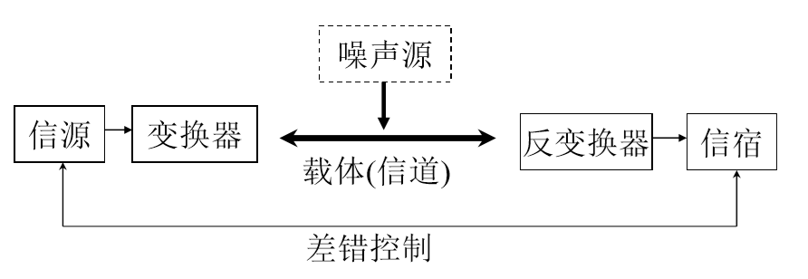

- 调制解调器

  - 调制解调
  - 调制方法
    - 调幅
    - 调频
    - 调相
    - 组合调制

- 编码解码

  - 编码

    - Pulse code modulation ，PCM，脉码调制技术
    - 采样、量化、编码
    - Nyquist Sampling Theorem
      - 最大频率为 F 的模拟信号 被不失真还原的前提条件是 取样频率不低于 2F

    

    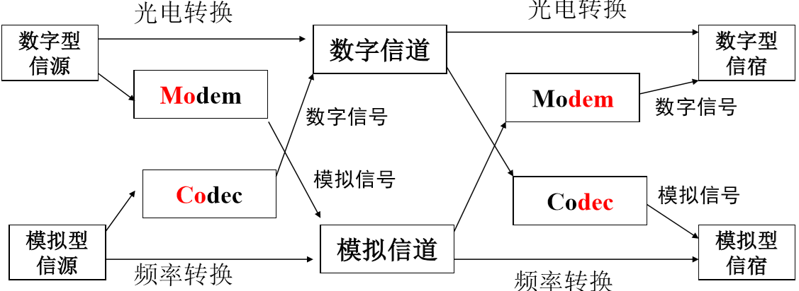

- 通信编码

  - NRZI（不归零交替编码）
    - 相邻比特点评变化情况
      - 变化1
      - 不变化0
  - 曼彻斯特编码
    - 一个比特时间一分为二，在此时间内发生低电平到高电平的变化 表示1，高电平到低电平的变化表示0 
    - 编码中含有同步信息(每个比特中部的电平跃变信号)
  - 差分曼彻斯特比编码
    - 一个比特时间一分为二，表示的值依赖于前一比特的最终电平状态 
    - 前半部分电平不同于前一比特的最终电平状态：0 
    - 前半部分电平相同于前一比特的最终电平状态：1

-  传输方式

  - 并行传输
  - 串行传输
    - 同步传输
      - 依靠双方始终的精确同步
        - 同步模式：一个或多个特定的字符或者符号组合
    - 异步传输
      - 单个字符独立传输
        - 独特的起始位和终止位

- 检错码

  - 校验字段（冗余信息）
  - 奇偶校验
    - 奇/偶校验
    - 水平垂直**偶**校验码
  - CRC（循环校验码）

- 多路复用

  - 频分多路复用FDM

    

    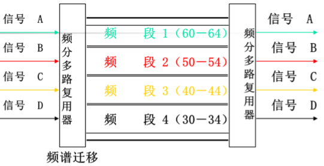

  - 时分多路复用TDM

    

    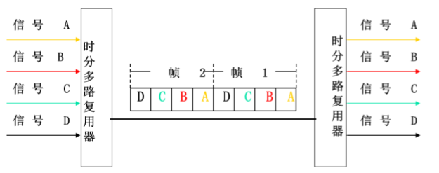

  - 波分多路复用WDM

  - 数据交换
    - 电路交换
      - 在数据传输之前，源点和目的点之间需要建立了一条独 占的物理电路（即使通信线路空闲，也不能供其他用户使用），包 含建立线路、数据传输、释放线路三个阶段
    - 报文交换
      - 存储转发，无需占用整个物理线路，中间结点根据报文 附加的目的地址确定输出端口和线路，排队等待线路空闲后再转发
    - 分组交换
      - 存储转发，对报文交换进行改进，来自上层的报文被分 割成多个分组再通过网络进行发送。目的结点必须等到该报文的所 有分组都到齐之后进行组装，才能将报文交付给上层

# Chapter 3

- OSI/RM模型

  

  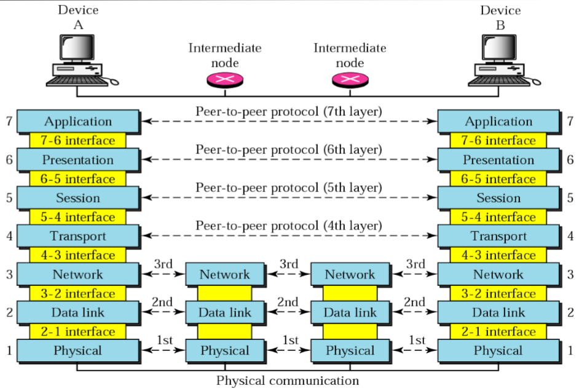

  1. 物理层
  2. 数据链路层
  3. 网络层
  4. 传输层
  5. 会话层
  6. 表示层
  7. 应用层

- 层间通信

  

  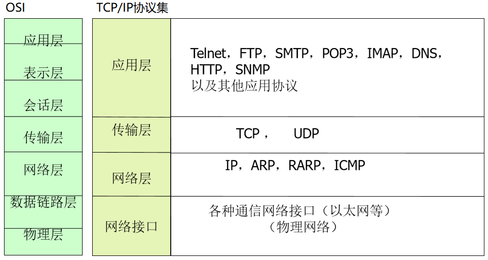

# Chapter 4 

- 局域网

- LAN逻辑结构

  - Network

    > 广播方式，不需要路由，可省略该层功能
    - Data link

      - MAC（介质访问控制子层）

        > 定义节点共享传输媒体时采用的访问技术，包括借助于物理层的无差错传输技术等

      - LLC（逻辑链路控制子层）

        > 屏蔽不同的MACX子层之间的差异，以便提供统一的接口

    - Physical

      > 定义结点的传输媒体的接口特性，包括机械特性，电气特性

      **只有局域网的数据链路层进行了子层划分**

      

      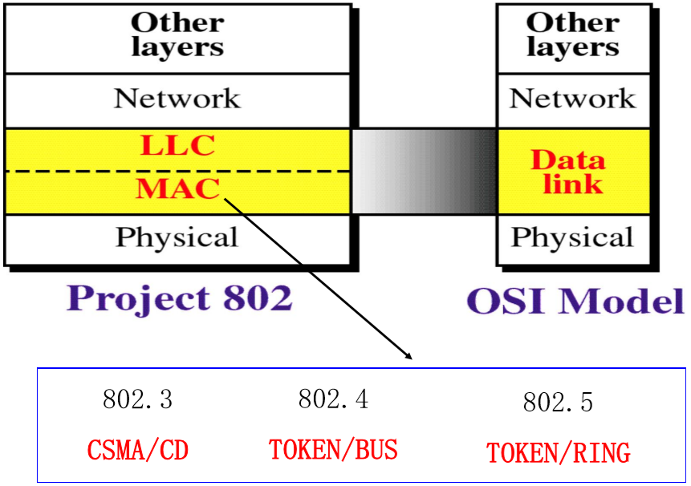

  - 多路访问

    - multiple-access protocols

      - Random access protocols
        - ALOHA ^*^
        - CSMA^*^
        - CSMA/CD(Carrier sense Multiple access Collision detection载波侦听多路访问冲突检测)
        - CSMS/CA

      - Controlled-access protocols(随机访问竞争)
        - Reservation^*^
        - Polling^*^
        - Token passing(受控访问)
      - Channelization protocols(通道化)
        - FDMA
        - TDMA
        - CDMA

  - CSMA/CD

    - 载波侦听(CS)：发送结点在发送信息帧之前必须侦听介质是否处 于空闲状态（说前先听），如果有其他结点在发送数据，则暂时 不要发送数据，以免发生碰撞 
    - 多路访问(MA)：多个结点可以同时访问介质；一个结点发送的 信息帧可以被多个结点接收 
    - 冲突检测(CD)：发送结点在发出信息帧的同时，还必须监听介质， 判断是否发生冲突（边说边听
    - 当检测到碰撞后
      - 数据碰撞会使总线上传输的信号产生了严重的失真，无法从中恢 复出有用的信息
      - 每一个正在发送数据的站，一旦发现总线上出现了碰撞，就要立 即停止发送，免得继续浪费网络资源，然后等待一段随机时间 （二进制指数退避）后再次发送

    

    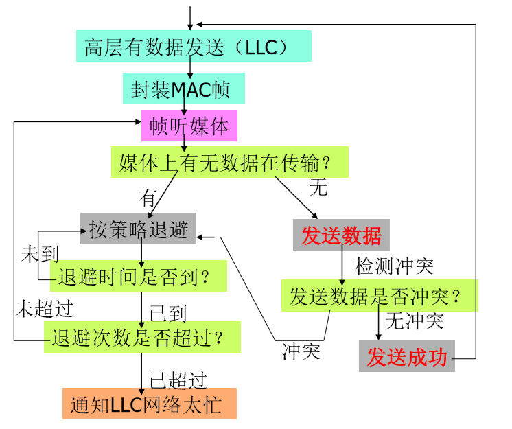

  - 最小帧长度

    - 发送方将信息帧全部发往介质时，如果未检测到冲突，则认为发送成功

    - 发送方发送的帧长度必须足够大，以确保发送方在检测到冲突时还在发送数据

    - 最小帧长度：保证发送结点可以对发送的冲突进行有效的冲突检 测，即保证其发送时间不小于信号在网络中传播距离最远的两个 结点之间传输的时间的2倍

    - 10base5：最小帧长度为64字节

      > 10base5
      >
      > 10:10Mbps
      >
      > Base:基带传输
      >
      > 5:200M
      >
      > T: 双绞线
      >
      > F:光纤

  - Ethernet

    - CSMA/CD

    - DIX标准，与802.3略有区别

      

      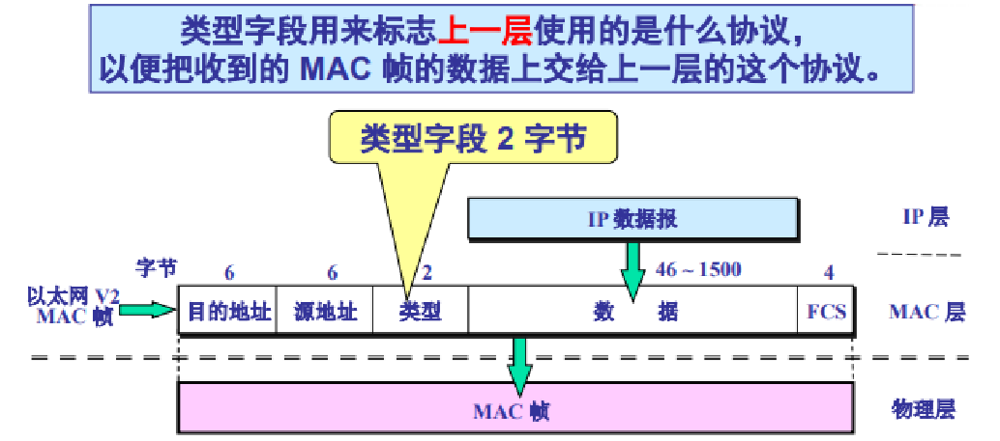

      - 最长数据字段1500（防止缓冲溢出）

  - 令牌

    - 结点获得媒体使用权的标志，保证有序地访问共享媒体 

    - 令牌总线 802.4

      - 物理拓扑
        - 总线
      - 逻辑拓扑
        - 环
      - 半双工
        - 只有获得令牌的结点才能发送 信息，其它结点只能接收信息，或者 被动地发送信息（在拥有令牌的结点 要求下，发送信息） 
      - 为了保证逻辑闭合环路的形成，每个 结点都动态地维护着一个连接表，该 表记录着本结点在环路中的前继、后 继和本结点的地址，每个结点根据后 继地址确定下一占有令牌的结点

    - 令牌环网 802.5

      - 物理拓扑
        - 环
      - 逻辑拓扑
        - 环
      - 单向
      - 发送方回收帧
      - 媒体访问
        - 令牌+优先级
      - 环中继转发器RPU

      

      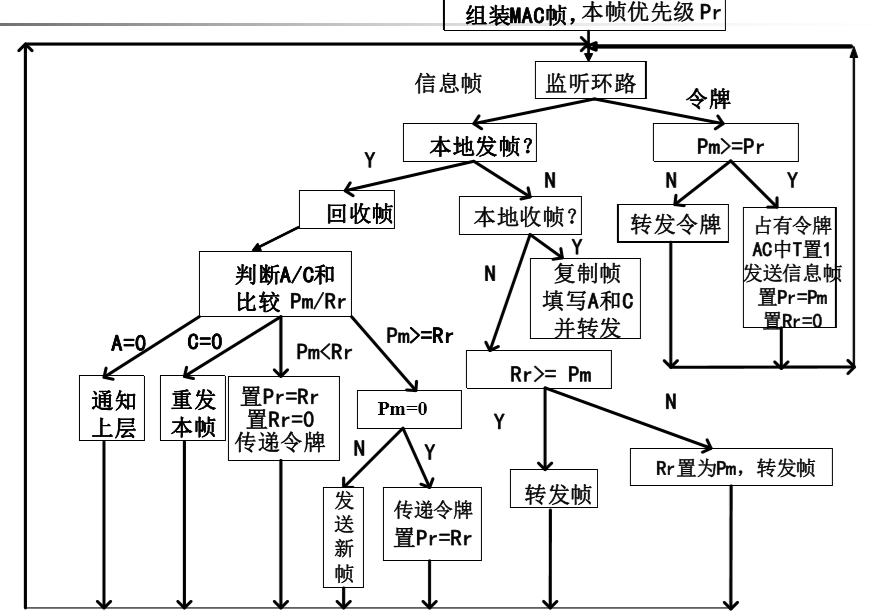

# Chapter 5

- 广域网

  - 帧中继网络
    - 一种虚电路广域网，高质量传输媒体应用，速率可达2～155Mb/s，传输差错 率下降，为简化X.25协议，不提供差错处理过程
    - 工作在物理层和数据链路层，提供部分的网络层功能

- FR

  - 精简X.25协议
  - 用光纤等高质量传输媒体，提高速率和降低误码率
  - 分组重发、流量控制、防止拥塞（正向拥塞通知，反向拥塞通知， 丢失指示等）等处理由端系统完成，降低网络时延
  - 将路由和简化的2层功能进行集成，提高协议效率
  - 保持X.25永久虚电路特性，提供虚拟专线服务，减少用户成本
  - 支持按需分配带宽，在“承诺信息速率”的基础上，支持突发性数 据量“瞬时”超标
  - 保持网络概念，减少专线方式所需的用户接入线，一条物理连接能 够提供多个逻辑连接

- ATM（异步传输模式）

  - 基于信元（53B）的分组交换技术

  - 面向连接：虚电路

    - 物理链路逻辑上被分为多条虚拟路径(Virtual Path, VP)，VP又 被划分为多条虚拟信道(Virtual Channel, VC)，每个VP和VC都 由标识符标识(VPI和VCI) ，VPI和VCI的组合(VPI/VCI )唯一地 标识了一条VC

  - 提供预约带宽机制 

  - 

  - 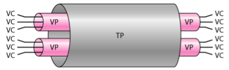

    

    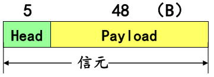

# Chapter 6

- 网络互连

  - 网络互连部件

    - 主要进行底层协议的转换

    - 转发器

      - 物理层

    - 网桥

      - 链路层及以下

    - 路由器

      - 网络层及以下

        
        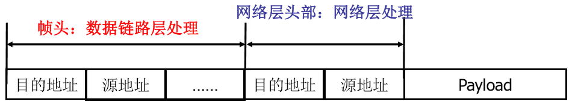
    
    - 转发器(Repeater, 中继器、集线器)
    
      - 互连仅在物理层及其下层(传输媒体)存在 差异的网络，延伸网段、改变传输媒体，实现网段之间的电气信号的接收和再生
    
        
    
        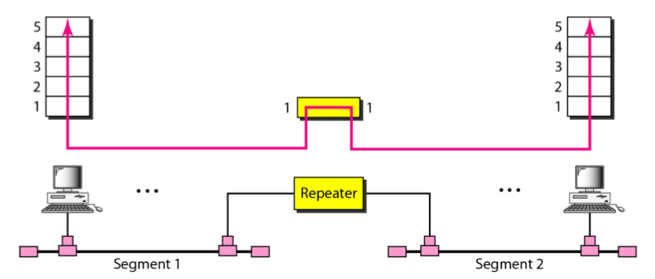
    
      - 转发器并不能连接两个局域网，它连接的是同一局域网的两个分段转发器转发每一帧，没有过滤能力
    
    - 网桥/交换机（Bridge/Switch)
    
      - 用于互连两个独立的子网，实现信息帧的存储 转发，工作在物理层和数据链路层
    
        
    
        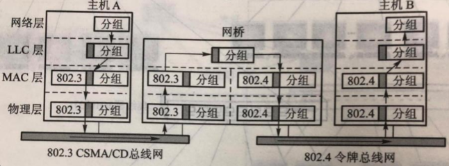
    
        
    
        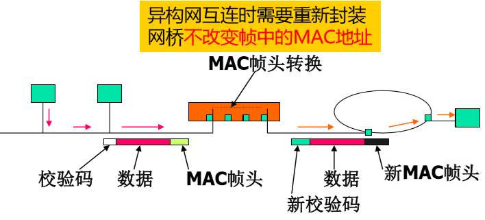
    
      - 执行OSI数据链路层及其下层的协议转换，适用于相同网络或者仅在低两层实现上有 差别的网络之间的互连
    
    - 网桥(Bridge)的功能 
    
      - 地址过滤：具有统一的数据链路层的编址格式，网桥能够识别各种地址，并根据数据帧的宿地址，有选择地让数据帧穿越网桥
      - 帧限制：网桥不对帧进行分段，只进行必要的帧格式转换，以适应不同的子网，超长帧则被丢弃，各子网相对独立，控制帧不能穿越网桥
      - 监控功能：作为单个子网的一部分，参与对子网的监控和对信息帧的校验，具有“存储-转发”的能力，工作过程包括接收帧、检查 帧和转发帧三个部分
      - 缓冲能力：适应不同子网对媒体访问的控制方式，可以解决数据传输不匹配的子网之间的互连
      - 透明性：不应影响原有子网的通信能力
      - 网桥：不同子网的结点间的通信
        - 问题：多个子网互连时，如何找到分属不同子网的结点？
        - 基本方法：网桥对信息帧宿地址的处理：如果该地址不属于原子网， 则向所有的端口转发（广播)
        - 结果:大量的"无用帧"被扩散到网络上导致广播风暴（帧在网络上无限制的转发）
        - 解决方案
          - 设置地址映射表，有选择地进行转发
          - 分析途经网桥的每个帧，如果宿地址出现在映射表中， 封装/转发该帧至对应网段（端口），否则广播(泛洪)
      - 类型
        - 透明桥/学习桥/自适应桥
          - 网桥环路→地址映射表无法工作→广播风暴
            - 对于存在环路的网络，执行构树过程，确保网络中任意两 个结点之间有且仅有一条路径，可构造基于网桥的支撑树(Span Tree, 生成树)，消除环，多余资源留作备用 
              - 目标：任意两个结点之间仅有一条（跨越不同网段）的路径
              - 原理：逐个增加网桥（端口），一旦出现环路，则阻塞引起该环路的端口
              - 算法依据：网段为点，桥为边的图中求生成树（支撑树）
        - 指定路径桥
          - 发送帧的源结点负责路由选择
          - IBM令牌环在数据帧中包含路径 
            - 源结点知道所发送的帧传输的确切路径，可以直接传输 ，否则，源结点以广播方式向目的结点发送一个用于探测的发现帧（discovery frame)，发现帧将通过网桥互连的局域网中沿着所有可能的路由传送
            - 在传送过程中，每个发现帧都记录所经过的路由。当这些发现帧到达目的结点 时，就选择出一个最佳路由（跳步数最少的路径）
            -  指定路径桥可以获得最佳的路径，其缺点是测试帧的发送增加了网络的信息流量，可能形成“广播风暴”，甚至可能导致网络拥塞现象 
      - 收到数据帧后，根据帧的目的地址查地址映射表，然后确定将这个帧转发到哪个接口，或者丢弃(过滤) 
      - 通过网桥互连的局域网，在网络层看是属于同一个网
      
    - 以太网交换机 
    
      - 多口的网桥
      - 同时连通多对接口，使多对主机能同时通信，相互通信的主机独占传输媒介，无碰撞地传输数据(网桥一次只能分析和转发一个帧) 
      - 交换机隔离冲突域 
    
    - 路由器(Router)：三层交换
    
      - 网桥的限制：仅适合低二层有差异的网络互连
      - 为了要互连两个或多个独立的同构或异构的网络，如局域网/广域网、局域网/局域网的互连，需要使用路由器，进行分组的封装和转发，屏蔽3层以下的差异
      - 通过路由器互连的网络属于不同网段（网络地址不同）：路由器不同接口分配不 同网络的IP地址
      - 路由器隔离广播域
      - 路由器的体系结构
        - 执行OSI网络层及其下层协议转换
        - 网络层主要功能：路由选择
      - 路由器的主要功能 
        - 寻址：通过路由器互连的网络具有公共的网络地址，并且，网间协议对全网地址 作出规定，以使路由器可以区分各个结点所在的通信子网
        - 路由选择：相对灵活的路由选择功能，以最快的速度将分组传送通过网络 
          - 开放式最短路径优先协议(OSPF：RFC 1247) 
          - 边界网关协议(BGP：RFC 1163) 
          - 内部网关路由协议(IGRP) 
        - 分组分段/合段：根据子网的分组长度要求，进行分组的分段和合段 
        - 存储-转发、分组格式转换和处理：严格地执行"存储-转发"的原则，即先接收和 存储分组，在完成必要的分组分析和格式转换之后，转发分组至特定的子网 
        - 分组过滤：分组校验（丢弃出错的分组） 
        - 功能主要由软件完成，效率较低，高性能的路由器具有高的价格
    
    - 二层交换 
    
      - 网桥、交换机根据帧的宿地址和映射表，不作修改地交换至输出端口(同构网络)， 交换对象为帧
    
        
    
        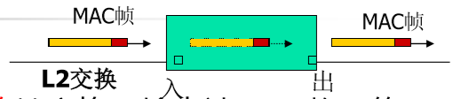
    
    - 三层交换 
    
      - 根据分组的宿地址和路由表，在路由器上实现分组的交换 
    
      - 三层交换机：简化的路由器，二层功能+IP路由，效率高 
    
        
    
        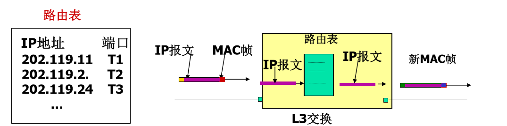
        
        
        
        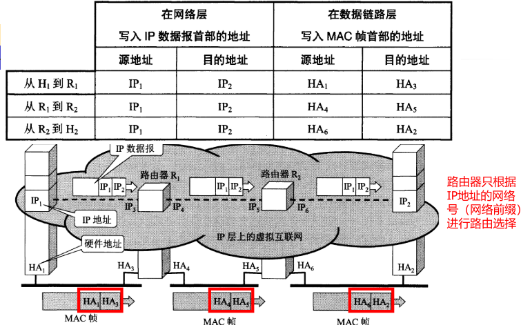
  
- 虚拟局域网 (virtual LAN)

    - 传统的局域网
        - 以物理网段为基本网络用户单位，如果一个节点接到一个网络设备（HUB、中继器、网桥或交换机）上，那么，它就与其他接在同一设备上的节点属于同一个局域网，可以互发广播报文
    - 虚拟局域网简称VLAN，跨接不同物理LAN网段的节点连接成逻辑 LAN网段，处于不同物理网段的用户通过软件设置处于同一局域网中， 形成逻辑的工作组。在同一逻辑工作组中的节点可以互发广播报文
    - 不同网段上的用户不能处于同一网段中
    - VLAN通信
        - 隔离二层广播域：严格地隔离了各个VLAN之间的任何流量，即不同VLAN之间的流量不能直接跨越VLAN的边界
        - VLAN直接通信需要使用路由，通过路由将报文从一个VLAN转发到另外一个VLAN

# Chapter 7

-   Internet

    

    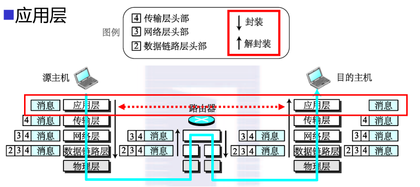

    -   应用层
        -   工作模式
            -   客户机-服务器
            -   

---

-   TCP <small>Transmission control protocol</small>

    -   在IP的基础上，支持面向连接的、可靠的、面向流的投递服务

    -   面向流的投递服务

        -   无结构字节流，收发字节顺序完全一致，根据对方给出的窗口值和网络拥塞程度决定//todo

    -   TCP模块之间建立点对点连接（虚电路）//todo

    -   套接字（socket）

        -   IP:socket
        -   五元组
            -   协议
            -   源IP
            -   源端口
            -   目的IP
            -   目的端口

    -   TCP报文格式

        -   //todoTCP首部最小长度20byte
    
-   TCP建立连接
  
    -   三次握手
        -   //todo
        -   [x] ACK
        -   [ ] NAK(直接丢弃)
    
-   TCP拆除连接
  
    -   四次确认
        -   //todo
    
-   TCP可靠传输
  
    -   校验
    
    -   字节为单位，体积可变的滑动窗口（可靠传输、流量控制）
    
        -   TCP建立连接阶段，双方协商窗口尺寸，接收方预留数据缓存区
            -   发送方根据协商结果，发送符合窗口尺寸的数据字节流，并等待对方确认
            -   发送方根据确认信息，改变发送窗口的尺寸
    
        <small>确保了可靠性和流量控制</small>
    
    -   超时重传
    
    -   拥塞控制&流量控制
    
        -   慢启动
            -   拥塞避免
            -   快重传
            -   快恢复
    
-   网络层

    -   IP 数据投递服务
        -   不可靠、无连接、尽力而为的服务
            -   ICMP
    -   IP地址段类型和划分
    -   专用IP地址
    -   10.xx.xx.xx
    -   172.16.00.00~172.31.255.255
    -   192.168.9.0~192.168.255.255
    -   IP地址分配
        -   子网掩码
        -   CIDR
    -   路由表
    -   IP路由过程
    -   分层次的路由信息协议
        -   局域网
        -   路由信息协议(RIP)
            -   分布式、基于向量的路由选择协议
            -   每一个路由器维护从它自己到每一个目的网络的距离记录（跳数）
            -   **不能在两个网络之间同时使用多条路由**
            -   仅和相邻路由器交换信息
        -   开放最短路径优先（OSPF Open shortest path first）
            -   Dijkstra算法
            -   使用洪泛传播ISP
            -   多路径间的负载均衡

-   数据链路层

    -   地址映射
    -   IP地址寻址ARP
    -   物理地址（e.g. MAC address）寻址

# Chapter 8

-   网络安全措施
    -   网络操作系统安全
    -   局域网安全
    -   Internet互联安全

-   数据安全
    -   加密/解密技术
    -   密钥管理
    -   数字签名
    -   认证技术
    -   防火墙技术
        -   区分内外网
    -   数据加密算法
        -   算法公开、密钥保密
        -   对称密钥加密
            -   高强度高效率
            -   密钥管理复杂
            -   一对一
        -   非对称密钥加密
            -   加密效率低
            -   密钥管理有优势、密钥分配协议
            -   多对一单项保密通信
            -   加密算法混合使用
        -   内容完整性检查
            -   信息摘录技术
                -   防重放攻击
                    -   时间戳
                    -   序列号
        -   数字签名
            -   信息摘录
            -   非对称加密
        -   认证技术
            -   消息验证
                -   数字签名
            -   身份验证
                -   秘密信息
                    -   口令
                -   物理安全
            -   抗否认、防抵赖服务
            -   第三方认证
            -   内容保密
            -   内容完整性
            -   序列完整性
            -   实体鉴别
            -   抗发方否认
            -   抗收方否认

# Chapter 9

-   简单网络管理协议SNMP
    -   协议数据单元PDU
    
        🚧稍后继续🚧