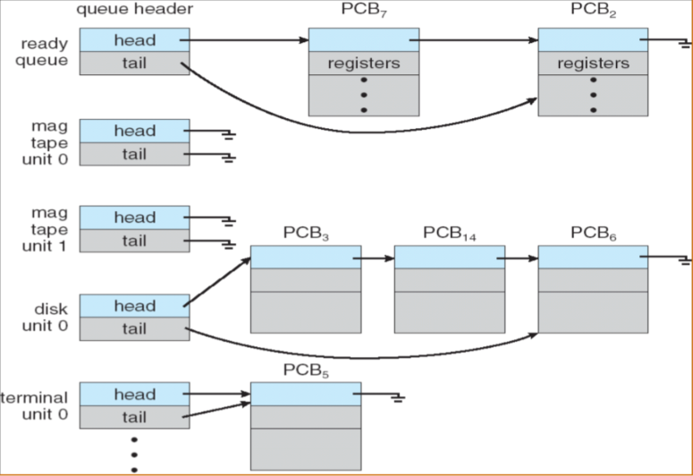

---

title: 操作系统原理总结
date: 2019-06-18 23:03:06
cover: https://raw.githubusercontent.com/HanyuuFurude/TechBlog/master/res/rm.png
tags: 
	- os
	- review
categories:
	- review
---

[TOC]

# Chapter 1 Introduction

- System view
  _ Resource allocator
  _ Control program

- Dual-Mode Operation
  _ User mode
  _ Kernel mode
  _ privileged instruction
  _ 
  _ 
  _ Hardware
  _ **CPU protection**
  _ **timer**
  _ **time sharing**
  _ **memory protection**
  _ **Base register**
  _ **Limit register**
  _ **I/O protection**
  _ **all I/O instruction are privilege instructions**

- Development of OS \* mainframe systems

      		*   NO OS
      		*   **batch systems**
      		*   **multiprogramming systems**
      		*   **time sharing systems**

      	*   desktop systems

      	*   multiprocessor systems

      	*   distributed systems

      	*   clustered systems

      	*   real-time systems

      	*   handheld systems

      	*   现代操作系统的特征

      		*   **并发性Concurrence**
      		*   **共享性Sharing**
      		*   **虚拟性Virtual**
      		*   **异步性Asynchronism**
      		*   提高CPU利用率，充分发挥并发性：**程序之间、设备之间、设备与CPU之间**均**并发**

      	*   Pr：

      		批处理系统、多道程序系统和分时系统的技术特性

# Chapter 2 Operating-System Structures

- 功能和服务的差别：
  - 功能对内：自行实现
  - 服务对外：可以调用其他功能代为实现
- common function of OS
  - process management
    - process synchronization
    - process communication
    - deadlock handling
    - (分布式)
  - main memory management
  - secondary-storage management
  - file management
  - I/O system management
- Operating System Services(Services for **helping users**)
  - Program execution
  - I/O operations
  - File-system manipulation
  - Communications
  - Error detection
  - Resource allocation
  - Accounting(审计)
  - Protection
- Operating System Interface
  - Interface to programs
    - **System calls**
      - System-call interface(SCI)
      - Application Programming Interface(API)
        - managed by runtime support library
    - 
    - 
      - Types of System calls
        - Process control
        - File management
        - Device management
        - Information maintenance
        - Communications
  - **PR. Why do user use APIs rather than system calls directory?**
  - **Ans**
    1.  跨平台能力（提供相同的 API 封装）移植性好
    2.  模块化封装，可维护性好
    3.  简化了程序编写
    4.  提高了执行效率
- Operating System Structure
  - Simple structure
  - Layered structure
    - virtual machines
  - Microkernel structure
    - Benefis
      - easier to extend
      - easier to port
      - more reliable
      - more secure
  - Modules
  - PR:设计操作系统时采用的模块化内核方法和分层方法在那些方面类似？那些方面不同？
- Operating system design and implementation
- 小结
  - 操作系统概念（管理资源、支持程序运行、方便用户使用的**程序集**）
  - 操作系统的基本目标：**方便性和高效性**
  - 引导程序：**中断、中断处理程序、中断向量**
  - 储存结构：内存（**小、易失**）二级储存（**大、非易失**）、分层结构
  - I/O 结构：设备控制器（本地缓冲）、DMA
  - 硬件保护：**双重模式操作、特权指令、I/O 保护、内存保护、CPU 保护**
  - 操作系统的发展：e.g: 多道程序设计
  - 操作系统的功能：进程（CPU）管理、内存管理、磁盘管理、文件管理、I/O 管理、**用户接口**
  - 操作系统服务：**程序执行、I/O 操作、文件系统操作、通信、错误检测与处理**、资源分配、统计、保护
  - 操作系统接口：用户接口（CLI、GUI）、程序接口（**系统调用（参数传递、类型）**）、SCI、API
  - 操作系统结构

# Chapter 3 Process

- Process

  - test section(program code)
  - **program counter**
  - **contents of the processer's registers**
  - Heap-stack
  - data section
  - 
  - 
  - **Characteristic of process**
    - **Dynamic 动态性**
    - **Independency 独立性**
    - **Concurrence 并发性**
    - **Structure 结构化**
  - PR.进程和程序是两个密切相关的概念，请阐述他们之间的区别和联系
  - Process state
  - 
  - 
  - Process control block(PCB)
  - 
  - 

- Process scheduling queues

  - Job queue (in main memory)
    - Ready queue
    - device queues
      - process migration between the various queues
      - 
      - 
      - 
      - 
    - Schedulers
      - Long-term scheduler(秒级、分钟级，作业调度)
      - Short-term scheduler(毫秒级，CPU 调度)
      - Medium-term scheduler(swapping)
    - I/O bound process
    - CPU bound process
    - Context switch
      - The **context** of a process is represented in **PCB** of the process and includes the values of CPU registers.
      - 保存执行后的上下文信息
      - 上下文切换会带来开销
      - 尽量减少上下文切换以减少开销
      - 
      - 

- Operation on Process

  - Process creation

    - child process(unique process identifier(int)), tree of process

    - resource sharing

      - parent and children shall all resources
      - children share subset of parent’s resources
      - parent and child share no resources

    - Execution

      - Parent and children execute concurrently
      - Parent waits until children terminate

    - Address space

      - child duplicate of parent

      - child has a program loaded into it (new text section)

      - UNIX examples

        - fork() :create new process

        - exec() :used after a fork to replace the process’s memory space with a new program

          

        - 

        - ```c++
          pid = fork();
          if(pid<0)	/* error occured */
          {
              printf(stderr,"Fork failed");
              exit(-1);
          }
          else if(pid==0)	/* child process */
          {
              execlp("/bin/ls","ls",NULL);
          }
          else	/* parent process */
          {
              wait(NULL);	/* wait for child process to finish */
              printf("Child complete");
              exit(0);
          }
          ```

      - Process Termination

        - exit() process executes last statement and asks the operating system to delete it
          - output data from child to parent (via wait)
          - Process’s resources are deallocated by OS
        - abort() parent may terminate execution of children process
          - child has exceeded allocated resources
          - task assigned to child is no longer required
          - parent is exiting <small>^\*^not all of the operation system supports **Cascading termination(级联终止)**</small>

- Inter-process Communication(**IPC**)

  - **Independent** process cannot affect or be effected by the execution of another process

  - **Cooperating** process can affect or be effected by the execution of another process

    - Advantages

      1.  Information sharing

      2.  Computation speed-up

      3.  Modularity

      4.  Convenience

  - **Shared memory & Message passing**

    

    

    - Shared-memory Systems

          	- requiring communication process to establish a region of shared memory
          	- a shared memory region resides in the address space of the process creating the shared memory segment
          	- the processes are responsible for ensuring that they are not writing to the **same location simultaneously**
          		- Producer-Consumer Problem

    - Message-passing Systems

          	- MPS has two operations

          		- send()
          		- receive()

          	- communication link

          		1. link may be unidirectional or bidirectional (双向)

          		2. a link may be associated with many processes

          		- direct communication

          			- send(P,message) send a message to process P
          			- receive(Q,message)  receive a message from process Q

          		- indirect communication

          			- mailboxes

          				- each mailbox has a unique id

          				- two processes can communicate only if the share a mailbox

          				- Operations

          					> 1. create a new mailbox
          					> 2. send and receive messages through mailbox
          					> 3. destroy a mail box

    - Synchronization

          	- Blocking: synchronous
          	- Non-blocking: asynchronous

    - Buffering

          	- **Zero capacity** sender must wait for receiver
          	- **Bounded capacity** finite length of $n$ messages, sender must wait if link full
          	- **Unbounded capacity** infinite length, sender never blocks

- Communication in Client-Server System

  - **Sockets**
  - **Remote Procedure Calls**
  - **Remote Method Invocation (Java)**

# Chapter 4 Threads

- Multithreading Models

  - A thread is a flow of control within a process

  - thread is a **basic** unit of CPU execution (known as light weight Process(LWP))

  - process (heavy weight process(HWP)) has a **single** thread of control

  - multithreaded process contains several **different** flows of control within the **same** address space

  - Thread

    - has

      - thread ID
      - program counter
      - register set
      - stack

    - share

      - code section

      - data section

      - other OS resources(file and signals)

        ```

        ```

      - Benefits

        ```
        - resource sharing
        - economy(low cost in overhead of creating and context-switch)
        ```

    - User Threads

      - user threads are supported above the kernel. The kernel is **not** aware of user threads

      - Library provides all support for thread creation, termination, joining and scheduling

      - more efficient(no kernel intervention)

      - if one thread is blocked, every other threads of the same process are also blocked(containing process is blocked)

        

        

      - Kernel Threads

        - kernel threads are usually **slower** than the user threads

        - blocking one thread will **not** cause other threads of the same process to block

        - the kernel can schedule threads on different processors(in a multiprocessor environment)

          

          

          **Pr.**

          1. 进程和线程之间的区别和联系
          2. 用户级线程和内核级线程的区别

    - Multithreading models

      - many to one

        - only one thread in the one process can access the kernel at a time
        - true concurrency is not gained

        

        

      - one to one

        - each user-level thread maps to kernel thread

        - providing more concurrency

        - restricting the number of threads supported by the system

          

          

      - many to many

        - allow many user level threads to be mapped to many kernel threads

          

          

- Thread Libraries

  - status
  -

  ```C++
  int pthread_create(tid,attr,function,arg);
  /*
   * pthread_t *tid
   	handle of created thread
   * const pthread_attr_t *attr
   	attribes of thread to be created
   * void *(*function)(void)
   	function to be mapped to thread
   * void * arg
   	single argument to function
   */
  int pthread_join(tid,val_ptr);
  /*
   * pthread_t *tid
   	handle of joinable thread
   * void ** var_ptr
   	exit value rturn by joined thread
   */
  void pthread_exit(void *status);
  int pthread_cancel(pthread_t thread);	//terminated immediately
  int pthread_kill(pthread_t thread,int sig);
  ```

  - CreateThread
  - GetCurrentThreadId
  - GetCurrentThread
  - SuspendThread/ResumeTread
  - ExitThread
  - TerminateThread
  - GetExitCodeThread
  - GetThreadTimes

- Threading Issues

- Operating System Examples

- //TODO 关于线程的实现

- **Pr.**

  - 信号机制和中断机制的异同

- Thread Pools

  - advantages - faster to service a request(save the time to create new thread) - allow the number of threads in the application to be bound to the size of the pool

- Thread specific data

  - threads belonging to a process share the data of the process
  - allows each thread to have its own copy of data
  - when using a thread pool, each thread may be assigned a unique identifier

- Scheduler activations

- **upcalls**

# Chapter 5 CPU Scheduling

- Maximum CPU utilization obtained with multiprogramming

- The success of CPU scheduling depends on an property of processes:**CPU-I/O Burst Cycle**

  - process execution consists of a **cycle** of CPU execution and I/O wait.

- CPU-bound

  - a few very long CPU bursts

- I/O-bound

  - many short CPU bursts

  

  

- When the CPU is idle, the OS must select another ready process to run

- This selection process is carried out by the **short-term scheduler**

- The CPU scheduler selects a process from **the ready queue** and allocates the CPU to it

- There are many ways to organize the ready queue<small>(e.g. FIFO)</small>

  

  

- Circumstances that scheduling may take place

  - A process switches from the running state to the terminated state(finished)

  - A process switches from the running state to the wait state(e.g. IO operation)

    ↑ 主动操作 ↑ 非抢占式调度

    ***

    ↓ 被动中止 ↓ 抢占式调度 → 同步机制

  - A process switched from the running state to the ready state(e.g. a interrupt occurs)

  - A process switches from the wait state to the ready state(e.g. I/O completion)

  - A process switches from the new state to ready state(e.g. a higher priority process ready)

  - Preemptive(抢占式)

    - cost associated with access to **shared data**
    - When the kernel is in its **critical** section modifying some important data .
    - special attention to situation

  - Non-preemptive

    - scheduling occurs when a process **voluntarily terminates**(主动结束) (case1)or enters the wait state(case2)
    - simple but very inefficient

  **Pr.**

  ​ 对于计算中心，抢占式调度和非抢占式调度哪一种比较适合

  - Dispatcher(调度) module
    - switching context
    - switching to user mode
    - jumping to the proper location in the user program to restart that program
  - Dispatch latency
    - the dispatcher should be as fast as possible

- Scheduling criteria

  - CPU utilization

    - keep the CPU as busy as possible
    - lightly|40%|-|90%|heavily

  - Throughput(吞吐)

    - higher throughput means more jobs get done

    <small>吞吐量和 CPU 利用率有相关性但并没有直接关系</small>

  - Turnaround time

    - The time period from job submission to completion is the turnaround time

    $$t_{turnaround}=\\t_{waitingTimeBeforeEnteringTheSystem}+\\ t_{waitingTImeInTheReadyQueue}+\\t_{waitingTImeInAllOtherEvents}+\\t_{timeTheProcessActuallyRunningOnTheCPU}$$

- Waiting time

  - time in ready queue

- Response time

  - the time form the submission of a request

- Optimization Criteria

  - MAX CPU utilization
  - MAX throughtput
  - MIN turnaround time(average)
  - MIN waiting time
  - MIN response time

- 为什么需要 CPU 调度


    大多数任务是CPU和I/O交替使用，

    导致CPU和I/O至少有一个空闲，

    通过调度让需要执行I/O的任务去执行I/O。

    把CPU给需要CPU的任务运行。

- **Scheduling Algorithms**

  - First-Come-First-Served Scheduling (FCFS)

    - can easily implemented using a queue
    - not preemptive
    - convoy effect (护航效应)
    - troublesome for time-sharing systems

  - Short-Job-First Scheduling (SJF)

    - sorted in next CPU burst length
    - can be nonpreemptive and preemptive
    - **minimum average waiting time for a given set of process**
    - predict CPU burst: exponential averaging
    - long jobs may meet **starvation**!!!

  - Priority Scheduling

    - each process has a **priority**

    - priority may be determined internally or externally

      - internal priority
        - time limits
        - memory requirement
        - number of files
        - etc.
      - external priority
        - importance of the process (not controlled by the OS)

    - starvation/Indefinite block

      a lower priority may never have a chance to run

      - Aging
        - gradually increase the priority of process what wait in the system for a long time

  - Round_Robin Scheduling (RR)(轮询)

    - designed for time-sharing systems
    - each process is assigned a time quantum/slice
    - If the process uses CPU for less than one time quantum, it will release the CPU voluntarily (主动退出)
    - when one time quantum is up , that process is preempted by the scheduler and moved to the tail of the list
    - Typically, higher average time than SJF, better response time
    - time quantum is too large → FCFS
    - time quantum is to small → processor sharing (并发)
      - _shorter time quantum means more context switches_
    - in general, 80% of the CPU bursts should be shorter than the time quantum
    -

  - Multilevel Queue Scheduling (多级队列)

    - partitioned into separate queues

      - foreground (interactive)
      - background (batch)

    - Each process is assigned permanently to one queue based on some properties of the process

    - Each queue has its own scheduling algorithm

      - foreground - RR

      - background -FCFS

        

      

      - Scheduling must be done between the queues
        - Fixed priority scheduling (possibility of starvation)
        - Time slice
          - each queue gets a certain amount of CPU time which it can schedule amongst its processes

  - Multilevel Feedback Queue Scheduling

    - allows process to move between queues

    - aging can be implemented this way

    - If a process use more/less CPU time, it is moved to a queue of lower/higher priority → I/O/CPU-bound process will be in higher/lower priority queues

    - exp

      

      

    * number of queues
    * scheduling algorithms for each queue
    * method used to determine when to upgrade a process
    * method used to determine when to demote a process
    * method used to determine which queue a process will enter when that process needs service

- Multiple-Processor Scheduling

  - Homogeneous(同构) processors
  - Load balancing
    - push migration
    - pull migration
  - Asymmetric multiprocessing (非平衡处理)
    - only on processor accesses the system data
      - alleviating(降低) the need for data shring
  - Symmetric multiprocessing (SMP)
    - two processors do **not** choose the same process
  - Processor Affinity (侵核)
    - most SMP systems **try** to avoid migration of processes from one processor to another
      - Soft/Hard Affinity (执行过程中可以/不可以侵核)

- Real-Time Scheduling

  - Hard real-time systems
  - the scheduler either **admits** a process and guarantees that the process will complete on-time, or **reject** the request (resource reservation)
  - secondary storage and virtual memory will cause unavoidable delay
  - Hard real-time systems usually have special software on special hardware

- Soft real-time systems

  - easily doable(可行) within a general system
  - may cause unfair resource allocation and longer delay(starvation) for noncritical tasks.
  - the CPU scheduler must **prevent aging** to occur(critical tasks may have lower priority)
  - **The dispatch latency must be small**

- Priority Inversion

  - a high-priority process needs to access the data that is currently being accessed by a low-priority process → The high-priority process is blocked by the low-priority process
  - priority-inheritance protocol

- Thread Scheduling

  - User-level threads
    - thread library
  - Kernel-level threads
    - scheduled by OS
  - user-level threads must ultimately be mapped to an associated kernel-level thread
  - Local scheduling → User-level Thread
    - Process-contention Scope (PCS)
  - Global Scheduling → Kernel-level Thread
    - System-contention Scope (SCS)

- Algorithm Evaluation

  - Deterministic modeling (Analytic evaluation) 确定情况下 的情形证明

  - Queueing models 队列模型

  - Simulations 仿真

  - Implementation 证明

    <small>从上往下证明力越强，越难证明</small>

- Operating System

  - Scheduling threads using **preemptive** and **priority-based** scheduling algorithms (Real time, system, time sharing, interactive)
  - The default scheduling class for a process is time sharing (multilevel feedback queue)

# Chapter 6 Process Synchronization

- Bounded-buffer

      	``` c++
      	//Shared data
      	#define BUFFER_SIZE 10
      	typedef struct
      	{
      	    //...
      	} item;
      	item buffer[BUFFER_SIZE];
      	int in = 0;
      	int out = 0;
      	int counter = 0;

      	//Producer process
      	item nextProduced;
      	while(1)
      	{
      	    while(counter == BUFFER_SIZE);
      	    	//do nothing
      	    buffer[in] = nextProduced;
      	    in = (in + 1) % BUFFER_SIZE;
      	    counter++;
      	}

      	//Consumer process
      	item nextConsumed;
      	while(1)
      	{
      	    while(counter == 0)
      	        //do nothing
      	    nextConsumed = buffer[out];
      	    out = (out + 1) % BUFFER_SIZE;
      	    counter--;
      	}
      	```

- **Atomic operation**

      	- counter++
      	- counter—

- Race condition

      	- two or more processes/thread access and manipulate the same data concurrently
      	- the outcome of the execution depends on the particular order in which the access takes place
      	- To prevent race conditions, concurrent processes must be synchronized

- The Critical-Section Problem

      	- Each process has a code segment, called critical section

      	- **Problem**: ensure that when one process is executing in its critical section, no other process is allowed to execute in its critical section

      	- The critical-section problem is to design a protocol that processes can use to cooperate

      		┌────────────┐

      		|    entry section      |

      		├────────────┤

      		|    critical section    |

      		├────────────┤

      		|       exit section      |

      		├────────────┤

      		|remainder section |

      		└────────────┘

      		**critical section must run in a mutually exclusive way.**

- Solution to Critical-Section Problem

      	- Mutual Exclusion (互斥、忙等) → 防止冲突
      	- Progress (空闲让进) → 进展性
      	- Bounded Waiting (有限等待) → 进展性
      		- <small>防止饥饿，让权等待，多CPU：死锁</small>
      	- **the solution cannot depend on relative speed of processes and scheduling policy**
      	- Mutual Exclusion

- Bakery Algorithm

      	``` c++
      	//shared data
      	boolean choosing[n];	//false
      	int number[n];			//0
      	do
      	{
      	    choosing[i] = true;
      	    number[i] = max(number[0],number[1],...,number[n-1])+1;
      	    choosing[i] = false;
      	    for(j = 0; j < n; ++j)
      	    {
      	        while(choosing[j]);
      	        while((number[j] != 0)&&((number[j],j)<(number[i],i)));
      	    }
      	    //critical section
      	    number[i] = 0;
      	    //remainder section
      	}while(1)
      	```

- Interrupt Disabling

      	- disable interrupts → critical section → enable interrupts
      	- When interrupts are disabled, no context switch will occur in a critical section
      	- Infeasible in a multiprocessor system because all CPUs must be informed
      	- Some feature that depend on interrupts (e.g. clock) may not work properly

- Mutual Exclusion (互斥锁)

      	- TestAndSet

      		``` c++
      		boolean TestAndSet(boolean &target)
      		{
      			booean rv = &target;
      		    &target = true;
      		    return rv;
      		}
      		```

      		``` c++
      		//shared data
      		boolean lock = false;
      		//Process P
      		do
      		{
      		    while(TestAndSet(lock));
      		    //critical section
      		    lock = false;
      		    //remainder section
      		}
      		```

- Swap

      	- **atomically** swap two variables

      		``` c++
      		void Swap(boolean &a,boolean &b)
      		{
      		    boolean temp = &a;
      		    &a = &b;
      		    &b = temp;
      		}
      		```

      		``` C++
      		//Global shared data
      		boolean lock;	//false
      		//Local variable for each process
      		boolean key;
      		Process Pi
      		do
      		{
      			key = true;
      			while(key == true)
      		    {
      		    	Swap(lock,key);
      		    }
      		    //critical section
      		    lock = false;
      		    //remainder section
      		}
      		```

- Semaphores

      	``` c++
      	wait(S)
      	{
      		while(S <= 0);
      			--S;
      	}

      	signal(S)
      	{
      	    ++S:
      	}
      	```

      	- Count semaphore
      	- Binary semaphore (mutex locks)

- busy waiting (Spinlock)

- block itself (阻塞方法，使用 PCB 唤醒)

      	- Define a semaphore as a record

      		```
      		typedef struct
      		{
      		    int value;
      		    struct process *L;	//waiting queue
      		}semaphore;
      		```

      		- block()
      		- wakeup(P)

      		``` c++
      		wait(S)
      		{
      		    S.value--;
      		    if (s.value < 0)
      		    {
      		        //add this process to S.L;
      		        block();
      		    }
      		}
      		signal(S)
      		{
      			S.value++;
      		    if(S.value <= 0)
      		    {
      		        //remove a process P from S.L;
      		        wakeup(P);
      		    }
      		}
      		```


    	- if the semaphore is negative, its magnitude is the number of process waiting on that semaphore
    	- Busy waiting has not been **completely** eliminated
    	- furthermore, we have limited busy waiting to the critical sections of the wait() and signal() operations

- Deadlock and Starvation

      	<small>临界资源、同步关系</small>

      	- Bounded-Buffer Problem

      		``` C++
      		//Shared data
      		Semaphore full = 0,empty = n,mutex = 1;
      		do	//Producer
      		{
      		    //produce an item in nextP
      		    wait(empty);
      		    wait(mutex);
      		    //add nextP to buffer
      		    signal(mutex);
      		    signal(full);
      		}while(1);

      		do	//Consumer
      		{
      		    wait(full);
      		    wait(mutex);
      		    //remove an item from buffer to nextC
      		    signal(mutex);
      		    signal(empty);
      		    //consume the item in nextC
      		}while(1);
      		```

      	- Readers and Writers Problem

      		- Reader first
      		- Writer first

      		``` C++
      		//Shared data
      		int readcount;
      		semaphore wrt = 1,mutex = 1;
      		int readcount = 0;
      		do
      		{
      		    wait(wrt);
      		    //writing
      		    signal(wrt);
      		}while(1);
      		do		//Error: 写者饥饿问题
      		{
      		    wait(mutex);
      		    readcount++;
      		    if(readcount == 1)
      		        wait(wrt);
      		    signal(mutex);
      		    //reading
      		    wait(mutex);
      		    readcount--;
      		    if(readcount == 0)
      		        signal(wrt);
      		    signal(mutex);
      		}
      		```

      	- Dining-Philosophers Problem

      	- 过独木桥问题

      		```
      		//Shared data
      		int countA = 0;	//A方向上已在独木桥上的行人数目
      		int countB = 0;	//B方向上已在独木桥上的新人数目
      		semaphore MA = 1;	//countA的互斥锁
      		semaphore MB = 1;	//countB的互斥锁
      		semaphore mutex = 1;	//实现互斥使用
      		```

      		- A方向过桥

      			``` C++
      			do
      			{
      			    wait(MA);
      			    countA++;
      			    if (count == 1)
      			    {
      			        wait(mutex);
      			    }
      			    signal(MA);
      			    //过桥
      			    wait(MA);
      			    countA--;
      			    if(countA == 0)
      			    {
      			        signal(mutex);
      			    }
      			    signal(MA);
      			}while(1);
      			```

- Monitors (管程)

      	- High-level synchronization construct that allows the safe sharing of an abstract data type among concurrent processes

      		``` C++
      		monitor monitor-name
      		{
      			shared variable declarations
      			proceudre body P1()
      		    {
      		    	//...
      		    }
      		    	proceudre body P2()
      		    {
      		    	//...
      		    }
      		    //...
      		    {//initialization code}
      		}
      		```

      	- no more than one process can be executing within a monitor

      	- when a process calls a monitor procedure and the monitor has a process running, the caller will be blocked outside the monitor

      	- Mutual exclusion is guaranteed with in a monitor

      		

      		

- Condition variables

      - x,y

      	- x.wait() means that the process invoking this operation is suspended until another process invokes x.signal();
      	- x.signal() operation resumes exactly one suspended process. If no process is suspended, the signal() operation has no effect

      	

      	


      	|                          Semaphores                          |                     Condition Variables                      |
      	| :----------------------------------------------------------: | :----------------------------------------------------------: |

| Can be used anywhere, but not in a monitor | Can only be used in monitors |
| wait() does **not** always block its caller | wait() **always** blocks its caller |
| signal() either releases a process, or increase the semaphore counter | signal() either releases a process ,or the signal is **lost** as if it never occurs |
| If signal() release a process, the caller and the release **both** continue | If signal() release a process, either the caller or the released continues, but **not** both | - 管程是公用数据结构，进程是私有数据结构 - 管程集中管理共享变量上的同步操作，临界区分散在每个进程中 - 管程管理共享资源，进程占用系统资源和实现系统并发性 - 管程被欲使用的共享资源的进程调用，管程和调用它的进程不能并发工作，进程之间能并发工作 - 管程是语言或操作系统的成分，不必创建或撤销，进程有生命周期，有创建有消亡

# Chapter 7 Deadlocks

- system model

  - Deadlock
    - Resources types R~1~ ,R~2~ …,R~m~
    - CPU cycles, memory space, I/O devices, files and so on
    - each resource type R~i~ has W~i~ instances
    - request → use → release

- deadlock characterization

  - The conditions for deadlock

    - **mutual exclusion**
    - **hold and wait**
    - **no preemption**
    - **circular wait**

  - resource allocation graph

    - edges E,process P,resource R

      - request edge P~i~→R~j~

      - assignment edge R~j~→P~i~

        

        

        

        

        

        

        > 死锁一定循环，循环未必死锁
        >
        > 当实例只有一个资源时，有循环就会死锁
        >
        > 但是当实例有多个资源时，循环可能导致死锁（如上图）

* Methods for handling deadlocks

  - **Ensure** that the system will never enter a deadlock state
    - Prevention
      - break conditions
    - Avoidance
      - the OS needs more information to determine whether the current request can be satisfied of delayed
    - Allow the deadlock, detect it, and recover.
    - Just ignore it and pretend deadlocks will never happened. :)

* deadlock prevention

  - ~~Mutual Exclusion~~
  - hold and wait
    - a process must acquire all resources before it runs
    - when a process requests for resources, it must hold none
      - Resource utilization might be low, since many resources will be held and unused for a long time
      - starvation is possible. A process that needs some popular resources may have to wait indefinitely
  - No preemption
    - if a process that is holding some resources requests another resource that cannot be immediately allocated to it , then all resources currently being held are **preempted**(抢占)
      - if the requested resources are not available
        - if they are being held by process that are waiting for additional resources, these resources are preempted and given to the requesting process.
        - else, the requesting process waits until the requested resources become available. When it is waiting. its resources may be preempted
  - Circular wait
    - a process can only request higher than the resources types it holds
    - a process must release some higher order resources to request a lower resource

* deadlock avoidance

  - all of the process declare the maximum number of resources of each type that it may need

  - the deadlock-avoidance algorithm dynamically exam the resource-allocation state to ensure that there can never be a circular-wait condition

  - Resource-allocation state is defined by the number of available and allocated resources, and the maxium demands of the process

  - Safe state

  - single instance of a resource type

    - resource-allocation-graph algorithm
      - claim edge p~i~→p~j~ indicated that process p~i~ may request resource r~j~; represented by a dashed line
      - claim edge converts to request edge when a process requests a resource
      - when a resource is released by a process, assignment edge reconverts to a claim edge
      - resource must be claimed a prior in the system

  - multiple instances of a resource type

    - banker’s algorithm

          | process | max  | allocation | need |
          | ------- | ---- | ---------- | ---- |
          | P~0~ | [7,5,3] | [0,1,0] |[7,4,3]|

      | P~1~ | [3,2,2] | [2,0,0] |[1,2,2]|

      available[3,3,2]

* deadlock detection

  - maintain wait-for-graph and search for a cycle in the graph

    - nodes are process

    - P~i~→P~j~ is waiting for P~j~

    - search for a cycle

      

      

* recovery form deadlock

  - Pross termination
    - About all deadlocked process
    - About one process at a time until the deadlock cycle is established
  - Resource preemption
    - selecting a victim (minimize cost if possible)
    - rollback
      - return to some safe state restart process for that state
    - starvation
      - same process may always be picked as victim (aging)
      - include the number of rollback in the cost factor

# Chapter 8 Memory Management

- backgroud

  - Main memory and register are only storage CPU can access directly

    - a register access per CPU clock

    - a main memory access many CPU clcok

    - cache sites between main memory and CPU registers

      - memory protect
      - base and limit registers
      - hardware address protection
      - multistep processing of a user program
        - symbolic address
          - source program
        - relocatable address
          - object program
        - absolute address
      - complie time
        - absolute code
        - os, drive
      - load time
        - relocatable code
      - execution time
        - need hardware support
      - Logical & Physical address space
        - logical address
          - generated by the CPU; referred to as virtual address
        - physical address
          - seen by the memory unit
        - logical and physical addresses are the same in compile-time and load-time address-binding schemes and differ in execution

      

      

    - Memory-Management Unit(MMU)

      - maps logical address to physical address

      - the value in relocation(base) register is added to every address generated by a user process at the time it is sent to memory

      - The user program deals with logical addresses

        

        

    - Dynamic loading

      - linking and loading postponed until execution time

    - swapping

      - backing store: fast disk

      - ready queue

        - consisting of all processes on the backing store or in memory and are ready to run
        - major part of swap time is transfer time; total transfer time is directly proportional to the amount of memory swapped

        

        

- contiguous allocation

  - main memory is usually divided into two partitions

    - resident operation system
    - user processes

  - relocation register scheme used to protect user process from each other, and from changing operating system code and data

  - allocation types

    - fixed partitions

      - memory is divided into n partitions at the startup time and altered later on

      - each partition may contain exactly only one process

      - each partition may have a job queue. Or, all partitions share the same job queue

        

        

    - variable partitions

      - hole

      - when a process arrives, it is allocated memory from a hole large enough to accommodate it

      - the partition sized are not fixed

      - os maintains maintains information about

        - allocated partitions

        - free partitions

          

          


        * First fit

          * 性能较好

        * Best fit

          * 使用率最优

        * worst fit

          * 烂差

        * external fragmentation: hole

          * external fragmentation problem exists when there is enough total free memory space to satisfy a request, but the available spaces are not contiguous
          * compaction(一般不用 ,开销较大)
          * permitting the physical address space of the processes to be noncontiguous
            * paging and segmentation

        * internal fragmentation

          

          

- paging

  - physical memory: pages

  - logical memory: frames

  - page table

    - keep track of all free frames
    - to run a program of size n pages, need to find n free frames and load program
    - **Still have internal Fragmentation**

  - address generated by CPU can be divided into

    - Page number(p)

      - base address of each page

    - Page offset(d)

    - a 2^m^ space logical address

      | page number | page offset |
      | ----------- | ----------- |
      | p           | d           |
      | m-n         | n           |

    

    

    

    

    - most allocate a page table for each process
    - in the simplest case, the page table is implemented as a set of dedicated registers
    - The use of registers is fit for the small page tables and not is fit for the large page tables
    - page table is kept in main memory
    - page-table base register(PTBR) points to the page table
    - require two memory accesses, one for page table and another for memory

  - Implementation of page table(TLB)

  - the two memory access problem can be solved by the use of special fast-lookup hardware

    - associative memory or translation look-aside buffer

    | page# | frame# |
    | ----- | ------ |
    | xxx   | xxx    |

    - if page# is in associative register, get frame# out. Else, get frame# from page table

      

      

* some TLBs store address-space identifiers (ASIDs) in each TLB entry to provide address space protection for process

* Effective Access Time

  - Hit ratio(命中率)(assume memory cycle time is 1 microsecond)

    | $\alpha$                   | hit ratio                                                               |
    | -------------------------- | ----------------------------------------------------------------------- |
    | $\varepsilon$ time unit    | TLB lookup                                                              |
    | effective access time(EAT) | $(1+\varepsilon)\alpha+(2+\varepsilon)(1-\alpha)=2+\varepsilon--\alpha$ |

* Memory protection

  - page table length register(PTLR) stores the length of a process’s page table
  - read-only,read-write,or execute bits(r-w-e permission)

* Shared pages

  - share common code

  - one copy of read-only code for many process they need

    

    

* structure of page table

  - Hierarchical paging(分层)

    - common in 32 bits

    - two-level page table

    - a logical address is as follows

      

      

      - p~1~ is an index into the outer page table, and p~2~ is the displacement within the page of the outer page table(页目录表)

        

        

        

        

        - three-level paging scheme

          

          

  - hashed page tables

    - common in address spaces > 32 bits

    - The virtual page number is hashed into a page table.

      

      

  - inverted page tables

    - One entry for each real frame of memory.

    - Entry consists of the virtual address of the page stored in that real memory location, with information about the process that owns that page.

    - Decreases memory needed not to store each page table, but increases time needed to search the table when a page reference occurs.

    - Use hash table to limit the search to one or at most a few page-table entries.

      

      

* segmentation

  - a program is a collection of segments. A segment is a logical unit such as

    - main program, procedure, function , method, object, object, local variables, global variables, common block, stack, symbol table, arrays

    - logical address consists of <segment-number,offset>

    - segment table

      - base

      - limit

        

        

      - validation bit = 0 → illegal segment

      - read/write/execute privileges

        

        

# Chapter 9 Virtual Memory

- background

  - logic address space can be larger than physical address space
  - shares library using virtual memory
  - copy on write
    - process creation
    - copy on write(COW) allows both parent and child processed to initially share the same pages in memory
    - if either process modifies a shared page, then only the page is copied
    - COW allows more efficient process creation as only are copied
    - free pages are allocated from a pool of zeroed-filled pages

- demand paging

  - bring a page into memory only when it is needed

    - less I/O needed
    - less memory needed
    - faster response
    - more users

  - page is needed → reference to it

    - invalid reference → abort
    - not in memory → bring to memory

  - Lazy swapper(Pager)

  - valid-invalid bit

    - 1- valid and in memory
    - 0- invalid or not in memory(default)

  - page fault

    - invalid reference > abort

    - just not in memory

    - get empty frame

    - swap page into farame

    - reset tables validation bit = 1

    - restart instruction

      

      

      - page fault rate p
      - p==0, no page faults
      - p==1, every reference is a fault
      - Effective Access Time(EAT)
        - $EAT = (1-p)\times memory\ access\ time + p(page\ fault\ overhead)$
        - $page\ fault overhead = service  \ the \ page = fault \  interrupt+[swap\ page\ out]+swap\ page\ in+restart\ overhead$

- page replacement

  - large virtual memory can be provided on a smaller physical memory
  - same pages may be brought into memory several times

- basic page replacement

  - find a free frame and use it
  - if no frame free, use a page replacement algorithm to select a victim frame
  - write the victim frame to the disk and change the page and frame tables
  - read the desired page into the free frame. Update the page and frame tables
  - restart the process
  - use modify bit to reduce overhead of page transfers(if not modified,not write)
  - lowest page fault rate

- Algorithm

  - FIFO first in first out
  - LRU least recently used
  - LRU approximation algorithms
    - second chance algorithm
    - clock replacement(FIFO)
    - if the page to be replaced has reference bit = 1.then
      - set reference bit 0
      - leave page in memory
      - replace next page, subject to same rules
    - Reference bit
      - initially = 0
      - referenced bit =1
      - replace the one which bit is 0
    - keep a counter of the number of references that have been made to each page
    - LFU
      - replace pages with smallest count
    - MFU
      - based on the argument that the page with the smallest count was probably just brought in and has yet to be used
  - OPT 最佳置换算法

- allocation of frames

  - Fixed allocation
    - equal allocation
    - proportional allocation
      - allocation according to the size of the process
      - s~i~ = size of process p~i~
      - s=$\sum$s~i~
      - m=total number of frames
      - a~i~ = allocation for p~i~ = $\frac{s_i}{s}\times m$
  - priority allocation
    - use a proportional allocation scheme using priorities rather than size
    - if process p~i~ generates a page fault
      - select for replacement one of its frames
      - select for replacement a frame from a process with lower priority numebr
    - Global or local allocation
      - global
        - select from all frames
      - local
        - select from its own set

- thrashing(颠簸)


- if a CPU does not have “enough” frames, the page fault rate is very high

  - low CPU utilization
  - operating system thinks that it needs to increase the degree of multiprogramming
  - another process is added to the system

- A process is busying swapping pages in and out

- Why does paging work

  - locality model
    - a locality is a set of pages that are actively used together
    - process migrates form one locality to another
    - localities may overlap

- why does the trashing occur

  - size of locality > allocated memory size

- Working set model

- Δ ≡ working-set window ≡ a fixed number of page references

- WSS~i~ (Working set of process P~i~)

  - to small not encompass entire loclity

  - to large encompass several localities

  - ∞ encompass entire program

    

    

  - establish “acceptable” page fault rate

- memory-mapped files

- allocation-mapped files

- allocating kernel memory

  - treated different form user memory

  - often allocated from a free-memory pool

    - kernel requests memory for structures of varying sizes
    - some kernel memory needs to be contiguous

  - buddy system

    

    

  - slab allocator

    

    

- other consideration

  - prepaging
  - page size
    - fragmentation ,small page
    - table size, large page
    - I/O overhead, large page
    - locality, small page
    - TLB reach = TLB size x page size
      - multiple page size
    - program structure
    - I/O interlock

- operating system examples

# Chapter 10 File system interface

- file concept

  - a file is a named collection of related information that is recorded on secondary storage

  - contiguous logical address space

  - file structure

    - simple record structure
      - lines
      - fixed length
      - variable length
    - complex structures
      - formatted document
      - relocatable load file

  - arrributes

    - name
    - ldentifier
    - type
    - location
    - size
    - protection
    - time,date, and user identification
    - information about file are kept in the directory structure, which is maintained on the disk

  - operation

    - create
    - write
    - read
    - reposition within file - file seek
    - delete
    - truncate (截短)- erase the contents of a file but keep its arrtibutes
    - open
    - close
    - internal tables
      - per-process open file table
      - system-wide open file table

  - access methods

    - sequential access

      - rewind/read/wrire

    - direct access

  - directory structure

    - disks are split into on or more partitions
    - each partition contains information about files within it
    - the information is kept in entries in a device directory or volume table of contents

  - operation performed on directory

    - search for a file
    - create a file
    - delete a file
    - list a directory
    - rename a file
    - traverse the file system

  - organize the file directory(Logically) to obrain

    - efficiency = locating a file quickly
    - naming -convenient to users
      - two users can have same for different files
      - the same file can have several different name
    - grouping - logical grouping of files by properties

  - Directory

    - Pr

      - naming
      - grouping
      - pathname
      - same file for different user
      - efficient searching
      - grouping capability

    - single level directory

      

      

    - two level directory

      - separate directory for each user

        

        

    - Tree structured directories

      

      

      - efficient searching

      - grouping capability

      - current directory( working directory )

      - absolute / relative path name

      - creating a new file is done in current directory

      - delete a file

      - mkdir

      - acyclic graph directories

        - shared subdirectories and files

        - two different names(aliasing)

        - if dict deletes count > dangling pointer

        - solutions

          - backpointers, so we can delete all pointers
          - entry hold count solution

          

          

      - how to guarantee no cycles
        - allow only links to file not subdirections
        - garbage collecton
        - every time a new link is added use a cycle detection algorithm to determine whether it is OK

- file system mounting

  - a file system must be mounted before it can be accessed
  - an unmounted file system is mounted at a mount point

- file sharing

  - sharing of files on multi-user system is desirable
  - sharing may be done though a protection scheme
  - on distributed systems, files ay be shared across a network
  - network file system(NFS) is a common distributed file sharing method

- protection

  - owner / creator control
    - what can be done by whom
  - type of access
    - read
    - write
    - execute
    - append
    - delete
    - list

# Chapter 11 File system implementation

- file system structure

  - file structure
    - logical storage unit
    - collection of related information
  - file system resides on secondary storage(disks)
  - file system organized into layers
  - application programs > logical file system > file-organization module > basic file system > I/O control > devices

- file system implementation

  - file control block

    - file permissions
    - file dates
    - file owner, group, ACL
    - file size
    - file data blocks or pointers to file data blocks

  - in memory file system structures

    

    

  - virtual file systems

    - virtual file system(VFS) provide an object oriented way of implementing file systems
    - VFS allows the same system call interface (API) to be used for different types of file systems
    - The API is to the VFS interface, rather than any specific type of file system

- directory implementation

  - linear list of file names with pointer to the data blocks
    - simple to program
    - time consuming to exectute
  - Hash table - linear list with hash data structure
    - decreases directory search time
    - collisions - situations where two file names hash to the same location

- allocation methods

  - an allocation method refers to how disk blocks are allocated for files

    - contiguous allocation

      - simple

      - random access (sequential direct)

      - wasteful of space (dynamic storage allocation problem)

      - files cannot grow

        

        

        - extent-based systems
          - many newer file system use a modified contiguous allocation scheme
          - extent-based file systems allocate disk blocks in extents
          - an extent is a contiguous block of disks
            - extents are allocated for file allocation
            - a file consists of one or more extents

    - linked allocation

      - each file is a liked list of disk blocks

      - blocks may be scattered anywhere on the disk

        - simple

        - no waste of space

        - files can grow

        - no random access

        - each block contains a pointer, wasting space

        - blocks scatter everywhere and a large number of disk seeks may be necessay

        - reliability - if a pointer is lost or damaged?

          

          

        - file allocation table

        

        

    - indexed allocation

      - bring all pointers together into the index block

      - a file’s directory entry contains a pointer to its index. Hence, the index block of an indexed allocation plays the same role as the page table

        

        

      - random access

      - the indexed allocation suffers from wasted space. The index block may not be fully used

      - the number of entries of an index table determines the size of a file

        - Overcome
          - multiple index blocks, chain them into a inked list
          - multiple index blocks, but make them into a tree just like the indexed access method(multilevel)
          - a combination of both

- free space management

  - free space list

    - bit vector

      

      

      - block number calculation

        = number of bits per word \*

        number of 0-value words +

        offset of first 1 bit

      - requires extra space

      - easy to get contiguous files

    - linked list

      - cannot get contiguous space easily

      - no waste of space

        

        

    - grouping

      

      

    - address counting

      - to make list short with the following trick

        - blocks are often allocated and freed in groups

        - for every group, we can store the address of the first free block and the number of the following n free blocks

          

          

    - linked list + grouping
    - linked list + address + count

- efficiency and performance

  - efficiency dependent on
    - disk allocation and directory management algorithms
    - type of data kept in file’s directory entry
  - performance
    - disk cache
    - free-behind and read-ahead (optimize sequential access)
    - virtual disk, ram disk , etc.
  - page cache

- recovery

  - consistency checking
  - back up data from disk to another
  - recover lost file or disk by restoring data from backup

- log structured file systems (审计和统计)

  - record each update to the file system as a transaction
  - all transactions are written to a log

- NFS

  - network file system

# Chapter 12 mass storage structure

- disk structure

  

  - magnetic disks provide bulk of secondary storage of modern computers
    - transfer rate
      - data flow between drive and computer
    - positioning time
      - random access time
        - time to move disk arm to desired cylinder (seek time) and time for desired sector to rotate under the disk head (rotational latency)
        - head crash results from disk head making contact with the disk surface
    - disk can be removeable
    - attached to computer via I/O bus
      - host controller in computer uses bus to talk to disk controller built into drive or storage array
    - logical blocks
      - sector 0 outmost
      - from outmost to inner most

- disk attachment

  - host attached via an I/O port
  - network attached via a network connection

- disk scheduling

  - access time
    - seek time
    - rotational latency
  - disk bandwidth

    - the total number of bytes transferred, divided by the total time between the first request for service and the completion of the last transfer

  - FCFS
  - SSTF(shortest seek time first)

  - may cause starvation of some requests

  - SCAN - elevator algorithm

  - C-SCAN

    - provide a more uniform wait time than SCAN

      

      

  - C-LOOK

    

    

  - SSTF is common and has natural appeal

  - SCAN and C-SCAN perform better for systems that place a heavy load on the disk

  - either SSTF or LOOK is a reasonable choice for the default algorithm

  - performance depends on the number and types of reuests

  - requests for disk service can be influences by the file-allocation method

- disk management

  - disk formatting

    - low-level formatting, of physical formatting

      - dividing a disk into sectors that the disk controller can read and write

        

        

      - partition

      - logical formatting

        - making a file system

  - boot block

    - boot block initializes system

      - the bootstrap is stored in ROM
        bootstrap loader program

        

        

  - Error handling

    - a disk track with a bad sector

    - substituting a spare for the bad sector

    - shifting all the sectors to bypass the bad one

      

      

- swap space management

  - swap space
    - swap space can be carved out of the normal file system, or, more commonly, it can be in a separate disk partition

- RAID structure

  - Redundant Array of Independent Disk (冗余磁盘阵列)

  - improves reliability via redundancy and performance via parallelism

  - raid is arranged into dix different levels

    

    

- stable storage implementation

- tertiary storage devices

​
