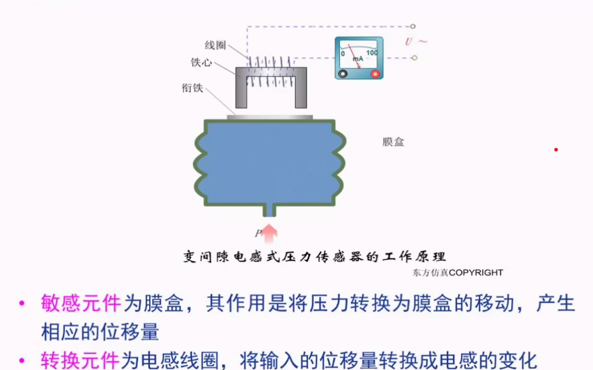
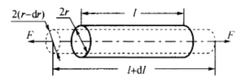
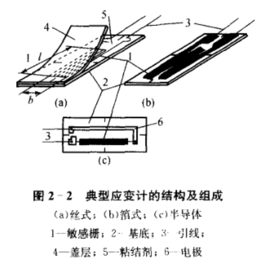
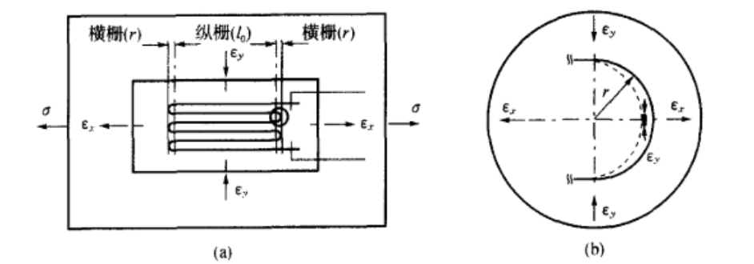
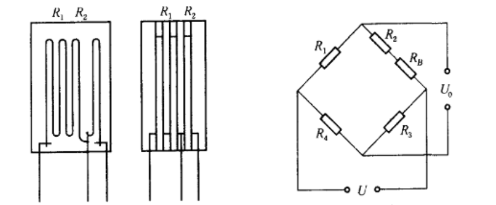
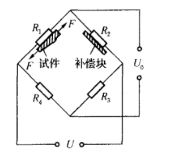
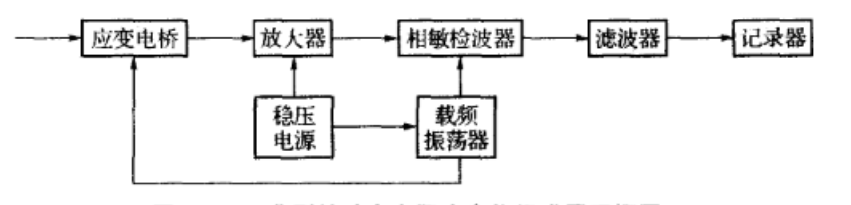
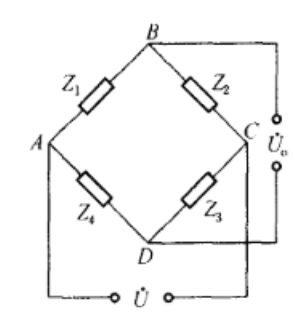
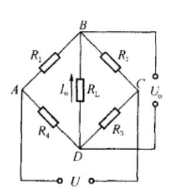
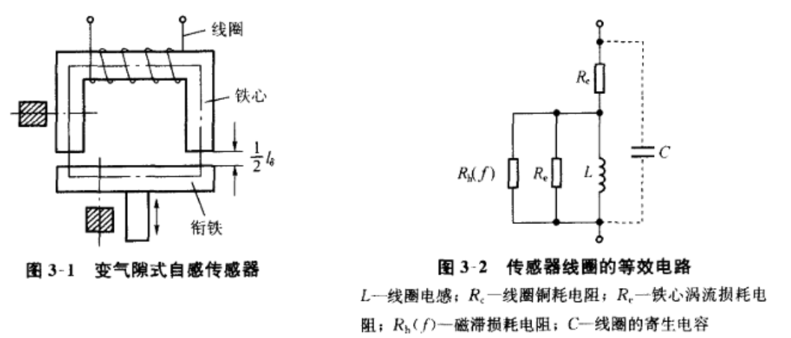

---

title:  传感器导论
date: 2020-03-11 23:03:06
tags: 
	- sensor
	- review
categories: review
---
# Chapter 1

## 传感器

*  传感器

  * 将被测信号转换为电/光信号

* 组成
  * 敏感元件

  * 转换元件

  * 转换（测量）电路

  * e.g.

    

  * 测量分类

    * 被测量
      * 热工量
        * 温度、热量、比热；压力、压差、真空度；流量、流速、风速
      * 机械量
        * 位移（线、角）、尺寸、形状；力、力矩、应力、；重量、质量；转速、线速度、震动幅度、频率、加速度、噪声；
      * 物性和成份量
        * 气体、液体化学成分；酸碱度、盐度等
      * 状态量
        * etc
    * 原理
      * 电阻式
      * 光电式
      * 电感式
      * 谐振式
      * 电容式
      * 霍尔式
      * 阻抗式
      * 超声式
      * etc……

  * 分类目的

  * 一般要求

    * 足够的容量（量程）
    * 灵敏度高，精度适当
    * 响应速度快，工作稳定，可靠性好
    * 使用性和适应性强使用经济

---

数据丢失

---

### 传感器的选择标准

* 依据测量对象和使用条件选定传感器类型
* 了解使用条件
* 线性范围与量程
* 灵敏度
* 精度
* 频率响应特性
* 稳定性

### 传感器的标定和校准

* 静态标定
* 动态标定

# Chapter 2 电阻式传感器

## 基本结构

### 应变电阻效应

设有一段长为$l$，截面积为$A$，电阻率为$\rho$的固态导体，有
$$
R=\rho\frac{l}{A}
$$

有($\mu$:导体材料的泊松比)
$$
\frac{dR}{R}=(1+2\mu)\epsilon+\frac{d\rho}{\rho}
$$

### 金属材料的应变电阻效应

金属材料电阻率相对变化与体积相对变化的关系
$$
\frac{d\rho}{\rho}=C\frac{dV}{V}
$$

$$
\frac{\Delta R}{R}=[(1+2\mu)=C(1-2\mu)]\epsilon=K_m\epsilon\\
K_m=(1+2\mu)=C(1-2\mu)
$$

### 半导体材料的应变电阻效应

#### 压阻效应

$$
\frac{d\rho}{\rho}=\pi\sigma=\pi E\epsilon
$$

$\sigma$:作用于材料的轴向盈利，$\pi$：半导体材料在受力方向的亚族系数，$E$:半导体材料的弹性模量
$$
\frac{\Delta R}{R}=[(1+2\mu)+\pi E]\epsilon = K_s\epsilon\\
K_m=(1+2\mu)+\pi E
$$

### 导电丝材料的应变电阻效应

$$
\frac{\Delta R}{R}=K_0\epsilon\\
K_0:导电丝材料的灵敏系数
$$

## 电阻式应变计的材料和类型

## 电阻应变计的主要特性

### 静态特性

#### 灵敏系数

在一定应变范围内有
$$
\frac{\Delta R}{R}=K\epsilon_x\\
\epsilon_x:应变计轴向应变
$$

#### 横向效应

$$
\frac{\Delta R}{R}=K_x\epsilon_x+K_y\epsilon_y=K_x(1+\alpha H)\epsilon_x\\
K_x:纵向灵敏系数
K_y:横向灵敏系数
$$
横向效应减小灵敏系数和相对电阻比

#### 机械滞后

#### 蠕变与零漂

反应长期稳定性

#### 应变极限

### 动态特性

* 正弦应变波
* 阶跃应变波
* 疲劳寿命

#### 评定应变计主要特性的精度指标

### 电阻应变计的温度效应及其补偿

#### 温度效应

$$
(\frac{\Delta R}{R})=\alpha_t\Delta t+K(\beta_s-\beta-t)\Delta t\\
\alpha_t:敏感栅材料的电阻温度系数\\
K:应变计的灵敏系数\\
\beta_s、\beta_t:试件和敏感栅材料的线膨胀系数
$$

有相对热输出：
$$
\epsilon_t=\frac{\frac{\Delta R}{R}_t}{K}=\frac{1}{t}\alpha_t\Delta_t+(\beta_s-\beta_t)\Delta_t
$$

#### 热输出补偿

* 温度自补偿法

  * 单丝自补偿

  * 双丝自补偿

    > 使$\alpha_t=-K(\beta_s-\beta_t)$

* 桥路补偿法

  * 双丝半桥式

    

  * 补偿块法

    

* 粘结剂选用

### 测量电路

#### 应变电桥

* 电桥结构

  

* 电源

  * 直流电桥
    * 只能接入电阻
  * 交流电桥
    * 可以接入电阻电容电感

* 工作方式

  * 平衡桥式电路
  * 不平衡桥式电路

* 桥臂关系

  * 对输出端对称
  * 对电源端对称
  * 半等臂
  * 全等臂

* 电压输出桥的输出特性

  

  $$
  U_0 = \frac{R_1R_3-R_2R_4}{(R_1+R_2)(R_3+R_4)}\cdot U
  $$

  

电压灵敏度
$$
S_u = (\frac{\Delta U_0}{\frac{\Delta R_1}{R_1}})=\frac{U}{4}
$$

* 功率输出桥
  $$
  R_L = \frac{R_1R_2}{R_1+R_2}+\frac{R_3R_4}{R_3+R_4} = R_r
  $$
  
* 非线性误差和补偿
* 应变计式传感器
  * 应用和测量范围广
  * 分辨率和灵敏度高
  * 结构轻小，对试件影响小，对复杂环境适应性强，etc…
*  调平

# 变磁阻式传感器

* 线圈电感
  $$
  L = \frac{W^2}{R_m}\\
  R_m:磁路总磁阻
  $$

* 铜损电阻
* 涡流损耗电阻
* 磁滞损耗电阻
* 总耗散因数和品质因数
* 