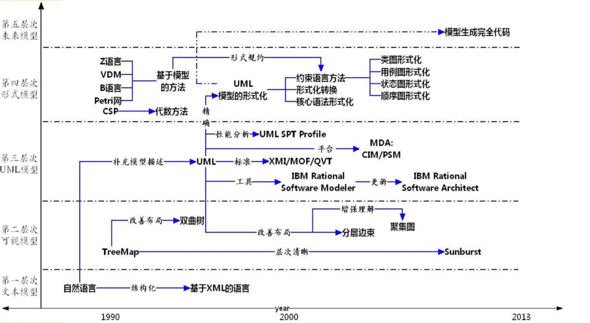
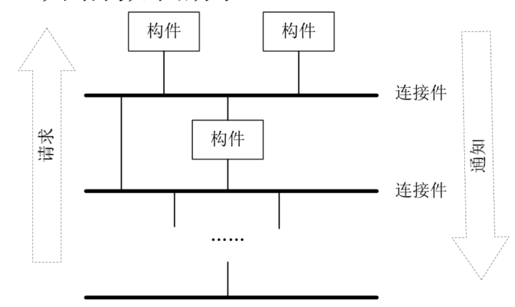

---


title: 软件体系架构
date: 2019-04-23 23:03:06
cover: https://raw.githubusercontent.com/HanyuuFurude/TechBlog/master/res/rm.png
tags: 
	- software architecture
	- review
categories:
	- review
---
[TOC]

# Chapter 1 概述

-   软件架构产生的背景
    -   软件危机
        -   根源
            1.  软件复杂易变，行为特性难于预见，需求向设计缺乏有效的转换导致开发过程中的困难和不可控
            2.  随着软件体系规模越来越大越来越复杂，整个系统的贵和和规格说明越来越重要
            3.  对于大规模复杂软件系统，总体的系统结构设计和规格说明非常重要
            4.  对软件体系的结构的研究有望成为提升软件生产率和解决软件维护问题的有效途径之一
        -   软件架构
            -   作用
-   **软件架构的思想和特征**
    -   **主要思想**
        -   **软件架构是一个系统软件的设计图，不仅限于软件系统的总体结构，还包含一些质量属性以及功能与结构之间的映射关系，即设计决策**
        -   **软件架构的两个主要焦点集中于系统的总体结构以及需求和实现之间的对应**
        -   **主要思想是将注意力集中在系统总体结构的组织上**
        -   **筛选按手段是运用抽象方法屏蔽模块间的连接，是人们的认知提升并保持在整体结构的部件的交互层次，并进一步将交互从计算中分离出来，建立“组件+连接件+配置”的软件系统高层结构组织方式**
    -   **特征**
        1.  **注重可重用性——组件及架构及重用**
        2.  **利益相关者多——平衡需求**
        3.  **关注点分离——模块化、分治**
        4.  **质量驱动——关注非功能属性**
        5.  **提倡概念完整性——强调设计结构是一个持续的过程**
        6.  **循环风格——用标准方法来处理反复出现的问题**
-   软件架构的发展阶段，各阶段特征
    -   1968-1994 基础研究阶段
        -   1968 NATO 软件架构概念提出
        -   模块化实践
            -   高内聚低耦合
            -   模块大小适度
            -   模块链调用深度不可过多
            -   接口干净，信息隐藏
            -   尽可能地复用已有模块（功能独立）
    -   1991-2000 概念体系和核心技术形成阶段
        -   组件技术（component）
    -   1996-1999 理论体系丰富发展阶段
        -   软件架构的描述与表述
        -   软件架构分析、设计与测试
        -   软件架构发现、演化与重用
        -   基于软件架构的开发方法
        -   软件架构的风格
        -   etc..
    -   1999-至今 理论完善和普及应用阶段
-   软件架构研究和应用现状

# chapher 2 软件架构概念

-   软件架构定义
    -   一研究人员一般认为
    -   软件架构就是一个系统的草图
-   **组成派定义**
    -   **组成派关注于软件本身，将软件架构看作构件和交互的集合**
-   **决策派定义**
    -   **决策派关注于软件架构中的实体（人），将软件架构视为一系列重要设计决策的集合**
-   **参考框架定义**（一般性定义）：
    -   **组件component**
        -   **角色role**
    -   **连接件connector**
        -   **端口port**
    -   **配置configuration**

# chapter 3 软件架构模型

-   软件架构模型是什么

    -   软件架构建模是对架构设计决策的具象化和文档化

-   **软件架构建模的五类方法**
    -   **基于非规范图形表示的建模方法**
    
        >   基于图形可视化建模方法
        >
        >   -   非正式图形表示
        >       -   盒线图
        >       -   etc.
        >   -   正式图形表示
        >       -   树形结构
        >       -   树地图
        >       -   改进的树地图
        >       -   旭日图
        >       -   双曲树
    
    -   **基于UML的建模方法**
    
        -   逻辑视图
        -   开发视图
        -   过程视图
        -   物理视图
        -   优点
            -   统一标准
            -   支持多视图结构
            -   模型操作工具
            -   统一的交叉引用
    
    -   **基于形式化的方法**
    
    -   **基于UML形式化的方法**
    
        ```mermaid
        graph LR
        A[需求分析]-->B[需求文档规格说明]
        B-->C[UML建模]
        C-->D[形式化描述和验证]
        D-->E[程序编码]
        E-->F[形式规范自动生成和测试变量]
        F-->G[软件产品]
        ```
    
        >   需求分析到形式化描述和验证占全部工作量的60%~70%
    
-   **软件架构建模方法的发展趋势**

    

    

    -   第一层次
      
        -   文本模型
    -   第二层次
      
        -   图形可视化模型
    -   第三层次
      
    -   UML模型
    -   第四层次
    
    -   形式化模型
    
    -   第五层次
    
        -   未来模型
    
        

# Chapter 4 软件架构风格和模式

-   **什么是软件架构风格/软件架构惯用模式**

    -   **描述特定应用领域中系统组织方式的惯用模式**

-   使用架构风格的好处

    -   作为“可复用的组织模式和习语”，为设计人员的交流提供了公共的术语空间，促进了设计复用和代码复用
    -   极大地促进了设计的重用性和代码的重用性，并且使得系统的组织结构易被理解
    -   使用标准的架构风格可较好地支持系统内部的互操作性以及针对特定风格的分析

-   **经典体系结构风格的特点、优点、缺点、适用范围**
  
    >   数据流风格 加一个批处理序列
    
    1.  **管道过滤器风格**
        -   特点
            -   过滤器是独立运行的部件
            -   过滤器无法感知其处理上下连接的过滤器
            -   结果的正确性不依赖与各个过滤器运行的先后次序
        -   优点
            -   每个组件行为不受其他组件的影响，整个系统的行为易于理解
            -   管道-过滤器风格支持功能模块的复用
            -   基于管道-过滤器风格的系统具有较强的可维护性和可扩展性
            -   支持一些特定的分析（e.g.吞吐量计算和死锁检测）
            -   管道-过滤器风格具有并发性
        -   缺点
            -   管道-过滤器风格往往导致系统处理过程的成批操纵
            -   对加密数据流需要在每个模块中进行解析或反解析，增加了过滤器实现的复杂性
            -   交互处理能力弱
    ---
    >   调用返回风格
    
    2.  **主程序/子程序风格**
        -   特点
            -   从功能观点设计系统，通过逐步分解和逐步细化得到系统架构，
            -   主程序的正确性依赖与它调用的子程序的正确性
            -   组件为主程序和子程序
            -   连接件为调用-返回机制
            -   拓补结构为层次化结构
        -   优点
            -   具有很高的数据访问效率（计算共享一个储存区）
            -   不同的计算功能被划分在不同的模块中
        -   缺点
            -   对数据储存格式的变化将会影响几乎所有的模块
            -   对处理流程的改变与系统功能的增强适应性较差
            -   这种分解方案难以支持有效的复用
    3.  **面向对象风格**
        -   特点
            -   对象负责维护其表示的完整性
            -   对象的表示对其他对象而言是隐蔽的
        -   优点
            -   对象隐藏了其实现细节、可以在不影响其他对象的情况下改变对象的实现，不仅使得对象的使用变得简单、方便，而且具有很高的安全性和可靠性
            -   设计者可将一些数据存取操作的问题分解成一些交互代理程序的集合
        -   缺点
            -   当一个对象和其他对象通过过程调用等方式进行交互时，必须知道其他对象的标识。无论何时改变对象的标识，都必须修改所有显示调用它的其他对象，并消除由此带来的一些副作用
    4.  **层次化风格**
    	- 特点
    		- 系统分层
    		- 每个层次由一系列组件组成
    		- 层次之间存在接口
    		- 下层组件向上层组件提供服务，上层组件被看作是下层组件的客户端
    	- 优点
    		- 支持基于可增加抽象层的设计，允许将一个复杂问题分解为一个增量步骤序列的实现
    		- 支持扩展，每一层的改变最多只影响相邻层
    		- 支持重用，只要给相邻层提供相同的接口，它允许系统中同一层的不同实现相互交换使用
    	- 缺点
    		- 不是所有系统都容易采用这种模式来构建
    		- 定义一个合适的抽象层次可能会非常困难，特别是对应标准化的层次模型
    
    ---
    
    >   独立组件风格
    
    5.  **事件驱动风格**
    
    	- 特点
    		- 事件发布者不知道那些组件会受到时间的影响；组件不能对事件的处理排序，或者事件发生后的处理结果做任何假设
    		- 从架构上来说，事件驱动系统的组件提供了一个过程集合和一组事件
    		- 过程可以使用显式的方法进行调用，也可以用组件在系统事件中注册。当触发事件时，会自动引发这些过程的调用
    		- 连接件既可以时显式过程调用，也可以是一种绑定事件声明和过程调用的手段
    	- 优点
    		- 事件声明者不需要知道那些组件会影响事件，组件之间关联较弱
    		- 提高软件复用能力。只要在系统事件中注册组件的过程，就可以将该组件继承到系统中
    		- 系统便于升级。只要组件名和事件中所注册的过程名保持不变，原有组件就可以被新组件取代
    	- 缺点
    		- 组件放弃了对计算的控制权，完全由系统来决定
    		- 存在数据交换问题
    		- 该风格中，正确性验证成为一个问题（难以调试）
    
    	
    
    ---
    
    >   虚拟机风格
    
    6.  **解释器风格**
    
    	- 解释器（Interpreter）是一个用来执行其他程序的程序，它针对不同的硬件平台实现了一个虚拟机，将高层次的程序翻译为低抽象层次的所能理解的指令，，以弥合程序语义所期望的与硬件提供的计算引擎之间的差距
    
    	- 优点
    
    		- 它有利于实现程序的可移植性和语言的跨平台能力
    		
    	- 它可以对未来的硬件进行模拟和仿真，能够降低测试所带来的复杂性和昂贵花费
    		
    	- 缺点
    
    		- 额外的间接层次导致了系统性能的下降（e.g. Java without JIT）
        
        
        
        
    
    
    7.  **基于规则的系统风格**
    
    	- 显示里的业务需求经常频繁的发生变化，不断修改代码效率低、成本高。**最好把频繁变化的业务逻辑抽取出来，形成独立的规则库**
    
    	- **规则可独立于软件系统而存在，可以被随时更新**
    
    	- 系统运行时，读取规则库，依据当前运行状态，从规则库中选择与之匹配的规则解释运行
        | 基于规则的系统     | 解释器风格             |
        | ------------------ | ---------------------- |
        | 知识库             | 待解释程序             |
        | 规则解释器         | 解释器引擎             |
        | 规则与数据元素选择 | 解释器引擎内部控制状态 |
        | 工作内存           | 程序当前的运行状态     |
    ---
    
    >   仓库风格
    
    8.  **仓库风格**
    
    	- 特点
    
    		- 仓库是储存和维护数据的中心场所
    		- 仓库式风格的两种组件
    			- 中央数据结构组件
    			- 相对独立的组件集合
    
    	- 优点
    
    		- 便于模块间的数据共享,方便模块的添加,更新和删除,避免了知识源的不必要的重复储存等 
    
    	- 缺点
    
    		- 对于各个模块,需要一定的同步/加锁机制保证数据结构的完整性和一致性    


    
    9.  **黑板系统风格**
    
    	- 特点
    	 -  黑板系统是传统上被用于信号处理方面进行复杂解释的应用程序,以及松散耦合的组件访问共享数据的应用程序
    
    	  - 黑板架构实现的基本出发点是已经存在一个对公共数据结构进行协同操作的独立程序集合
    
    	  - 组成部分
    
    	  	- 知识源
    
    	  	- 黑板数据结构
    
    	  	- 控制器


    	
    - 优点
    	- 便于多客户共享大量数据,他们不关心数据何时有的,谁提供的,怎样提供的
    	- 既便于添加新的作为知识源代理的应用程序,也便于扩展共享的黑板数据结构
    	- 知识源可重用
    	
    	- 支持容错性和健壮性
    	
    - 缺点
    	
    	- 不同的知识源代理对于共享数据结构要达成一致,而且这也造成对黑板数据结构的修改较为苦难(要考虑到给个代理的调用)
    	
    	- 需要一定的同步/加锁机制保证数据结构的完整性和一致性,增大了系统复杂度
    	
    	  
    	  		
    	
    
    ---
    
    >   其他
    
    10.  **C2风格**
    - 特点
    
    	- 系统组织规则
    
    	   - 系统中的组件和连接件都有一个顶部和一个底部
    		- 组件的顶部应连接到某连接件的底部,组件的底部应连接到某连接件的顶部,不允许组件之间的直接连接
    		  - 一个连接件可以和任意数目的其他组件和连接件连接
    				- 当两个连接件进行直接连接时,必须由其中一个的底部到另一个的底部
    				
    				
    		- C2的内部,通信和处理时分开完成的
    - 优点
          - 可使用任何编程语言开发组件,组件重用和替换易实现
           - 由于组件之间相对独立,依赖较小,因而该风格具有一定扩展能力,可支持不同粒度的组件
           - 组件不需共享地址空间
           - 可实现多个用户和多个系统之间的交互
           - 课使用多个工具集和多种媒体类型,动态更新系统框架结构(适合交互系统)
    - 缺点
     - 不太适合大规模流式系统,以及对数据库使用比较频繁的应用
    
    11.  **客户机/服务器风格**（两层C/S架构）
    - 特点
      
    	- 协作关系
         		- 客户机
              		- 服务器
                 	- 客户机和服务器程序配置在分布式环境中时:通过远程调用(RPC)协议进行通信
         - 优点
         	- 客户机组件和服务器组件分别运行在不同的计算机上,有利于分布式数据的组织和处理
         	- 组件之间的位置是相互透明的
         	- 客户机程序和服务器程序可运行在不同的操作系统上,便于实现异构环境和多种不同开发技术的融合
         	- 软件环境和硬件环境的配置具有极大的灵活性,易于系统功能的扩展
         	- 将大规模的业务逻辑分布到多个通过网络连接的低成本的计算机上,降低了系统的整体开销
         - 缺点
         	- 开发成本高(客户机软硬件要求搞)
         	- 客户机程序的设计复杂度大,客户机负载重
         	- 信息内容和形式单一
         	- C/S架构升级需要开发人员到现场更新客户机程序,对运行环境进行重新配置,增加了维护费用
         	- 两层C/S结构采用了单一的服务器,同时以局域网为中心,难以扩展到inrtante和Internet
         	- 数据安全性不高
    12.  **浏览器/服务器风格**（三层C/S架构）
         - 特点
           - 相对两层C/S架构的优点
             - 合理地划分三层结构的功能，可以使系统的逻辑结构更加清晰，提高软件的可维护性和可扩充性 
             - 在实现三层C/S架构时，可以更有效地选择运行平台和硬件环境，从而使每一层都具有清晰的逻辑结构，良好的符合处理能力和叫号的开放性
             - **在C/S结构中，可以分别选择合适的变成语言并行开发**
             -  系统具有较高的安全性
           - 在使用三层C/S架构时需要注意以下问题
             - 如果各层之间通信效率不高，及时每一层的硬件配置都很高，系统的整体性能也不会太高
             - 必须慎重考虑三层之间的通信方法，通信频率和数据传输量，这和提高各层的独立性一样也是实现三层C/S架构的关键性问题 
         - 浏览器/服务器风格是三层C/S风格的一种实现方式
           - 与三层C/S结构的解决方案相比，B/S架构在客户机采用了WWW浏览器，把web服务作为应用服务器
         - 优点
           - 客户端只需要安装浏览器，操作简单，能够发布动态信息和静态信息
           - 运用HTTP标准协议和统一客户端软件，能够实现跨平台通信
           - 开发成本比较低，只需要维护web服务器和中心数据库，客户端升级可以通过升级浏览器是实现
         - 缺点
           - 个性化程度低,所有客户端程序的功能都是一样的
           - 客户端数据处理能力较差,加重了web服务器的工作负担,,影响系统的整体性能 
           - 在B/S架构中,数据提交一般以页面为单位,动态交互性不强,不利于在线事务处理(OLTP)
           - B/S架构可扩展性比较差,系统安全性难以保障
           - B/S架构的应用系统查询中心数据库,其速度要远低于C/S架构
         
    13.  **平台/插件风格**
         - 特点
           - 平台
             - 程序的主题或主框架
               - 内核功能
               - 插件处理功能
           - 接口
             - 平台扩展接口 
             - 插件接口
           - 插件
             - 对软件功能的扩展或补充模块
         - 优点
           - 降低系统各模块之间的互依赖性
           - 系统模块独立开发,部署,维护
           - 根据需求动态的组装,分离系统
         - 缺点
           - 只服务与该主程序,可重用性差
         
    14.  **面向Agent风格**
         - 特点
           - Agent
             - 一个能感知环境并主动决策和行为的软件实体
           - Agent组件
             - 对系统处理的高度抽象,具有高度灵活和高度智能特色的软件实体
             - 自主性,智能性,交互性
           - Agent连接件
             - 对复合型组件的连接,提供通信,协调,转换,接通等服务
         - 优点
           - 面向Agent的软件工程方法对于解决复杂问题是一种好技术,特别是对于分布开放异构的软件环境
         - 缺点
           - 大多数结构中Agent自身缺乏社会性结构描述和与环境的交互
         
    15.  **面向方面软件架构风格**
         
         - 特点
           - 一般认为AOP在传统软件架构基础上增加了方面组件(Aspect Component)这一个新的构成单元,通过 方面组件来封装系统的横切关注点(需求特性或关注点)
         - 优缺点
           - 可以定义交叉的关系,并将这些关系应用于跨模块的,彼此不同的对象模型
           - AOP同时还可以让我们层次化功能性而不是嵌入功能性,从而使得代码有更好的可读性和易于维护
           - 他会和面向对象编程很好地合作,互补
         
    16.  **面向服务架构风格**
    
         - 特点
    
           - 面像服务架构模型（SOA）
    
           - 服务
    
             - 一个粗粒度的，可发现的软件实体
    
           - 接口
    
           - 
    
             
    
             - 发布
             - 发现
             - 绑定和调用
    
         - 优点
    
           - 灵活性，根据需求变化，重新编排服务
           - 对IT资产的复用
           - 使企业的信息建设真正以业务为核心。业务人员根据需求编排服务，而不必考虑技术细节
    
         - 缺点
    
           - 服务的划分很困难
           - 服务的编排问题
           - 接口标准可能会带来系统的额外开销和不稳定性
           - 对硬件IT资产谈不上复用
           - 目前主流实现方式很多，松散脆弱
           - 目前主流实现方式局限于不带界面的服务的共享
    
    17.  **正交架构风格**
    
         - 特点
    
           - 由完成不同功能的n个线索（子系统）组成
    
           - 系统具有m个不同抽象级别的层
    
           - 线索之间是相互独立的 
    
           - 系统有一个公共驱动层（一般为最高层）和公共数据结构（一般为最底层）
    
             - 组织层（Layer）
               - 由一组具有相同抽象级别的组件构成
             - 线索（Thread）<small>子系统的特例</small>的组件（Component）
             - 线索是相互独立的，即线索中的组件之间没有相互调用
    
             
    
             
    
         - 优点
    
           - 结构清晰，易于理解。由于线索功能相互独立，组件的位置可以清楚地说明它所实现的抽象层次和负担的功能
           - 易修改，可维护性强。由于线索之间是相互独立的，所以对一个线索的修改不会影响到其他线索
           - 可移植性强，重用粒度大。因为正交结构可以为一个领域内的所有应用程序所共享，这些软件有着相同或类似的层次和线索，可以实现架构级的重用
    
         - 缺点
    
           - 在实际应用中，并不是所有软件系统都能完全正交化，或者有时完全正交化的成本太高。因此，在进行应用项目的软件架构设计时，必须反复权衡进一步正交化的额外开销与所得到的更好的性能之间的关系
    
    18.  **异构风格**
    
         - 特点
           - 在设计软件系统时，从不同角度来观察和思考问题，会对架构风格的选择产生影响
           - 每一种架构风格都有不同的特点，适用于不同的应用问题，因此，架构风格的选择是多样化的和复杂的
           - 实际应用中，各种软件架构并不是独立存在的，在一个系统中，往往会有多种架构共存和相互融合，形成更复杂的框架结构，即异构架构
           - 组合方式
             - 层次结构
             - 单一组件使用符合的连接件
         - 优点
           - 可以实现遗留代码的重用
           - 在某些单位中，规定了共享软件包和某些标准，但仍会存在解释和表示习惯上的不同。选择异构架构风格，可以解决这一问题
         - 缺点
           - 不同风格之间的兼容问题有时很难解决
    
    19.  **基于层次消息总线的架构风格**（JB/HMB风格）
    
         - 特点
           - 以青鸟软件生产线的实践为背景，提出了基于层次消息总线的软件架构(Jade bird hierarchical message bus based style)
           - JB/HMB风格基于层次消息总线、支持组件的分布和并发，组件之间通过消息总线进行通讯
           - 消息总线是系统的连接件，负责消息的分派、传递和过滤以及处理结果的返回。各个组件挂接在消息总线上，向总线登记感兴趣的消息类型
         - 优点
           - 较好地支持架构设计
           - 构件之间的耦合性较低
           - 构建使用灵活
           - 构建重用性较高
           - 动态性（支持系统演化）
         - 缺点
           - 总线可重用性差
           - 重用要求高
    
    20.  **模型-视图-控制器风格**
    
         - 特点
           - 模型
           - 视图
           - 控制器
         - 优点
           - 多个视图与一个模型相对应。变化一一传播机制确保了所有相关视图都能够及
             时地获取模型变化信息，从而使所有视图和控制器同步，便于维护
           - 具有良好的移植性。由于模型独立于视图，因此可以方便的实现不同部分的移植
           - 系统被分割为三个独立的部分，当功能发生变化时，改变其中的一个部分就能满足要求
         - 缺点
           - 增加了系统设计和运行复杂性
           - 视图与控制器连接过于紧密，妨碍了二者的独立重用
           - 视图访问模型的效率比较低。由于模型具有不同的操作接口，因此视图需要多次访问模型才能获得足够的数据
           - 频繁访问未变化的数据，也将降低系统的性能

# Chapter 5 架构描述语言

-   什么是软件架构描述语言
    -   ADL（Architecture description language）用于任何软件架构的表示形式
-   **为何有多种软件架构描述语言**
    -   //TODO
-   ADL的核心设计元素
    -   组件(Component)
        -   表示系统中主要的计算元素和数据存储，如客户端、服务器、数据库等
    -   连接件(Connector)
        -   定义了组件之间的交互关系，如过程调用、消息传递、事件广播等
    -   软件架构配置（ArchitectureConfiguration）
        -   描述组件、连接件之间的拓扑关系
    -   约束条件（constraint)
        -   定义组件之间依赖、组件与连接件之间依赖的约束

# Chapter 6 软件架构与敏捷开发

-   敏捷开发的基本理念

    -   强调个体和互动比强调过程和工具更好
    -   强调获得可运行的软件比强调完成详尽的文档好
    -   强调与客户合作比强调进行详细的合同谈好
    -   强调响应变化比强调遵循既定的计划好

    ---

    - 尽早并持续地交付有价值的软件以满足顾客需求
    - 敏捷流程欢迎需求的变化，并利用这种变化来提高用户的竞争优势
    - 经常交付可用的软件，发布间隔可以从几周到几个月，能短则短
    - 业务人员和开发人员在项目开发过程中应该每天共同工作
    - 选择有进取心的人作为项目核心人员，充分支持并信任他们
    - 无论团队内外，面对面交流始终是最有效的沟通方式
    - 可用的软件是衡量项目进展的主要指标
    - 敏捷流程应能保持可持续发展。责任人，开发者和用户应该能够保持一个长期的，恒定的开发速度
    - 不断关注技术和设计能增强敏捷能力
    - 保持简明（尽可能简化工作量的技巧）
    - 最高的构架，需求和设计出自于自组织的团队
    - 时时总结如何提高团队效率，并付诸行动

-   敏捷开发与架构的设计的关系

    -   软件架构与敏捷开发的出发点是一致的
        -   目的：提高软件开发效率，提高软件质量，降低软件成本，将开发团队的价值最大化（权衡的过程）
    -   敏捷开发也要重视软件架构
    -   敏捷开发改变了软件架构的设计方式

-   敏捷开发中如何改变了软件架构的设计方式

    -   敏捷开发非常重视软件的架构设计，但是轻架构的详细设计

    -   敏捷思想中进传统的架构设计分成

        -   种子架构设计

            -   软件的架构层次
            -   重要模块
            -   重要的说明类

        -   详细架构设计

            

            

            - 敏捷开发把传统软件开发前期的详细架构设计分散到了整个敏捷开发软件过程中，以达到提高效率，减少风险的目的

-   两类常见敏捷架构设计方法
    
    -   规划式设计和演进式设计，具体体现为初始化阶段设计和迭代过程中的设计
    
    -   团队设计
    
        - 群体决策
    
        - 优点
          - 团队设计的理论依据是群体决策。其结论要比个人决策更加完整，避免个人遗漏，相对稳定、周密
        - 缺点
          - 需要额外付出沟通成本、决策效率低、责任不明
            确等。
    
    -   简单设计
    
        -   敏捷的思想要求软件架构设计必须是简单设计
            -   表达方式的简单化
            -   现实抽象的简单化。
                - 敏捷开发中对详细架构描述文档等中间产物的弱化，只满足有效沟通即可
            -   现实抽象的简单化
                -   仅针对当前需求建模分析，不做“多余的"工作
        -   简单设计可以降低开发成本、提升沟通效率、增强适应性和稳定性

# Chapter 7 架构驱动的软件开发

-   **架构驱动的软件开发步骤**和开发流程

    -   步骤

        -   架构需求获取
        -   基本架构设计
        -   架构记录和文档化
        -   架构评估
        -   架构实现
        -   架构维护

    -   开发流程

        

        

-   **质量场景**、质量模型

    -   抽象场景
        -   根据软件的使用进行一定层面的分类（如：软件流水线方式、三层结构等），这些分类就会对相应软件提出一定的需求，此类需求即为架构需求的抽象场景
    -   质量场景
        -   架构需求要用质量场景进行描述
            -   对于架构师和领域专家来说，需要做的是从抽象场景描述中获得**特定的质量属性场景**
            -   通常来说，我们考虑的特定的质量场景是对性能、可移植性、可替换性、可重用性等质量属性产
                生影响时的质量场景
    -   质量模型
        -   软件质量理想模型
            -   质量场景进行描述，可以用来描述，评估和预测质量属性的模型
            -   可以清晰地描述质量模型中元素和元素之间的相互关系的模型
            -   实例化的软件质量理想模型和对质量场景的注解

-   架构的结构

    -   通过一定的结构对软件的架构进行描述，把这样的结构称为架构结构
    -   架构结构描述了架构的基本信息，也包括了类，方法，对象，文件，库等所有需要人做的设计和编码
    -   架构视图是由架构结构派生而出的，它可以是架构结构的子部分，也可以是多个架构结构信息的综合

# Chapter 8 软件架构建模方法

-   **成功的软件架构应具有的品质**

    -   **良好的模块化**
    -   **适应功能需求的变化，适应技术的变化**
    -   **对系统的动态运行有良好的规划**
    -   **对数据的良好规划** 
    -   **明确，灵活的部署规划**
-   **将软件架构的概念和原则引入软件需求阶段有什么好处？不引入可能会引起什么问题？**

    -   **好处**
        -   **有助于保证需求规约 ，系统设计之间的可追踪新和一致性，有效保持软件质量**
        -   **有助于更有结构性和可重用的需求规约**
    -   **用传统方法产生需求规约，不考虑软件架构概念和原则，，则在软件架构设计阶段建立需求规约与架构的映射将相对困难**
-   软件架构和软件需求是如何协同演化的？

    -   软件需求和软件架构两者是相辅相成的关系，一方面软件需求影响软件架构设计，另一方面软件架构帮助需求分析的明确和细化
-   需求与架构的相互影响可以看作一个螺旋的过程，也是一个双峰的过程
        
        
        
        
-   将软件架构映射到详细设计经常遇到什么问题？如何解决？
    - 问题
      - 缺失重要架构视图，片面强调功能需求
      - 不够深入，架构设计方案过于笼统，基本还停留在概念性架构的层面，没有提供明确的技术蓝图
      - 名不副实的分层架构，缺失层次之间的交互接口和交互机制，只进行职责划分
      - 在某些方面过度设计。
    - 解决方案
      - 对于缺失重要架构视图问题，可以针对遗漏的架构视图进行设计
      - 对于不够深入问题，需要将设计决策细化到和技术相关的层面
      - 对于名不副实的分层架构问题，需要步步深入，明确各层之间的交互接口和交互机制
      - 虽然我们必须考虑到系统的扩展性，可维护性等，但切忌过度设计
-   **MDA<small>model driven architecture基于模型驱动软件架构</small>的基本思想，应用MDA的好处**
    -   计算无关模型(CIM.Comutation Independent Model)也称业务模型
        -   描述系统的外部行为和运行环境
    -   平台无关模型(PIM,Platform Independent Model)
        -   具有高抽象层次、无关于任何实现技术的模型
    -   平台特定模型(PSM,Platform secific Model)
        -   为某种特定实现技量身定做，让你用这种技术中可用现构造来描述系统的模型。PIM会被变换一个或多个PSM
    -   MDA开发步骤
        - 用计算无关模型CIM捕获需求
          - 创建平台无关模型PIM
          - 将PIM转化成为一个或多个平台特定模型PSM，并加入平台特定的规则和代码
          - 将PSM转化为代码等
    -   **基本思想**
        -   **将软件系统分成模型和实现两部分**
            -   **模型是对系统的描述，实现是利用特定技术在特定平台或环境中对模型的解释。模型仅仅负责对系统的描述与实现技术无关。这是模型的实现技术无关性**
    -   **好处**
        -   **将模型与实现分离后，能够很好的适应技术易变性。由于实现往往高度依赖特定技术和特定平台，当技术发生迁移时，只需针对这种技术作相应的实现，编写相应的运行平台或变换工具。所以，能够比较好的应对实现技术发展带来的挑战**
-   架构设计原则
    -   一般原则
        -   商业原则
        -   数据原则
        -   应用程序原则
        -   技术原则
    -   关键设计原则
        -   关注分离点
        -   单一职责原则
        -   最少知识原则

# Chapter 15 软件架构评估方法

-   软件架构评估的必要性

    -   软件体系结构的好坏关系到软件产品的好坏，软件产品的好坏关系到软件公司的发展
    -   通过评估能了解系统的体系结构和重要属性（质量属性），能够屏蔽风险，带来诸多收益
    -   到目前为止没有很好的自动化评估系统

-   软件架构评估的方式分类

    -   基于调查问卷或检查表的评估方式
    -   基于场景的评估方式
    -   基于度量的评估方式
    -   质量属性、（质量）场景<small>基于场景的评估</small>

-   体系结构权衡分析方法（ATAM）的相关概念、评估过程（步骤）、优缺点

    -   基本概念
        -   敏感点(Sensitivity point)
            -   敏感点是一个或多个构件的特征
            -   敏感点可以使设计师搞清楚实现质量目标时应该注意什么
        -   权衡点(Tradeoffpoint)
            -   权衡点是影响多个质量属性的特征
            -   是多个质量属性的敏感点
            -   权衡点需要进行权衡
        -   敏感点影响一个质量属性
        -   权衡点影响多个质量属性
        -   风险承担者，涉众，牵涉到的人
        -   场景
            -   刺激
            -   环境
            -   响应
    -   评估过程
        1. 陈述，包括通过它进行的信息交流
           1. ATAM方法的陈述
           2. 商业动机的陈述
           3. SA的陈述
        2. 调查与分析，包括对照体系结构方法评估关键质量属性需求
           1. 确定体系结构方法
           2. 生成质量效用树
           3. 分析体系结构方法
        3. 测试，包括对照所有相关人员的需求检验最新结果
           1. 集体讨论并确定场景优先级
           2. 分析体系结构方法
        4. 形成报告，包括陈述ATAM的结果
           1. 结果的表述

-   软件体系结构分析方法（SAAM）的评估过程（步骤）、优缺点（敏感点、权衡点、效用树...）

    - 评估过程

      

      

      1. 场景的形成
      2. 体系结构的表述
      3. 场景分类和优先级的确定
      4. 对场景的单个评估
      5. 场景相互作用的评估
      6. 形成总体评估

# Chapter 9软件架构的演化和维护

-   软件架构演化的目的

    -   维持软件架构自身的有用性

-   软件架构演化的实施

-   **软件架构演化方式的分类**
    -   **静态演化：需求、过程**
    
        -   需求
    
            -   设计时演化需求
                -   在架构开发和实现过程中对原有架构进行调整，保证软件实现与架构的一致性以及软件开发过程的顺利进行
                -   运行前演化需求：软件发布之后由于运行环境的变化，需要对软件进行修改升级，在此期间软件的架构同样要进行演化
        -   过程
             
            
            1. 软件理解
               1. 查阅软件文档，分析软件架构，识别系统组成元素及其之间的相互关系，提取系统的抽象表
                  示形式
            2. 需求变更分析
               1. 静态演化往往是由于用户需求变化、系统运行出错和运行环境发生改变等原因所引起的,需要找出新的软件需求与原有的差异
            3. 演化计划
               1. 分析原系统，确定演化范围和成本，选择合适的演化计划
            4. 系统重构
               1. 根据演化计划对系统进行重构，使之适应当前的需求
            5. 系统测试
               1. 对演化后的系统进行测试，查找其中的错误和不足之处
    -   **动态演化：需求、类型、内容、技术**
        -   **需求**
            -   **软件内部执行所导致的体系结构改变**
            -   **是软件系统外部的请求对软件进行的重配置**
        -   **类型**
            1. **交互动态性**
            2. **结构动态性**
            3. **架构动态性**
        -   **内容**
            -   **属性改名**
                -   **在运行过程中，用户可能会对非功能指标进行重新定义，如服务响应时间等**
            -   **行为变化**
                -   **在运行过程中，用户需求变化或系统自身服务质量的调节，都将引发软件行为的变化。如：为了提高安全级别而更换加密算法；将http协议改为https协议**
            -   **拓扑结构改变**
                -   **如增、删组件，增、删连接件，改变组件与连接件之间的关联关系等**
            -   **风格变化**
                -   **一般软件演化后其架构风格应当保持不变，如果非要改变软件的架构风格，也只能将架构风格变为其“衍生"风格，如将两层c/s结构调整为三层c/s结构或c/s和B/s的混合结构**
        -   **技术**
            -   **动态软件架构 (SDA, Dynamic Software Architecture)**
            -   **动态重配置 (DR, Dynamic Reconfiguration)**
    
-   软件架构演化原则

    -   成本控制原则

    - 进度可控原则
    - 风险可控原则
    - 主体维持原则
    - 系统总体结构优化原则
    - 平滑演化原则
    - 目标一致原则
    - 模块独立烟花原则/修改局部化原则
    - 影响可控原则
    - 复杂性可控原则
    - 有利于重构原则
    - 有利于重用原则
    - 设计原则遵从性原则
    - 适应新技术原则
    - 环境适应性原则
    - 标准依从性原则
    - 质量向好原则
    - 适应新需求原则