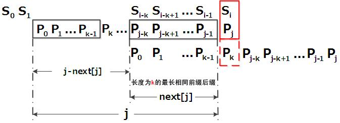

# 数据结构 
## 性能度量
> 算法的时间复杂度和空间复杂度合称为算法的复杂度。
### 时间复杂度

1. 时间频度 一个算法中的语句执行次数称为语句频度或时间频度。记为T(n)。

2. 时间复杂度 一般情况下，算法中基本操作重复执行的次数是问题规模n的某个函数，用$T(n)$表示，若有某个辅助函数$f(n)$,使得当$n$趋近于无穷大时，${\frac{T(n)}{f(n)}}$的极限值为不等于零的常数，则称$f(n)$是$T(n)$的同数量级函数。记作$T(n)=O(f(n))$,称$O(f(n))$为算法的渐进时间复杂度，简称时间复杂度。
	常见的时间复杂度有：常数阶$O(1)$,对数阶$O(log_{2}n)$,线性阶$O(n)$, 线性对数阶$O(n\cdot log_{2}n)$,平方阶$O(n^{2})$，立方阶$O(n^{3})$,…， k次方阶$O(n^{k})$ ,指数阶$O(k^{n})$。
3. 最坏时间复杂度和平均时间复杂度 　最坏情况下的时间复杂度称最坏时间复杂度。一般不特别说明，讨论的时间复杂度均是最坏情况下的时间复杂度。
4. 记号
	渐进精确记号$\Theta(n)$
	渐进上界记号$O(n)$
	渐进下界记号$\Omega(n)$
5. 求时间复杂度
	1. 如果算法的执行时间不随着问题规模n的增加而增长,此类算法的时间复杂度是O(1)。
		``` cpp
		x=91;
		y=100;
		while(y>0)
		    if(x>100) {
		    x=x-10;
		    y--;
		}
		else {
		    x++;
		}
		```
		解答： $T(n)=O(1)$，

	2. 当有若干个循环语句时，算法的时间复杂度是由嵌套层数最多的循环语句中最内层语句的频度f(n)决定的。
		```cpp
		x=1;
		for(i=1;i<=n;i++)
		   for(j=1;j<=i;j++)
		      for(k=1;k<=j;k++)
		          x++;
		```

		该程序段中频度最大的语句是`x++`，则该程序段的时间复杂度为$T(n)=O(n3/6+$ 低次项 $)=O(n3)$

      1. 算法的时间复杂度不仅仅依赖于问题的规模，还与输入实例的初始状态有关。

	5. 时间复杂度评价性能
	一般将渐近时间复杂度$T(n)=O(f(n))$简称为时间复杂度，其中的$f(n)$一般是算法中频度最大的语句频度。
### 空间复杂度
	一个程序的空间复杂度是指运行完一个程序所需内存的大小。利用程序的空间复杂度，可以对程序的运行所需要的内存多少有个预先估计。一个程序执行时除了需要存储空间和存储本身所使用的指令、常数、变量和输入数据外，还需要一些对数据进行操作的工作单元和存储一些为现实计算所需信息的辅助空间。程序执行时所需存储空间包括以下两部分。　　
	1. 固定部分。这部分空间的大小与输入/输出的数据的个数多少、数值无关。主要包括指令空间（即代码空间）、数据空间（常量、简单变量）等所占的空间。这部分属于静态空间。
	2. 可变空间，这部分空间的主要包括动态分配的空间，以及递归栈所需的空间等。这部分的空间大小与算法有关。
		> 一个算法所需的存储空间用$f(n)$表示。$S(n)=O(f(n))　$　其中$n$为问题的规模，$S(n)$表示空间复杂度。

## 数组
抽象数据类型（Abstract Data Type，ADT）
``` cpp
class  GeneralArray {
// a set of pairs <index, value> where for each value of
index in IndexSet there is a value of type float. IndexSet is a finite ordered set of one or more dimensions.
public:
    GeneralArray(int j, RangeList list, float initValue = defaultValue);
// This constructor creates a j dimensional array of floats; the range of the kth dimension is given by the kth element of list. For all i∈IndexSet, insert <i, initValue> into the array.
    float  Retrieve(index i);
// if (i∈IndexSet) return the float associated with i in the array;else throw an exception.
    void Store(index i, float x);
// if (i∈IndexSet) replace the old value associated with i by x;  else throw an exception.
}; //end of GeneralArray
```
### 顺序表
* 多项式
  * 基本操作：求长度、遍历、取数、存数、插入、删除
基本结构

``` cpp
class Polynomial; // forward declaration
class Term {
friend Polynomial;
private:
     float coef; // coefficient
     int exp;     // exponent
};
class Polynomial {
public:
	///...
  private:
   Term *termArray;
   int capacity; // size of termArray
   int terms; // number of nonzero terms
}

Polynomial Polynomial::Add(Polynomial b)
{ // return the sum of the polynomials *this and b.
	Polynomial c;
	int aPos = 0, bPos = 0;
	while ((aPos < terms) && (b < b.terms))
		if (termArray[aPos].exp == b.termArray[bPos].exp)
		{
			float t = termArray[aPos].coef + termArray[bPos].coef;
			if (t)
				c.NewTerm(t, termArray[aPos].exp);
			aPos++;
			bPos++;
		}
		else if (termArray[aPos].exp < b.termArray[bPos].exp)
		{
			c.NewTerm(b.termArray[bPos].coef,b.termArray[bPos].exp);
			bPos++;
		}
		else
		{
			c.NewTerm(termArray[aPos].coef, termArray[aPos].exp);
			aPos++;
		}
	// add in the remaining terms of *this
	for (; aPos < terms; aPos++)
		c.NewTerm(termArray[aPos].coef, termArray[aPos].exp);
	// add in the remaining terms of b
	for (; bPos < b.terms; bPos++)
		c.NewTerm(b.termArray[bPos].coef, b.termArray[bPos].exp);
	return c;
}
void Polynomial::NewTerm(const float theCoeff,const int theExp)
{ // add a new term to the end of termArray.
	if (terms == capacity)
	{ // double capacity of termArray
		capacity *= 2;
		term *temp = new term[capacity]; // new array
		copy(termArray, termAarry + terms, temp);
		delete[] termArray; // deallocate old memory
		termArray = temp;
	}
	termArray[terms].coef = theCoeff;
	termArray[terms++].exp = theExp;
}
```
* 时间复杂度分析：
  * 插入：
    * 无需翻倍时：$O(1)$
    * 翻倍时（内存不足）:$O(m + n +$ 在数组加倍中花费的时间 $)$
  * 翻倍（内存扩容）：
    * $$O(\sum_{i=1}^{k}{2^{i}})=O(2^{k+1})=O(2^{k})$$
    * 由于 $c.terms>2^{k-1}$ , $m+n\in c.terms$实际使用时间为$O(c.terms)=O(m+n)$

### 稀疏矩阵
``` cpp
class SparseMatrix
 { // a set of <row, column, value>, where row, column are non-negative integers and form a unique combination; value is also an integer.
 public:
      SparseMatrix ( int r, int c, int t);
      // creates a r∈c SparseMatrix with a capacity of t nonzero terms
      SparseMatrix Transpose ( );
      // return the SparseMatrix obtained by transposing *this
      SparseMatrix  Add ( SparseMatrix b);
      SparseMatrix  Multiply ( SparseMatrix b);
 };
```
``` cpp
class  SparseMatrix;
class  MatrixTerm {
friend class SparseMatrix;
Private:
    int row, col, value;
};
```
* 转置
 ```cpp
 SparseMatrix SparseMatrix::Transpose()
{ // return the transpose of *this
	SparseMatrix b(cols, rows, terms);
	if (terms > 0)
	{ //nonzero matrix
		int currentB = 0;
		for (int c = 0; c < cols; c++)		// transpose by columns
			for (int i = 0; i < terms; i++) // find and move terms in column c
				if (smArray[i].col == c)
				{
					b.smArray[CurrentB].row = c;
					b.smArray[CurrentB].col = smArray[i].row;
					b.smArray[CurrentB++].value = smArray[i].value;
				}
	} // end of if (terms > 0)
	return b;
}
 ```
* 快速转置
``` cpp
 SparseMatrix SparseMatrix::FastTranspose()
{ // return the transpose of *this in O(terms+cols) time.
	SparseMatrix b(cols, rows, terms);
	if (terms > 0)
	{ // nonzero matrix
		int *rowSize = new int[cols];
		7int *rowStart = new int[cols];
		// compute rowSize[i] = number of terms in row i of b
		fill(rowSize, rowSize + cols, 0); // initialze
		for (i = 0; i < terms; i++)
			rowSize[smArray[i].col]++;
		// rowStart[i] = starting position of row i in b
		rowStart[0] = 0;
		for (i = 1; i < cols; i++)
			rowStart[i] = rowStart[i - 1] + rowSize[i - 1];
		for (i = 0; i < terms; i++)
		{ // copy from *this to b
			int j = rowStart[smArray[i].col];
			b.smArray[j].row = smArray[i].col;
			b.smArray[j].col = smArray[i].row;
			b.smArray[j].value = smArray[i].value;
			rowStart[smArray[i].col]++;
		} // end of for
		delete[] rowSize;
		delete[] rowStart;
	} // end of if
	return b;
}
```
* 时间复杂度
$O(cols+terms)$

## 字符串匹配算法

### 1. 暴力匹配法
定义现有文本串S模式串P，假设现在文本串S匹配到i位置，模式串P匹配到j位置，则有：
* 如果当前字符匹配成功（即S[i] == P[j]），则i++，j++，继续匹配下一个字符；
*如果失配（即S[i]! = P[j]），令i = i - (j - 1)，j = 0。相当于每次匹配失败时，i 回溯，j 被置为0。


``` cpp
int ViolentMatch(char* s, char* p)
{
	int sLen = strlen(s);
	int pLen = strlen(p);

	int i = 0;
	int j = 0;
	while (i < sLen && j < pLen)
	{
		if (s[i] == p[j])
		{
			//当前字符匹配成功（即S[i] == P[j]），则i++，j++
			i++;
			j++;
		}
		else
		{
			//失配（即S[i]! = P[j]），令i = i - (j - 1)，j = 0
			i = i - j + 1;
			j = 0;
		}
	}
	//匹配成功，返回模式串p在文本串s中的位置，否则返回-1
	if (j == pLen)
		return i - j;
	else
		return -1;
}
```
>		暴力匹配法没有利用已经匹配过的信息，实现简单但是效率低下。
***

### 2.KMP算法
* 算法流程
  * 假设现在文本串S匹配到i位置，模式串P匹配到j位置
    * 如果j=-1，或者当前字符匹配成功（S[i]==P[j]），都令i++，j++，继续匹配下一个字符；
    * 如果j!=-1，且当前字符匹配失败（S[i]!=P[j]），则令i不变，j =next[j]。此举意味着失配时，模式串P相对于文本串S向右移动了j-next[j] 位。\
  	（当匹配失败时，模式串向右移动的位数为：失配字符所在位置 - 失配字符对应的next 值（next 数组的求解会在下文阐述），即移动的实际位数为j-next[j]，且此值大于等于1。next数组的值代表当前字符之前的字符串中，有多大长度的相同前缀后缀。例如如果next[j]=k，代表j之前的字符串中有最大长度为k 的相同前缀后缀。此也意味着在某个字符失配时，该字符对应的next值会告诉你下一步匹配中，模式串应该跳到哪个位置（跳到next[j]的位置）。如果next[j]等于0或-1，则跳到模式串的开头字符，若next[j]=k且k>0，代表下次匹配跳到j之前的某个字符，而不是跳到开头，且具体跳过了k个字符。)
``` cpp
int KmpSearch(char* s, char* p)
{
	int i = 0;
	int j = 0;
	int sLen = strlen(s);
	int pLen = strlen(p);
	while (i < sLen && j < pLen)
	{
		//如果j = -1，或者当前字符匹配成功（即S[i] == P[j]），都令i++，j++
		if (j == -1 || s[i] == p[j])
		{

			i++;
			j++;
		}
		else
		{
			//如果j != -1，且当前字符匹配失败（即S[i] != P[j]），则令 i 不变，j = next[j]
			//next[j]即为j所对应的next值
			j = next[j];
		}
	}
	if (j == pLen)
		return i - j;
	else
		return -1;
}
```
* 步骤
1.  寻找前缀后缀最长公共元素长度
	对于P = p0 p1 ...pj-1 pj，寻找模式串P中长度最大且相等的前缀和后缀。如果存在p0 p1 ...pk-1 pk = pj- k pj-k+1...pj-1 pj，那么在包含pj的模式串中有最大长度为k+1的相同前缀后缀。举个例子，如果给定的模式串为“abab”，那么它的各个子串的前缀后缀的公共元素的最大长度如下表格所示：

|模式串|a|b|a|b|
|-|-|-|-|-|
|最大前缀后缀公共元素长度|0|0|1|2|
> 比如对于字符串aba来说，它有长度为1的相同前缀后缀a；而对于字符串abab来说，它有长度为2的相同前缀后缀ab（相同前缀后缀的长度为k+1，k+1=2）。
2. 求next数组
	next数组考虑的是除当前字符外的最长相同前缀后缀，所以通过第①步骤求得各个前缀后缀的公共元素的最大长度后，只要稍作变形即可：将第①步骤中求得的值整体右移一位，然后初值赋为-1，如下表格所示：

|模式串|a|b|a|b|
|-|-|-|-|-|
|next数组|-1|0|0|1|

3. 根据next数组进行匹配

	匹配失配，$j=next[j]$，模式串向右移动的位数为：$j-next[j]$。换言之，当模式串的后缀$pj-kpj-k+1,...,pj-1$跟文本串$si-ksi-k+1,...,si-1$匹配成功，但$pj$跟$si$匹配失败时，因为$next[j]=k$，相当于在不包含pj的模式串中有最大长度为k的相同前缀后缀，即$p0p1...pk-1=pj-kpj-k+1...pj-1$，故令$j=next[j]$，从而让模式串右移$j-next[j]$位，使得模式串的前缀$p0p1,...,pk-1$对应着文本串$si-ksi-k+1,...,si-1$，而后让$pk$跟$s$i继续匹配。如下图所示：
	​	

### 解释
* 寻找最长前缀后缀
	*  如果给定的模式串是：“ABCDABD”，从左至右遍历整个模式串，其各个子串的前缀后缀分别如下表格所示： 

   也就是说，原模式串子串对应的各个前缀后缀的公共元素的最大长度表为：


``` cpp
void GetNext(char* p,int next[])
{
	int pLen = strlen(p);
	next[0] = -1;
	int k = -1;
	int j = 0;
	while (j < pLen - 1)
	{
		//p[k]表示前缀，p[j]表示后缀
		if (k == -1 || p[j] == p[k])
		{
			++k;
			++j;
			next[j] = k;
		}
		else
		{
			k = next[k];
		}
	}
}
```
## 波兰式、逆波兰式实现

### 简单技巧：

中序表达式转后序表式式：

    将中序表达式所有括号补全，然后将所有运算符向右移出无匹配的第一个右括号，去掉括号即为后序表式式

举例：
​	原式：a+b*(c+d/e)
​	补全括号：(a+(b*(c+(d/e))))
​	操作符右移：(a(b(c(de)/)+)*)+
​	去掉括号：abcde/+*+

中序表达式转前序表式式：

    将中序表达式所有括号补全，然后将所有运算符向左移出无匹配的第一个左括号，去掉括号即为前序表式式

举例：
​    原式：a+b*(c+d/e)
​    补全括号：(a+(b*(c+(d/e))))
​    操作符右移：+(a*(b+(c/(de))))
​    去掉括号：+a*b+c/de

### 算法：

利用运算符栈(OPTR)和数据栈(OPND)将中缀表达式转化为后缀表达式。

将结束标志字符’#’放入操作符栈（OPTR）；
从中缀表达式pre左端依次读取pre[i]：

    1.若pre[i]为操作数，压入数据栈（OPND）；
    2.若pre[i]为左括号，压入操作符栈（OPTR）；
    3.若pre[i]为右括号，则将操作符栈（OPTR）中的运算符依次出栈并压入数据栈（OPND），直到遇到左括号为止，但是该左括号出栈但不压入数据栈（OPND）
    4.若pre[i]为操作符:
    （1）若操作符栈（OPTR）为空，将此操作符pre[i]压入数据栈（OPND）；
    （2）若pre[i]的优先级大于操作符栈（OPTR）顶的优先级，将此操作符pre[i]压入数据栈（OPND）；
    （3）若操作符栈（OPTR）不为空且pre[i]的优先级小于等于操作符栈（OPTR）顶的优先级，将操作符栈（OPTR）中的运算符依次出栈并压入数据栈（OPND），直到不满足条件，此操作符pre[i]压入数据栈（OPND）

直到遍历完整个中序表达式之后，操作符栈（OPTR）中仍然存在运算符，那么将这些运算符依次出栈加入到数据栈（OPND）中，直到栈为空。

按照上述步骤完成后，将操作符栈（OPTR）逆序即可得到逆波兰表达式。

### 实现

    ``` cpp
    //把中缀表达式转换为后缀表达式
    void postfix(char pre[])
    {
        int i = 0;
        stack<char> OPTR; //运算符栈
        stack<char> OPND; //数据栈
        OPTR.push('#'); // 首先把结束标志‘#’放入栈底
        while(pre[i]!='#')
        {
            if((pre[i]>='a' && pre[i] <='z')) // 遇到点直接写入后缀表达式
            { OPND.push(pre[i]); }
            else if (pre[i]=='(') // 遇到“（”不用比较直接入栈
                OPTR.push(pre[i]); else if(pre[i] ==')') // 遇到右括号将其对应左括号后的操作符（操作符栈中的）全部写入后缀表达式
            {
                while(OPTR.top()!='(')
                {
                    OPND.push(OPTR.top()); OPTR.pop();
                }
                OPTR.pop(); // 将“（”出栈，后缀表达式中不含小括号 }
                else if (isoperator(pre[i]))
                {
                    while(!OPTR.empty() && priority(pre[i]) <= priority(OPTR.top()))
                    { // 当前的操作符小于等于栈顶操作符的优先级时，将栈顶操作符写入到后缀表达式，重复此过程
                        OPND.push(OPTR.top()); OPTR.pop();
                    }
                    OPTR.push(pre[i]); // 当前操作符栈为空或者当前操作符优先级大于栈顶操作符的优先级，将该操作符入栈
                }
                i++;
            }
            while(OPTR.top() != '#') // 将所有的操作符加入后缀表达式
            { OPND.push(OPTR.top()); OPTR.pop(); }
            OPTR.pop(); //利用操作符栈逆序即可得到后缀表达式
            while(!OPND.empty())
            { OPTR.push(OPND.top()); OPND.pop(); }
            while(!OPTR.empty())
            { cout << OPTR.top(); OPTR.pop(); }
            cout << endl;
        }
    ```


## 二叉树

``` cpp

    tree *root;
    Btree()
    {
        root=NULL;
    }
    void create_Btree(int);
    void Preorder(tree *);                  //先序遍历
    void inorder(tree *);                   //中序遍历
    void Postorder(tree *);                 //后序遍历
    void display1() {Preorder(root); cout<<endl;}
    void display2() {inorder(root);cout<<endl;}
    void display3() {Postorder(root); cout<<endl;}
    int count(tree *);                      //计算二叉树的个数
    int findleaf(tree *);                   //求二叉树叶子的个数
    int findnode(tree *);                   //求二叉树中度数为1的结点数量,这是当初考数据结构时候的最后一道题目
};
int Btree::n=0;
int Btree::m=0;
void Btree::create_Btree(int x)
{
    tree *newnode=new tree;
    newnode->data=x;
    newnode->right=newnode->left=NULL;
    if(root==NULL)
        root=newnode;
    else
    {
        tree *back;
        tree *current=root;
        while(current!=NULL)
        {
            back=current;
            if(current->data>x)
                current=current->left;
            else
                current=current->right;
        }
        if(back->data>x)
            back->left=newnode;
        else
            back->right=newnode;
    }
}
int Btree::count(tree *p)
{
    if(p==NULL)
        return 0;
    else
        return count(p->left)+count(p->right)+1;      //这是运用了函数嵌套即递归的方法。
}
void Btree::Preorder(tree *temp)    //这是先序遍历二叉树，采用了递归的方法。
{
    if(temp!=NULL)
    {
        cout<<temp->data<<" ";
        Preorder(temp->left);
        Preorder(temp->right);
    }
}
void Btree::inorder(tree *temp)      //这是中序遍历二叉树，采用了递归的方法。
{
    if(temp!=NULL)
    {
        inorder(temp->left);
        cout<<temp->data<<" ";
        inorder(temp->right);
    }
}
void Btree::Postorder(tree *temp)     //这是后序遍历二叉树，采用了递归的方法。
{
    if(temp!=NULL)
    {
        Postorder(temp->left);
        Postorder(temp->right);
        cout<<temp->data<<" ";
    }
}
int Btree::findleaf(tree *temp)
{
    if(temp==NULL)return 0;
    else
    {
        if(temp->left==NULL&&temp->right==NULL)return n+=1;
        else
        {
            findleaf(temp->left);
            findleaf(temp->right);
        }
        return n;
    }
}
int Btree::findnode(tree *temp)
{
    if(temp==NULL)return 0;
    else
    {
        if(temp->left!=NULL&&temp->right!=NULL)
        {
            findnode(temp->left);
            findnode(temp->right);
        }
        if(temp->left!=NULL&&temp->right==NULL)
        {
            m+=1;
            findnode(temp->left);
        }
        if(temp->left==NULL&&temp->right!=NULL)
        {
            m+=1;
            findnode(temp->right);
        }
    }
    return m;
}


void main()
{
    Btree A;
    int array[]={7,4,2,3,15,35,6,45,55,20,1,14,56,57,58};
    int k;
    k=sizeof(array)/sizeof(array[0]);
    cout<<"建立排序二叉树顺序: "<<endl;
    for(int i=0;i<k;i++)
    {
        cout<<array[i]<<" ";
        A.create_Btree(array[i]);
    }
    cout<<endl;
    cout<<"二叉树节点个数： "<<A.count(A.root)<<endl;
    cout<<"二叉树叶子个数："<<A.findleaf(A.root)<<endl;
    cout<<"二叉树中度数为1的结点的数量为："<<A.findnode(A.root)<<endl;
    cout<<endl<<"先序遍历序列: "<<endl;
    A.display1();
    cout<<endl<<"中序遍历序列: "<<endl;
    A.display2();
    cout<<endl<<"后序遍历序列: "<<endl;
    A.display3();
}
```
## 堆

``` cpp
#include <vector>
#include <cassert>
 using namespace std;
class MaxHeap
{
  private:
	vector<int> heap;
	int size;

  public:
	void make_heap(vector<int> & nums, int s)
	{ //构建堆
		heap.assign(nums.begin(), nums.end());
		size = s;
		for (int i = size / 2 - 1; i >= 0; i--)
			down(i);
	}
	void push(int num)
	{ //插入元素
		heap.push_back(num);
		size++;
		up(size - 1);
	}
	int pop()
	{ //删除元素
		assert(size > 0);
		int result = heap[0];
		heap[0] = heap[size - 1];
		heap.pop_back();
		size--;
		down(0);
		return result;
	}
	void down(int index)
	{
		assert(index >= 0);
		int temp = heap[index];
		index = index * 2 + 1;
		while (index < size)
		{
			if (index + 1 < size && heap[index] < heap[index + 1])
				index++;
			if (heap[index] < temp)
				break;
			else
			{
				heap[(index - 1) / 2] = heap[index];
				index = index * 2 + 1;
			}
		}
		heap[(index - 1) / 2] = temp;
	}
	void up(int index)
	{
		assert(index < size);
		int temp = heap[index];
		while (index > 0 && temp > heap[(index - 1) / 2])
		{
			heap[index] = heap[(index - 1) / 2];
			index = (index - 1) / 2;
		}
		heap[index] = temp;
	}
};

```
## 胜者树

``` cpp
#include <stdio.h>
 #define K 10
 #define MAX 65535
 int leaves[K+1];
 int successTree[K];

 /* 对于单个内部节点进行调整 */
 void adjust(int i)
 {
     int m,n;
     if(2 * i < K)               /* 获取它的左孩子结点 */
         m = successTree[2 * i];
     else
         m = 2 * i - K + 1;
     if(2*i+1<K)                 /* 获取它的右孩子节点 */
         n = successTree[2*i+1];
     else
         n = 2 * i + - K + 2;
     successTree[i] = leaves[m] > leaves[n] ? n : m; /* 进行胜负判定 */
 }
 /* 初始化叶子节点并对内部节点进行类似于堆的调整 */
 void initTree()
 {
     for(int i=1;i<K+1;i++)
         scanf("%d", &leaves[i]);
     for(int i=K-1;i>0;i--)
         adjust(i);
 }
 /* 自下而上对胜者树进行调整 */
 void adjustToRoot(int i)
 {
     int parent = (i + K - 1) / 2; /* 对从当前节点到根节点路径上的所有
                                    * 节点进行调整 */
     while(parent>0)
     {
         adjust(parent);
         parent = parent / 2;
     }
 }

 int main()
 {
     freopen("in","r",stdin);
     initTree();
     for(int i=1;i<K+1;i++)      /* 每次用最大值替换掉冠军节点，并对树
                                  * 进行调整,最终得到升序排序的序列 */
     {
         printf("%d ", leaves[successTree[1]]);
         leaves[successTree[1]]=MAX;
         adjustToRoot(successTree[1]);
     }
     return 0;
 }
```
## 败者树

``` cpp
int loserTree[K];               /* 存储中间节点值，下标0处存储冠军节点 */
int leaves[K+1];                /* 从下标1开始存储叶子节点值，下标0处存储一个最小值节点 */

void adjust(int i)
{
    int parent=(i+K-1)/2;      /* 求出父节点的下标 */
    while(parent>0)
    {
        if(leaves[i]>leaves[loserTree[parent]])
        {
            int temp=loserTree[parent];
            loserTree[parent]=i;
            /* i指向的是优胜者 */
            i= temp;
        }
        parent = parent / 2;
    }
    loserTree[0]=i;
}

void initLoserTree()
{
    int i;
    for(i=1;i<K+1;i++)
        scanf("%d",&leaves[i]);
    leaves[0]=MIN;
    for(int i=0;i<K;i++)
        loserTree[i]=0;
    for(int i=K;i>0;i--)
        adjust(i);
}
```
## 最小生成树

``` cpp
typedef struct
{
    char vertex[VertexNum];                                //顶点表
    int edges[VertexNum][VertexNum];                       //邻接矩阵,可看做边表
    int n,e;                                               //图中当前的顶点数和边数
}MGraph;

typedef struct node
{
    int u;                                                 //边的起始顶点
    int v;                                                 //边的终止顶点
    int w;                                                 //边的权值
}Edge;

void kruskal(MGraph G)
{
    int i,j,u1,v1,sn1,sn2,k;
    int vset[VertexNum];                                    //辅助数组，判定两个顶点是否连通
    int E[EdgeNum];                                         //存放所有的边
    k=0;                                                    //E数组的下标从0开始
    for (i=0;i<G.n;i++)
    {
        for (j=0;j<G.n;j++)
        {
            if (G.edges[i][j]!=0 && G.edges[i][j]!=INF)
            {
                E[k].u=i;
                E[k].v=j;
                E[k].w=G.edges[i][j];
                k++;
            }
        }
    }
    heapsort(E,k,sizeof(E[0]));                            //堆排序，按权值从小到大排列
    for (i=0;i<G.n;i++)                                    //初始化辅助数组
    {
        vset[i]=i;
    }
    k=1;                                                   //生成的边数，最后要刚好为总边数
    j=0;                                                   //E中的下标
    while (k<G.n)
    {
        sn1=vset[E[j].u];
        sn2=vset[E[j].v];                                  //得到两顶点属于的集合编号
        if (sn1!=sn2)                                      //不在同一集合编号内的话，把边加入最小生成树
        {
            printf("%d ---> %d, %d",E[j].u,E[j].v,E[j].w);
            k++;
            for (i=0;i<G.n;i++)
            {
                if (vset[i]==sn2)
                {
                    vset[i]=sn1;
                }
            }
        }
        j++;
    }
}
```
``` cpp
// 单源最短路径Dijkstra算法实现.cpp : Defines the entry point for the console application.
//

#include "stdafx.h"
#include<iostream>
#define MAX 200
#define Infinity 65535
using namespace std;

//边尾节点信息结构体
struct edgeNode
{
 int no;   //尾接点序号
 int cost;  //边权值
 edgeNode *next; //其下一条邻接边尾节点指针
};

//节点信息结构体
struct vexNode
{
 char info;  //节点名称
 edgeNode *link; //与其相连的边的尾节点链表指针
};

struct Queue
{
 int no; //队列中节点序号
 int cost; //以此为尾节点的边的权值
};

//优先队列
Queue priQue[MAX];
//节点数组
vexNode adjlist[MAX];
//指定源点到节点i的最短路径花费
int lowcost[MAX];
//指定源点到节点i路径中，节点i的前驱节点序号
int parent[MAX];

//建立图邻接表
void createGraph(vexNode *adjlist,int *parent,int * lowcost,const int n,const int e)
{
 int i;
 for(i=1;i<=n;i++)
 {
  cout<<"请输入节点"<<i<<"的名称：";
  cin>>adjlist[i].info;
  adjlist[i].link = NULL;
  lowcost[i] = Infinity;
  parent[i] = i;
 }
 edgeNode *p1;
   int v1,v2;
 for(i=1;i<=e;i++)
 {
  cout<<"请输入边"<<i<<"的起始节点与尾节点序号：";
  cin>>v1>>v2;
  p1 = (edgeNode*)malloc(sizeof(edgeNode));
  p1->no = v2;
  cout<<"此边的权值：";
  cin>>p1->cost;
  p1->next = adjlist[v1].link;
  adjlist[v1].link = p1;
 }
}
//当插入节点到优先队列时，保持队列优先性
void keep_min_heap(Queue *priQue,int &num,const int k)
{
 int l = 2*k;
 int r = 2*k + 1;
 int smallest = k;
 if(l<=num&&priQue[l].cost<priQue[k].cost)
  smallest = l;
 if(r<=num&&priQue[r].cost<priQue[smallest].cost)
  smallest = r;
 if(smallest != k)
 {
  Queue temp = priQue[smallest];
  priQue[smallest] = priQue[k];
  priQue[k] = temp;
  keep_min_heap(priQue,num,smallest);
 }
}

//插入节点到优先队列时并且保持队列优先性
void heap_insert(Queue *priQue,int &num,int no,int cost)
{
 num +=1;
 priQue[num].no = no;
 priQue[num].cost = cost;
 int i = num;
 while(i>1&&priQue[i/2].cost>priQue[i].cost)
 {
  Queue temp = priQue[i];
  priQue[i] = priQue[i/2];
  priQue[i/2] = temp;
  i = i/2;
 }
}
//取出优先队列的队头元素
Queue heap_extract_min(Queue *priQue,int &num)
{
 if(num<1)
  return priQue[0];
 Queue min = priQue[1];
 priQue[1] = priQue[num];
 num -=1;
 keep_min_heap(priQue,num,1);
 return min;
}

//打印指定源点带序号为i的点的最短路径
void print_it(int *parent,vexNode *adjlist,int v)
{
 if(parent[v] == v)
  cout<<"("<<v<<":"<<adjlist[v].info<<") ";
 else
 {
  print_it(parent,adjlist,parent[v]);
  cout<<"("<<v<<":"<<adjlist[v].info<<") ";
 }
}

int _tmain(int argc, _TCHAR* argv[])
{
int cases;
 cout<<"请输入案例的个数：";
 cin>>cases;
 while(cases--)
 {
  int n,e;
  cout<<"请输入节点数：";
  cin>>n;
  cout<<"请输入边数：";
  cin>>e;
  //队列中的元素，初始为0
  int num = 0;
  int i;
  //创建邻接表
  createGraph(adjlist,parent,lowcost,n,e);
  cout<<endl;
  cout<<"从哪个节点开始：";
  int v0;
  cin>>v0;
  int v =v0;
  lowcost[v0] = 0;
  cout<<endl;
  Queue queue;

  for(i=1;i<n;i++)
  {
   edgeNode *p = adjlist[v0].link;
   while(p != NULL)
   {

    if(lowcost[v0] + p->cost<lowcost[p->no])
    {
     lowcost[p->no] = lowcost[v0] + p->cost;
     parent[p->no] = v0;
     heap_insert(priQue,num,p->no,lowcost[p->no]);
    }
    p = p->next;
   }
   queue = heap_extract_min(priQue,num);
   v0 = queue.no;
  }
  for(i=1;i<=n;i++)
  {
   mincost = 0;
   cout<<"从点"<<adjlist[v].info<<"开始到"<<adjlist[i].info<<"的最短路径为："<<endl;
   print_it(parent,adjlist,i);
   cout<<endl;
   cout<<"距离为："<<lowcost[i]<<endl;
  }
 }
 system("pause");
 return 0;
}
```
## AOV

``` cpp
#include <stdio.h>
#include <malloc.h>
#define max 100
typedef struct arcnode
{
	int adjvex;
	struct arcnode *next;
} arcnode;
typedef struct
{
	int vertex;
	arcnode *firstarc;
} vexnode;
vexnode adjlist[max];
int creatadjlist()
{
	arcnode *ptr;
	int arcnum, vexnum, k, v1, v2;
	printf("input vexnum and arcnum:");
	scanf("%d,%d", &vexnum, &arcnum);
	for (k = 1; k <= vexnum; k++)
	{
		adjlist[k].firstarc = NULL;
		adjlist[k].vertex = 0;
	}
	for (k = 1; k <= arcnum; k++)
	{
		printf("v1,v2=");
		scanf("%d,%d", &v1, &v2);
		ptr = (arcnode *)malloc(sizeof(arcnode));
		ptr->adjvex = v2;
		ptr->next = adjlist[v1].firstarc;
		adjlist[v1].firstarc = ptr;
		adjlist[v2].vertex++;
	}
	return vexnum;
}
toposort(int n)
{
	int queue[max];
	int front = 0, rear = 0;
	int v, w, m;
	arcnode *p;
	m = 0;
	for (v = 1; v <= n; v++)
		if (adjlist[v].vertex == 0)
		{
			rear = (rear + 1) % max;
			queue[rear] = v;
		}
	printf("the toposort:\n");
	while (front != rear)
	{
		front = (front + 1) % max;
		v = queue[front];
		printf("%d ", v);
		m++;
		p = adjlist[v].firstarc;
		while (p != NULL)
		{
			w = p->adjvex;
			adjlist[w].vertex--;
			if (adjlist[w].vertex == 0)
			{
				rear = (rear + 1) % max;
				queue[rear] = w;
			}
			p = p->next;
		}
	}
	if (m < n)
		printf("the toposort is fail.");
}
int main()
{
	int n;
	n = creatadjlist();
	toposort(n);
	return 0;
}
```
## AOE

``` cpp
#include<iostream>
using namespace std;

#define MAXN 100		//顶点个数最大值
#define MAXM 200		//边数的最大值

struct ArcNode
{
	int to, dur, no;	//边的另一个顶点、持续时间、活动序号
	ArcNode *next;
};
int n, m;				//顶点个数、边数
ArcNode *List1[MAXN];	//每个顶点的边链表表头指针（出边表）
ArcNode *List2[MAXM];	//每个顶点的边链表表头指针（入边表）
int count1[MAXN];		//各顶点的入度
int count2[MAXM];		//各顶点的出度
int Ee[MAXN];			//各事件的最早可能开始时间
int El[MAXN];			//各事件的最迟允许开始时间
int e[MAXM];			//各活动的最早可能开始时间
int L[MAXM];			//各活动的最迟允许开始时间
void CriticalPath()		//求关键路径
{
	//拓扑排序求Ee
	int i, j, k;
	int top1 = -1;
	ArcNode *temp1;
	memset(Ee, 0, sizeof(Ee));
	for(i = 0; i < n; i++)
		if(count1[i] == 0) { count1[i] = top1; top1 = i; }
	for(i = 0; i < n; i++)
	{
		if(top1 == -1) { printf("Network has a cycle!\n"); return; }
		else
		{
			j = top1; top1 = count1[top1];
			temp1 = List1[j];
			while(temp1 != NULL)
			{
				k = temp1->to;
				if(--count1[k] == 0) { count1[k] = top1; top1 = k; }
				if(Ee[j]+temp1->dur > Ee[k]) Ee[k] = Ee[j] + temp1->dur;//有向边<j, k>
				temp1 = temp1->next;
			}
		}
	}
	//逆拓扑排序求El
	int top2 = -1;
	ArcNode *temp2;
	for(i = 0; i < n; i++)
	{
		El[i] = Ee[n-1];
		if(count2[i] == 0) { count2[i] = top2; top2 = i; }
	}
	for(i = 0; i < n; i++)
	{
		j = top2; top2 = count2[top2];
		temp2 = List2[j];
		while(temp2 != NULL)
		{
			k = temp2->to;
			if(--count2[k] == 0) { count2[k] = top2; top2 = k; }
			if(El[j]-temp2->dur < El[k]) El[k] = El[j] - temp2->dur;//有向边<k, j>
			temp2 = temp2->next;
		}
	}
	//求各活动的e[k]和L[k]
	memset(e, 0, sizeof(e)); memset(L, 0, sizeof(L));
	printf("The Critical activities are:\n");
	for(i = 0; i < n; i++)
	{
		temp1 = List1[i];
		while(temp1 != NULL)
		{
			j = temp1->to; k = temp1->no;	//有向边<i, j>
			e[k] = Ee[i]; L[k] = El[j] - temp1->dur;
			if(e[k] == L[k]) printf("a%d : %d->%d\n", k, i, j);
			temp1 = temp1->next;
		}
	}
}
int main()
{
	int i, u, v, w;	//循环变量、边的起点和终点
	scanf("%d%d", &n, &m);	//读入顶点个数和边数
	memset(List1, 0, sizeof(List1)); memset(List2, 0, sizeof(List2));
	memset(count1, 0, sizeof(count1)); memset(count2, 0, sizeof(count2));
	ArcNode *temp1, *temp2;
	for(i = 0; i < m; i++)
	{
		scanf("%d%d%d", &u, &v, &w);	//读入边的起点和终点
		count1[v]++;
		temp1 = new ArcNode;			//构造邻接表
		temp1->to = v; temp1->dur = w;
		temp1->no = i + 1; temp1->next = NULL;
		if(List1[u] == NULL) List1[u] = temp1;
		else { temp1->next = List1[u]; List1[u] = temp1; }
		count2[u]++;
		temp2 = new ArcNode;			//构造逆邻接表
		temp2->to = u; temp2->dur = w;
		temp2->no = i + 1; temp2->next = NULL;
		if(List2[v] == NULL) List2[v] = temp2;
		else { temp2->next = List2[v]; List2[v] = temp2; }
	}
	CriticalPath();
	for(i = 0; i < n; i++)				//释放边链表上各边结点所占用的存储空间
	{
		temp1 = List1[i]; temp2 = List2[i];
		while(temp1 != NULL) { List1[i] = temp1->next; delete temp1; temp1 = List1[i]; }
		while(temp2 != NULL) { List2[i] = temp2->next; delete temp2; temp2 = List2[i]; }
	}
	return 0;
}
```

## 图

### 邻接矩阵

``` cpp
/*
    邻接矩阵实现图的广搜和深搜
*/

#include<iostream>
#include<queue>
#define inf 1000000 //假设的无穷大
#define vertex_max_num 100  //设的最大顶点数

using namespace std;

typedef struct {
    int v[vertex_max_num];//顶点名称
    int adj_matrix[vertex_max_num][vertex_max_num];//邻接矩阵
    int v_num, arc_num;//顶点数，弧数
    int kind;//图的种类,0有向图，1有向网，2无向图，3无向网
}graph;

int vis[vertex_max_num+1];//标志数组
//标志数组初始化
void init() {
    memset(vis, 0, sizeof(vis));
}

//创建有向图
void dir_graph_create(graph &G) {
    cout << "请输入要创建的有向图的顶点数和弧数："; cin >> G.v_num >> G.arc_num;
    //结点初始化
    for (int i = 1; i <= G.v_num; i++) G.v[i] = i;//对结点编号
    for (int i = 1; i <= G.v_num; i++)
        for (int j = 1; j <= G.v_num; j++)
            G.adj_matrix[i][j] = 0;
    cout << "请依次输入邻接可达的成对结点：" << endl;
    for (int i = 1; i <= G.arc_num; i++) {
        int v1, v2;
        cin >> v1 >> v2;
        G.adj_matrix[v1][v2] = 1;
    }
}

//创建有向网（带权有向图）
void dir_net_create(graph &G) {
    cout << "请输入要创建的有向网的顶点数和弧数："; cin >> G.v_num >> G.arc_num;
    //结点初始化
    for (int i = 1; i <= G.v_num; i++) G.v[i] = i;//对结点编号
    for (int i = 1; i <= G.v_num; i++)
        for (int j = 1; j <= G.v_num; j++)
            G.adj_matrix[i][j] = inf;
    cout << "请依次输入邻接可达的成对结点及弧长：" << endl;
    for (int i = 1; i <= G.arc_num; i++) {
        int v1, v2,w;
        cin >> v1 >> v2 >> w;
        G.adj_matrix[v1][v2] = w;
    }
}

//创建无向图
void udir_graph_create(graph &G) {
    cout << "请输入要创建的无向图的顶点数和弧数："; cin >> G.v_num >> G.arc_num;
    //结点初始化
    for (int i = 1; i <= G.v_num; i++) G.v[i] = i;//对结点编号
    for (int i = 1; i <= G.v_num; i++)
        for (int j = 1; j <= G.v_num; j++)
            G.adj_matrix[i][j] = 0;
    cout << "请依次输入邻接的成对结点：" << endl;
    for (int i = 1; i <= G.arc_num; i++) {
        int v1, v2;
        cin >> v1 >> v2;
        G.adj_matrix[v1][v2] = 1;
        G.adj_matrix[v2][v1] = 1;
    }
}

//创建无向网（带权无向图）
void udir_net_create(graph &G) {
    cout << "请输入要创建的无向网的顶点数和弧数："; cin >> G.v_num >> G.arc_num;
    //结点初始化
    for (int i = 1; i <= G.v_num; i++) G.v[i] = i;//对结点编号
    for (int i = 1; i <= G.v_num; i++)
        for (int j = 1; j <= G.v_num; j++)
            G.adj_matrix[i][j] = inf;
    cout << "请依次输入邻接的成对结点及弧长：" << endl;
    for (int i = 1; i <= G.arc_num; i++) {
        int v1, v2, w;
        cin >> v1 >> v2 >> w;
        G.adj_matrix[v1][v2] = w;
        G.adj_matrix[v2][v1] = w;
    }
}


void graph_create(graph &G) {
    cout << "************" << endl;
    cout << "0-----有向图" << endl;
    cout << "1-----有向网" << endl;
    cout << "2-----无向图" << endl;
    cout << "3-----无向网" << endl;
    cout << "************" << endl;
    cout << "根据上方菜单，输入相应数字，来创建你想要类型的图" << endl;
    cin >> G.kind;
    switch (G.kind) {
    case 0:dir_graph_create(G); break;
    case 1:dir_net_create(G); break;
    case 2:udir_graph_create(G); break;
    case 3:udir_net_create(G); break;
    default:return;
    }
}

//图深度优先遍历
void dfs1(graph G, int v) {
    if (!vis[v]) {
        cout << G.v[v]<<" ";
        vis[v] = 1;
    }
    for (int i = 1; i <= G.v_num; i++)
        if (!vis[i] && G.adj_matrix[v][i]==1)
            dfs1(G, i);
}

//网深度优先遍历
void dfs2(graph G, int v) {
    if (!vis[v]) {
        cout << G.v[v]<<" ";
        vis[v] = 1;
    }
    for (int i = 1; i <= G.v_num; i++) {
        if (!vis[i] && G.adj_matrix[v][i] != inf)
            dfs2(G, i);
    }
}


//深度优先遍历
void dfs(graph G, int v) {
    init();
    cout << "深度优先遍历结果：";
    switch (G.kind) {
    case 0:
    case 2:dfs1(G, v); break;
    case 1:
    case 3:dfs2(G, v); break;
    default:return;
    }
    cout << endl;
}

//广度优先遍历
void bfs(graph G, int v) {
    init();
    cout << "广度优先遍历结果：";
    queue<int>que;
    if (!vis[v]) {
        cout << G.v[v] << " ";
        vis[v] = 1;
        que.push(v);
    }
    while (!que.empty()) {
        int vertex = que.front();
        que.pop();
        for (int i = 1; i <= G.v_num; i++) {
            if (!vis[i]) {
                if (((G.kind == 0 || G.kind == 2) && G.adj_matrix[vertex][i] == 1) ||
                    ((G.kind==1 || G.kind==3) && G.adj_matrix[vertex][i]!=inf)) {
                    cout << G.v[i] << " ";
                    vis[i] = 1;
                    que.push(i);
                }
            }
        }
    }
    cout << endl;
}
```


### 邻接表

``` cpp

#include<iostream>
#include<queue>
using namespace std;

const int vertex_max = 100;
typedef char vertex_type;

//边
typedef struct edge_node {
    int vertex;//边所指向的结点编号
    struct edge_node *next;//下一条边
}edge;

//结点
typedef struct vertex_node {
    vertex_type e;//结点名字
    edge *side;
}vertex;

typedef struct Graph {
    vertex adj_list[vertex_max+1];//邻接表
    int w[vertex_max+1][vertex_max + 1];//边权重
    int v_num, e_num;//结点数、边数
}graph;

bool vis[vertex_max + 1];
void init() {
    memset(vis, 0, sizeof(vis));
}

//建立图
void graph_create(graph &G) {
    cout << "请输入要创建的图的结点数和边数：";
    cin >> G.v_num >> G.e_num;
    cout << "========================================" << endl;
    cout << "结点信息如下"<<endl;
    for (int i = 1; i <= G.v_num; i++) {
        cout << "第" << i << "个结点是"; cin >> G.adj_list[i].e;
        G.adj_list[i].side = nullptr;
    }
    cout << "========================================" << endl;
    cout << "边信息如下" << endl;
    for (int i = 1; i <= G.e_num; i++) {
        cout << "请输入第" << i << "条边相连的两个结点编号及边的权重：";
        int x, y,weight;
        cin >> x >> y >> weight;
        G.w[x][y] = G.w[y][x] = weight;
        edge *p_edge = new edge;
        edge *q_edge = new edge;
        p_edge->next = nullptr; p_edge->vertex = y;
        q_edge->next = nullptr; q_edge->vertex = x;
        edge *tmp1 = G.adj_list[x].side;
        edge *tmp2 = G.adj_list[y].side;
        //把x结点指向y结点
        while (tmp1) {
            if (tmp1->next == nullptr) break;
            tmp1 = tmp1->next;
        }
        if (tmp1 == nullptr) G.adj_list[x].side = p_edge;
        else tmp1->next = p_edge;
        //把y结点指向x结点
        while (tmp2) {
            if (tmp2->next == nullptr) break;
            tmp2 = tmp2->next;
        }
        if (tmp2 == nullptr) G.adj_list[y].side = q_edge;
        else tmp2->next = q_edge;
    }
}

//打印邻接表
void adj_list_print(graph G) {
    for (int i = 1; i <= G.v_num; i++) {
        cout << G.adj_list[i].e;
        edge *tmp = G.adj_list[i].side;
        while (tmp) {
            cout <<"→"<< G.adj_list[tmp->vertex].e;
            tmp = tmp->next;
        }
        cout << endl;
    }
}

//深搜（从某结点出发搜索）
void dfs1(graph G, int v) {
    if (!vis[v]) {
        cout << G.adj_list[v].e << " "; vis[v] = true;
    }
    edge *p = G.adj_list[v].side;
    while (p) {
        if (!vis[p->vertex]) dfs1(G, p->vertex);
        p = p->next;
    }
}
//深搜（从各个结点出发搜索）
void dfs(graph G) {
    for (int i = 1; i <= G.v_num; i++) {
        init();
        dfs1(G, i);
        cout << endl;
    }
}

//广搜（从某个结点出发搜索）
void bfs1(graph G,int i) {
        init();
        queue<int>que;
        if (!vis[i]) {
            cout << G.adj_list[i].e << " ";
            que.push(i);
            vis[i] = 1;
        }
        while (!que.empty()) {
            int ii = que.front();
            que.pop();
            edge *p = G.adj_list[ii].side;
            while (p) {
                if (!vis[p->vertex]) {
                    cout << G.adj_list[p->vertex].e << " ";
                    que.push(p->vertex);
                    vis[p->vertex] = 1;
                }
                p = p->next;
            }
        }
}
//广搜（从各个结点出发搜索）
void bfs(graph G) {
    for (int i = 1; i <= G.v_num; i++) {
        bfs1(G, i);
        cout << endl;
    }
}
```

### Dijkstra算法

```cpp
class MatrixUDG {
    #define MAX    100
    #define INF    (~(0x1<<31))        // 无穷大(即0X7FFFFFFF)
    private:
        char mVexs[MAX];    // 顶点集合
        int mVexNum;             // 顶点数
        int mEdgNum;             // 边数
        int mMatrix[MAX][MAX];   // 邻接矩阵

    public:
        // 创建图(自己输入数据)
        MatrixUDG();
        // 创建图(用已提供的矩阵)
        //MatrixUDG(char vexs[], int vlen, char edges[][2], int elen);
        MatrixUDG(char vexs[], int vlen, int matrix[][9]);
        ~MatrixUDG();

        // 深度优先搜索遍历图
        void DFS();
        // 广度优先搜索（类似于树的层次遍历）
        void BFS();
        // prim最小生成树(从start开始生成最小生成树)
        void prim(int start);
        // 克鲁斯卡尔（Kruskal)最小生成树
        void kruskal();
        // Dijkstra最短路径
        void dijkstra(int vs, int vexs[], int dist[]);
        // 打印矩阵队列图
        void print();

    private:
        // 读取一个输入字符
        char readChar();
        // 返回ch在mMatrix矩阵中的位置
        int getPosition(char ch);
        // 返回顶点v的第一个邻接顶点的索引，失败则返回-1
        int firstVertex(int v);
        // 返回顶点v相对于w的下一个邻接顶点的索引，失败则返回-1
        int nextVertex(int v, int w);
        // 深度优先搜索遍历图的递归实现
        void DFS(int i, int *visited);
        // 获取图中的边
        EData* getEdges();
        // 对边按照权值大小进行排序(由小到大)
        void sortEdges(EData* edges, int elen);
        // 获取i的终点
        int getEnd(int vends[], int i);
};
/*
 * Dijkstra最短路径。
 * 即，统计图中"顶点vs"到其它各个顶点的最短路径。
 *
 * 参数说明：
 *       vs -- 起始顶点(start vertex)。即计算"顶点vs"到其它顶点的最短路径。
 *     prev -- 前驱顶点数组。即，prev[i]的值是"顶点vs"到"顶点i"的最短路径所经历的全部顶点中，位于"顶点i"之前的那个顶点。
 *     dist -- 长度数组。即，dist[i]是"顶点vs"到"顶点i"的最短路径的长度。
 */
void MatrixUDG::dijkstra(int vs, int prev[], int dist[])
{
    int i,j,k;
    int min;
    int tmp;
    int flag[MAX];      // flag[i]=1表示"顶点vs"到"顶点i"的最短路径已成功获取。

    // 初始化
    for (i = 0; i < mVexNum; i++)
    {
        flag[i] = 0;              // 顶点i的最短路径还没获取到。
        prev[i] = 0;              // 顶点i的前驱顶点为0。
        dist[i] = mMatrix[vs][i]; // 顶点i的最短路径为"顶点vs"到"顶点i"的权。
    }

    // 对"顶点vs"自身进行初始化
    flag[vs] = 1;
    dist[vs] = 0;

    // 遍历mVexNum-1次；每次找出一个顶点的最短路径。
    for (i = 1; i < mVexNum; i++)
    {
        // 寻找当前最小的路径；
        // 即，在未获取最短路径的顶点中，找到离vs最近的顶点(k)。
        min = INF;
        for (j = 0; j < mVexNum; j++)
        {
            if (flag[j]==0 && dist[j]<min)
            {
                min = dist[j];
                k = j;
            }
        }
        // 标记"顶点k"为已经获取到最短路径
        flag[k] = 1;

        // 修正当前最短路径和前驱顶点
        // 即，当已经"顶点k的最短路径"之后，更新"未获取最短路径的顶点的最短路径和前驱顶点"。
        for (j = 0; j < mVexNum; j++)
        {
            tmp = (mMatrix[k][j]==INF ? INF : (min + mMatrix[k][j]));
            if (flag[j] == 0 && (tmp  < dist[j]) )
            {
                dist[j] = tmp;
                prev[j] = k;
            }
        }
    }

    // 打印dijkstra最短路径的结果
    cout << "dijkstra(" << mVexs[vs] << "): " << endl;
    for (i = 0; i < mVexNum; i++)
        cout << "  shortest(" << mVexs[vs] << ", " << mVexs[i] << ")=" << dist[i] << endl;
}
```

## 归并排序（递归）

``` cpp
// 归并排序_递归.cpp:
// 以数组为例子
#include "stdafx.h"
#include<iostream>
using namespace std;
// 在原始数组上进行操作，将前后两个有序序列合并到一个临时数组中，并将合并后的数组复制给原始数组arr
void merge(int arr[], int low, int middle, int high)
{
	int i, j, k;
	i = low; // low为第一个有序区的第一个元素
	j = middle + 1; // middle+1为第二个有序区的第一个元素
	k = 0;
	int *temp = new(nothrow) int[high - low + 1];
	if (!temp)
	{
		cout << "内存分配失败！" << endl;
		return;
	}
	// 依次比较两个有序序列的第一个元素，将较小的一方存放到temp数组中
	while (i <= middle && j <= high)
	{
		if (arr[i] < arr[j])
			temp[k++] = arr[i++];
		else
			temp[k++] = arr[j++];
	}
	while (i <= middle)
		temp[k++] = arr[i++];
	while (j <= high)
		temp[k++] = arr[j++];
	// 将排好序的存回arr中low到high该区间内
	for (i = low, k = 0; i <= high; i++, k++)
		arr[i] = temp[k];
	// 删除指针，由于指向的是数组，必须用delete []
	delete[]temp;
}
void mergeSort(int arr[], int low, int high)
{
	// 用递归应用二路归并函数实现排序——分治法
	if (low < high)  //（是if，不是while！，且不含等号！否则死循环！）
	{
		int mid = (low + high) / 2;
		mergeSort(arr, low, mid);
		mergeSort(arr, mid + 1, high);
		merge(arr, low, mid, high);
	}
        else
            return;
}
int main()
{
	int x[] = { -3,5,7,-7,4,1,0,9};
	int n = sizeof(x) / sizeof(int);
	mergeSort(x, 0, n-1);
	for (int i = 0; i<8; i++)
		cout << x[i] << " ";
	return 0;
}
```

## k路归并

``` cpp
#include <iostream>
#include <vector>
#include <list>
#include <iterator>
#include <cstdlib>
using namespace std;

template<class T> class MinHeap
{
public:
    MinHeap();
    MinHeap(const size_t size);
    ~MinHeap();
    T get_min() const;
    void delete_min();
    void insert_element(const T& e);
    void adjust_min_heap(const size_t i);
    size_t get_heap_size() const;
    int compare(const T& t1,const T& t2);
private:
    T *heap;
    size_t heap_size;
};

template<class T>
MinHeap<T>::MinHeap():heap(NULL),heap_size(0){}

template<class T>
MinHeap<T>::MinHeap(const size_t size)
{
    if(!heap)
        delete [] heap;
    heap = new T[size+1];
    heap_size = 0;
}

template<class T>
MinHeap<T>::~MinHeap()
{
    if(!heap)
        delete [] heap;
    heap_size = 0;
}

template<class T>
T MinHeap<T>::get_min() const
{
    if(heap_size > 0)
        return heap[1];
    else
        return T();
}

template<class T>
void MinHeap<T>::delete_min()
{
    if(heap_size > 0)
    {
        heap[1] = heap[heap_size];
        heap_size = heap_size - 1;
        adjust_min_heap(1);
    }
    else
    {
        cout<<"Error: the min heap is empty"<<endl;
    }
}

template<class T>
void MinHeap<T>::insert_element(const T& e)
{
    size_t i,parent;
    T temp;
    heap_size = heap_size + 1;
    heap[heap_size] = e;
    i = heap_size;
    parent = i/2;
    while(i>1 && compare(heap[parent],heap[i]) > 0)
    {
        temp = heap[parent];
        heap[parent] = heap[i];
        heap[i] = temp;
        i = parent;
        parent = i/2;
    }
}

template<class T>
void MinHeap<T>::adjust_min_heap(const size_t i)
{
    size_t left,right,least;
    T temp;
    left = i*2;
    right = i*2+1;
    if(left <= heap_size && compare(heap[left],heap[i]) < 0)
        least = left;
    else
        least = i;
    if(right <= heap_size && compare(heap[right],heap[least]) < 0)
        least = right;
    if(least != i)
    {
        temp = heap[least];
        heap[least] = heap[i];
        heap[i] = temp;
        adjust_min_heap(least);
    }
}
template<class T>
size_t MinHeap<T>::get_heap_size() const
{
    return heap_size;
}

template<class T>
int MinHeap<T>::compare(const T& t1,const T& t2)
{
    return (*t1-*t2);
}

const static int k = 3;

int main()
{

    list<int> lists[k];
    list<int>::iterator iters[k];
    list<int> retlist;
    list<int>::iterator retiter;
    list<int>::iterator iter;
    MinHeap<list<int>::iterator> minheap(k);

    //first list <12,24,52>
    lists[0].push_back(12);
    lists[0].push_back(24);
    lists[0].push_back(52);
    cout<<"First list: ";
    for(iter=lists[0].begin();iter != lists[0].end();++iter)
          cout<<*iter<<"->";
    cout<<"NULL"<<endl;
    //second list <9,32>
    lists[1].push_back(9);
    lists[1].push_back(32);
    cout<<"Second list: ";
    for(iter=lists[1].begin();iter != lists[1].end();++iter)
          cout<<*iter<<"->";
    cout<<"NULL"<<endl;
    //third list <34,42,78>
    lists[2].push_back(34);
    lists[2].push_back(42);
    lists[2].push_back(78);
    cout<<"Third list: ";
    for(iter=lists[2].begin();iter != lists[2].end();++iter)
          cout<<*iter<<"->";
    cout<<"NULL"<<endl;
    iters[0] = lists[0].begin();
    iters[1] = lists[1].begin();
    iters[2] = lists[2].begin();

    minheap.insert_element(iters[0]);
    minheap.insert_element(iters[1]);
    minheap.insert_element(iters[2]);

    while(minheap.get_heap_size())
    {
        iter = minheap.get_min() ;
        retlist.push_back(*iter);
        minheap.delete_min();
        ++iter;
        if(iter != lists[0].end() && iter != lists[1].end()
           &&iter != lists[2].end())
            minheap.insert_element(iter);
    }
    cout<<"Merge the there list is: "<<endl;
    for(retiter = retlist.begin();retiter!= retlist.end();retiter++)
        cout<<*retiter<<"->";
    cout<<"NULL"<<endl;
    exit(0);
}
```

Hanyuu Furude @ 2019 all right saved.