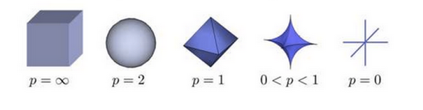
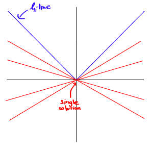
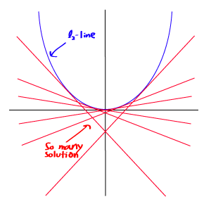
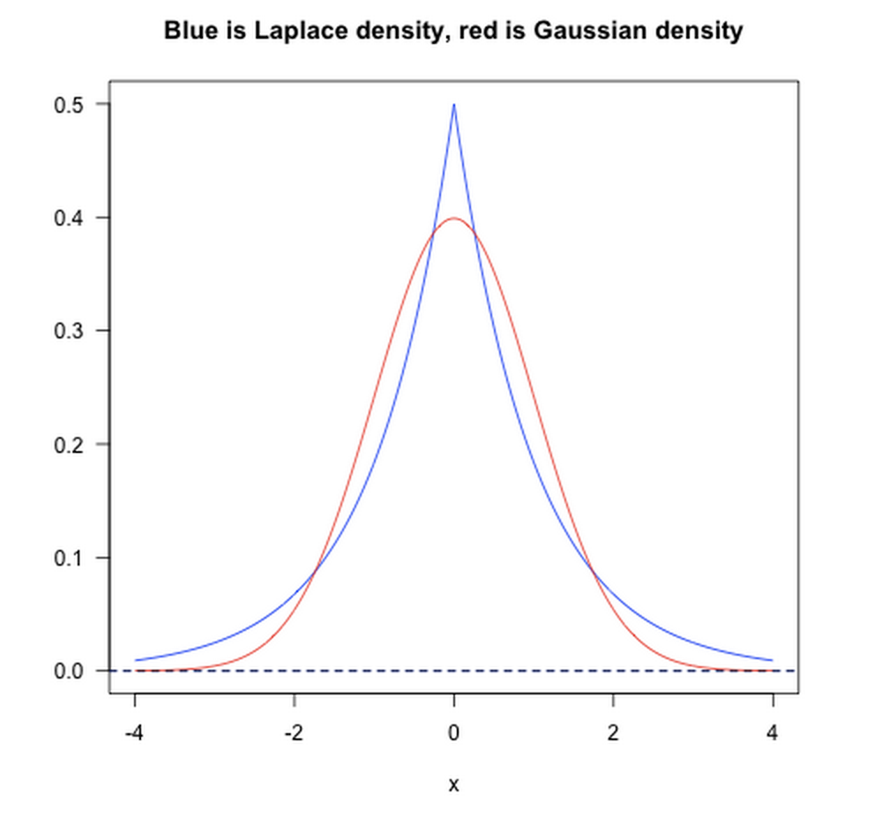

# $L-P$范数
 与闵可夫斯基距离的定义一样，$L-P$范数不是一个范数，而是一组范数，其定义如下
 $$L_p=\sqrt[p]{\sum_i^n{x^p_i}}\  x=x_1,x_2,\cdot \cdot \cdot ,x_n$$
 根据P​的变化，范数也有着不同的变化，一个经典的有关P​范数的变化图如下：



上图表示了P从$\infty$到$0$变化时，三维空间中到原点的距离（范数）为$1$的点构成的图形的变化情况。以常见的$L-2$范数（$p=2$）为例，此时的范数也即欧氏距离，空间中到原点的欧氏距离为$1$的点构成了一个球面。实际上，在$0\leq p\leq1$
时，$L_p$并不满足三角不等式的性质，也就不是严格意义下的范数。以$p=0.5$，二维坐标$(1,4),(4,1),(1,9)$为例，$\sqrt[0.5]{1+\sqrt{4}}+\sqrt [0.5]{\sqrt{4}+1}<\sqrt[0.5]{1+\sqrt{9}}$。因此这里的L-P范数只是一个概念上的宽泛说法。

# $L0$范数
 当$P=0$时，也就是$L0$范数，由上面可知，$L0$范数并不是一个真正的范数，它主要被用来度量向量中非零元素的个数。用上面的L-P定义可以得到的L-0的定义为：
$$ ||x||=\sqrt[0]{\sum_1^nx^0_i}\  x=x_1,x_2,\cdot \cdot \cdot ,x_n$$
 这里就有点问题了，我们知道非零元素的零次方为1，但零的零次方，非零数开零次方都是什么鬼，很不好说明L0的意义，所以在通常情况下，大家都用的是：
 $$||x||_0=\#(i)\  with\  x_i \neq 0$$
 在实际应用中，由于$L0$范数本身不容易有一个好的数学表示形式，给出上面问题的形式化表示是一个很难(NP难)的问题。所以在实际情况中，L0的最优问题会被放宽到L1或L2下的最优化。
# $(Lasso\ Regression)L1$范数
 L1范数是我们经常见到的一种范数，它的定义如下：
$$||x||_1=\sum _{i=1}^{n}|x_i|\  x=x_1,x_2,\cdot \cdot \cdot ,x_n$$
 表示向量$x_i$中非零元素的绝对值之和。
L1范数有很多的名字，例如我们熟悉的曼哈顿距离,最小绝对误差等。使用L1范数可以度量两个向量间的差异，如绝对误差和（Sum of Absolute Difference)。对于$L1$范数，它的优化问题如下：$min||x||_1$ 由于L1范数的天然性质，对L1优化的解是一个稀疏解，因此$L1$范数也被叫做稀疏规则算子。通过$L1$可以实现特征的稀疏，去掉一些没有信息的特征，例如在对用户的电影爱好做分类的时候，用户有100个特征，可能只有十几个特征是对分类有用的，大部分特征如身高体重等可能都是无用的，利用$L1$范数就可以过滤掉。
# $(Lasso\ Regression)L2$范数
 L2范数是我们最常见最常用的范数了，我们用的最多的度量距离欧氏距离就是一种L2范数，它的定义如下：
$$||x||_2=\sqrt{\sum_{i=1}^{n}x^2_i}$$
表示向量元素的平方和再开平方。 像$L1$范数一样，$L2$也可以度量两个向量间的差异，如平方差和（Sum of Squared Difference）。
对于$L2$范数，它的优化问题如下：$min||x||_2$$L2$范数通常会被用来做优化目标函数的正则化项，防止模型为了迎合训练集而过于复杂造成过拟合的情况，从而提高模型的泛化能力。

# $L1$与$L2$范数的比较

L2范数越小，可以使得w的每个元素都很小，接近于0，但L1范数不同的是他不会让它等于0而是接近于0. /





但由于L1范数并没有平滑的函数表示，起初L1最优化问题解决起来非常困难，但随着计算机技术的到来，利用很多凸优化算法使得L1最优化成为可能。

# 贝叶斯先验

从贝叶斯先验的角度看，加入正则项相当于加入了一种先验。即当训练一个模型时，仅依靠当前的训练数据集是不够的，为了实现更好的泛化能力，往往需要加入先验项。

*   L1范数相当于加入了一个Laplacean先验；

*   L2范数相当于加入了一个Gaussian先验。
     如下图所示：

    
    

# $L\infty$范数
 当$P=\infty$时，也就是$L-\infty$范数，它主要被用来度量向量元素的最大值。用上面的L-P定义可以得到的$L\infty$的定义为：
 $$||x||_\infty=\sqrt[\infty]{x^\infty_i}\  x=x_1,x_2,\cdot \cdot \cdot ,x_n$$
  与$L0$一样，在通常情况下，大家都用的是：$||x||_\infty=max(x_i)$来表示$L\infty$

>   参考文章:
>
>   *   [几种范数的简单介绍 - Kobe Bryant的专栏 - CSDN博客](https://blog.csdn.net/shijing_0214/article/details/51757564)
>
>   *   [L0/L1/L2范数的联系与区别](https://www.cnblogs.com/little-YTMM/p/5879093.html)
>
>   *   [机器学习中的范数规则化之（一）L0,L1与L2范数](https://blog.csdn.net/zouxy09/article/details/24971995)
>
>       非盈利非商业性质，侵删。