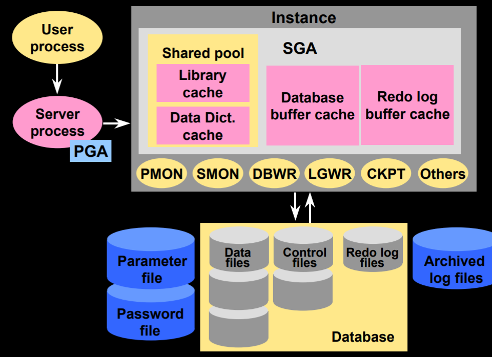
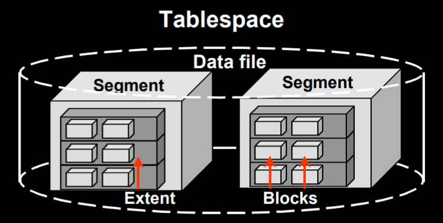
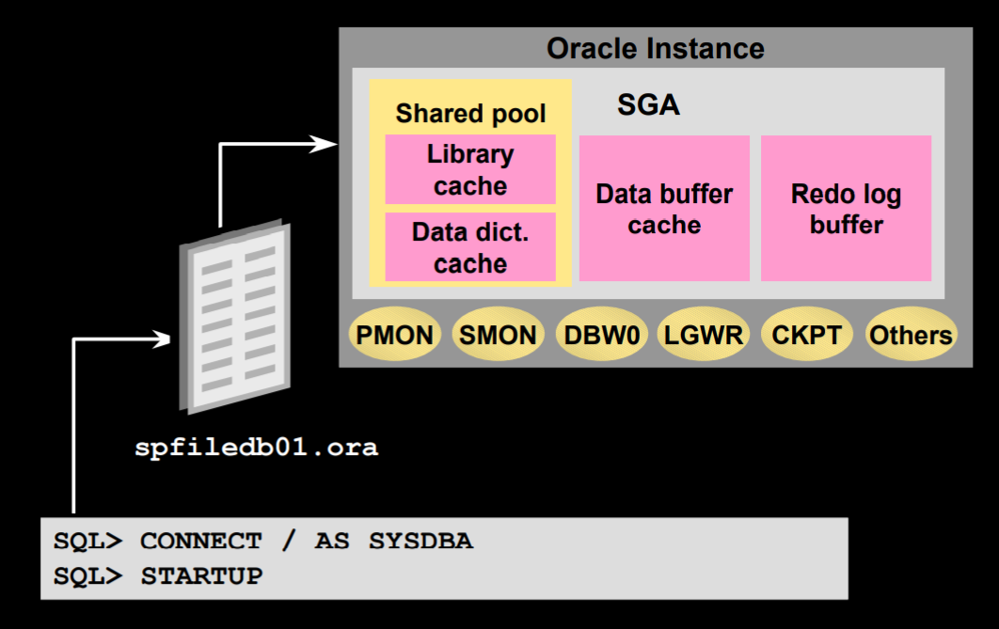

[toc]

# Introduction

## Instance

p10

An Oracle instance: 

*   Is a means to access an Oracle database
*   Always opens one and only one database
*   Consists of memory and process structures

## Database

p12

An Oracle database: 

*   Is a collection of data that is treated as a unit
*   Consists of three file types
    *   Data files
    *   Control files
    *   Redo log files

## Physical Structure

p13

The physical structure of an Oracle database is determined by the operating system files that provide the actual physical storage for database information. 

*   Control files
*   Data files(includes data dictionary)
*   Redo log files

## Memory Structure

P14

Oracle’s memory structure consists of two memory areas known as:

### SGA

System Global Area (SGA): Allocated at instance startup, and is a fundamental component of an Oracle Instance

*    The SGA consists of several memory structures:
    *   Shared pool
    *   Database buffer cache
    *   Redo log buffer
    *   Other structures (e.g. lock and latch management, statistical data) 
*   There are two optional memory structures that can be configured within the SGA:
    *   Large pool
    *   Java pool

*   SGA is dynamic and sized using SGA_MAX_SIZE. 
*   SGA memory allocated and tracked in granules by SGA components
    *   Contiguous virtual memory allocation
    *   Size based on SGA_MAX_SIZE

#### Shared Pool

The shared pool is used to store the most recently executed SQL statements and the most recently used data definitions.

*   It consists of two key performance-related memory structures: 
    *   Library cache
    *   Data dictionary cache
*   Sized by the parameter SHARED_POOL_SIZE.

#### Library Cache

The library cache stores information about the most recently used SQL and PL/SQL statements. The library cache:

*   Enables the sharing of commonly used statements
*   Is managed by a least recently used (LRU) algorithm
*   Consists of two structures:
    *   Shared SQL area
    *   Shared PL/SQL area
*   Has its size determined by the shared pool sizing

#### Data Dictionary Cache

*   The data dictionary cache is a collection of the most recently used definitions in the database.
    *   It includes information about database files, tables, indexes, columns, users, privileges, and other database objects.
    *   During the parse phase, the server process looks at the data dictionary for information to resolve object names and validate access.
    *   Caching the data dictionary information into memory improves response time on queries.
    *   Size is determined by the shared pool sizing.

#### Database Buffer Cache 

The database buffer cache stores copies of data blocks that have been retrieved from the data files. • It enables great performance gains when you obtain and update data.

*   It is managed through a least recently used (LRU) algorithm.
*   DB_BLOCK_SIZE determines the primary block size.

#### Redo Log Buffer Cache

The redo log buffer cache records all changes made to the database data blocks.

*   Its primary purpose is recovery.
*   Changes recorded within are called redo entries.
*   Redo entries contain information to reconstruct or redo changes.
*   Size is defined by LOG_BUFFER.

#### Large Pool

The large pool is an optional area of memory in the SGA configured only in a shared server environment. 

*   It relieves the burden placed on the shared pool. 

*   This configured memory area is used for session memory (UGA), I/O slaves, and backup and restore operations.

*   Unlike the shared pool, the large pool does not use an LRU list.

*   Sized by LARGE_POOL_SIZE. 

    `ALTER SYSTEM SET LARGE_POOL_SIZE = 64M;`

#### Java Pool

The Java pool services the parsing requirements for Java commands.

*   Required if installing and using Java.
*   It is stored much the same way as PL/SQL in database tables.
*   It is sized by the JAVA_POOL_SIZE parameter.

### PGA

p25

Program Global Area (PGA): Allocated when the server process is started

The PGA is memory reserved for each user process that connects to an Oracle database

#### Process Structure

An Oracle process is a program that depending on its type can request information, execute a series of steps, or perform a specific task.

Oracle takes advantage of various types of processes: 

*   User process: Started at the time a database user requests connection to the Oracle server

    *   A user process is a program that requests interaction with the Oracle server. 
        *   It must first establish a connection.
        *   It does not interact directly with the Oracle server.

*   Server process: Connects to the Oracle Instance and is started when a user establishes a session.

    A server process is a program that directly interacts with the Oracle server.

    *   It fulfills calls generated and returns results.
    *   Can be dedicated or shared server.

*   Background process: Available when an Oracle instance is started

    The relationship between the physical and memory structures is maintained and enforced by Oracle’s background processes

    *   Mandatory background processes
        *   DBWn PMON CKPT LGWR SMON RECO P29
    *   Optional background processes
        *   ARCn LMON Snnn QMNn LMDn CJQ0 Pnnn LCKn Dnnn P35

## Logical Structure

The logical structure of the Oracle architecture dictates how the physical space of a database is to be used.

A hierarchy exists in this structure that consists of tablespaces, segments, extents, and blocks.

## Processing a SQL Statement

*   Connect to an instance using:
    *   The user process
    *   The server process
*   The Oracle server components that are used depend on the type of SQL statement: 
    *   Queries return rows.
    *   DML statements log changes.
    *   Commit ensures transaction recovery. 
*   Some Oracle server components do not participate in SQL statement processing.

# Oracle Server

## Database Administration Tools

P42

# Managing Oracle Instances

p60

## Initialization Parameter Files

*   Entries are specific to the instance being accessed
*   There are two kinds of parameters:
    *   Explicit: Having an entry in the file
    *   Implicit: No entry within the file, but assuming the Oracle default values
*   Multiple files can be used for a single database to optimize performance in different situations.
*   Changes to entries in the file take effect based on the type of initialization parameter file used;
    *   Static parameter file, PFILE
    *   Persistent parameter file, SPFILE

### PFILE initSID.ora 

*   The PFILE is a text file that can be modified with an operating system editor. 
*   Modifications to the file are made manually.
*   Changes to the file take effect on the next startup. • Its default location is $ORACLE_HOME/dbs.

---

# Oracle数据库结构

它由至少一个表空间和数据库模式对象组成。这里，模式是对象的集合，而模式对象是直接引用数据库数据的逻辑结构。模式对象包括这样一些结构:表、视图、序列、存储过程、同义词、索引、簇和数据库链等。逻辑存储结构包括表空间、段和范围，用于描述怎样使用数据库的物理空间。

总之,逻辑结构由逻辑存储结构(表空间,段,范围,块)和逻辑数据结构(表、视图、序列、存储过程、同义词、索引、簇和数据库链等)组成,而其中的模式对象(逻辑数据结构)和关系形成了数据库的关系设计。

段(Segment):

是表空间中一个指定类型的逻辑存储结构，它由一个或多个范围组成，段将占用并增长存储空间。

数据库的物理存储结构是由一些多种物理文件组成，主要有数据文件、控制文件、重做日志文件、归档日志文件、参数文件、口令文件、警告文件等。

控制文件:存储实例、数据文件及日志文件等信息的二进制文件。alter system set control_files='路径'。V$CONTROLFILE。

数据文件:存储数据，以.dbf做后缀。一句话:一个表空间对多个数据文件，一个数据文件只对一个表空间。dba_data_files/v$datafile。

# Oracle 的 oracle sql*plus常用命令

一、sys用户和system用户
Oracle安装会自动的生成sys用户和system用户
(1)、sys用户是超级用户，具有最高权限，具有sysdba角色，有create database的权限，该用户默认的密码是change_on_install
(2)、system用户是管理操作员，权限也很大。具有sysoper角色，没有create database的权限，默认的密码是manager
(3)、一般讲，对数据库维护，使用system用户登录就可以拉
注意：也就是说sys和system这两个用户最大的区别是在于有没有create database的权限。
          
二、sql\*plus工具简介
sql\*plus是oracle自带的工具软件，主要用于执行sql语句，pl\sql块。
操作如下：
(1)、在D:\dev\oracle\product\10.2.0\db_1\bin\目录下的sqlplusw.exe。(D:\dev\oracle\为oracle安装目录)
(2)、在运行栏中输入“sqlplusw”即可

三、sqlplus dos工具简介
(1)、概述：sqlplus是在dos下操作oracle的工具，其功能和sql*plus相似。
(2)、操作如下：在运行栏中输入“sqlplus”即可

四、PLSQL Developer工具，需要自己安装，推荐大家使用

五、sql\*plus常用命令
1)、连接命令
1.conn[ect]
用法：conn 用户名/密码@网络服务名 [as sysdba/sysoper]
说明：当用特权用户身份连接时，必须带上as sysdba或是as sysoper
eg、
SQL> show user
USER 为 "SCOTT"
SQL> conn system/oracle@orcl
已连接。
SQL> show user
USER 为 "SYSTEM"
SQL>
以上命令实现类似切换用户的效果
2.disc/disconn/disconnect
说明: 该命令用来断开与当前数据库的连接
3.pssw[ord]
说明: 该命令用于修改用户的密码，如果要想修改其它用户的密码，需要用sys/system登录。
eg、
SQL> conn scott/oracle
已连接。
SQL> passw
更改 SCOTT 的口令
旧口令:
新口令:
重新键入新口令:
口令已更改
SQL>
4.show user
说明: 显示当前用户名
5.exit
说明: 该命令会断开与数据库的连接，同时会退出sql*plus
5.clear screen
清空屏幕

2)、文件操作命令
1.start和@
说明: 运行sql脚本
案例: sql>@ d:\a.sql或是sql>start d:\a.sql
2.edit
说明: 该命令可以编辑指定的sql脚本
案例: sql>edit d:\a.sql,这样会把d:\a.sql 这个文件打开
3.spool
说明: 该命令可以将sql*plus屏幕上的内容输出到指定文件中去。
案例: sql>spool d:\b.sql并输入sql>spool off
eg、
sql>spool d:\b.sql;
sql>select * from emp;
sql>spool off;

3)、交互式命令
1.&
说明：可以替代变量，而该变量在执行时，需要用户输入。
select * from emp where job='&job'；

4)、显示和设置环境变量
概述：可以用来控制输出的各种格式，set show 如果希望永久的保存相关的设
置，可以去修改glogin.sql 脚本
1.linesize
说明：设置显示行的宽度，默认是80个字符
show linesize
set linesize 90
2.pagesize说明：设置每页显示的行数目，默认是14
用法和linesize 一样
至于其它环境参数的使用也是大同小异