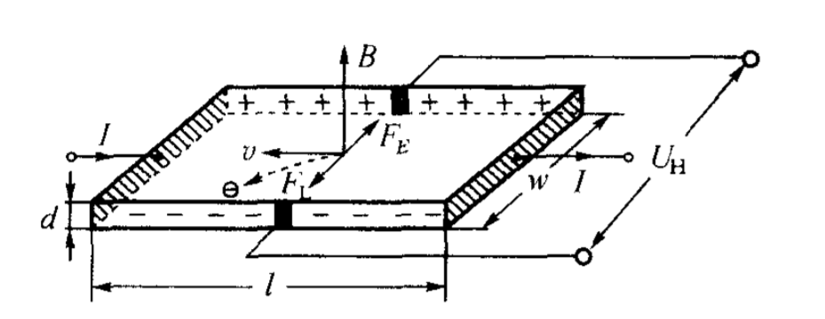

[toc]

# Chapter 0 绪论

## 传感器定义

*   能感受规定的被测量并按照一定的规律转换成可用性好的器件或装置

## 传感器组成

*   敏感元件
*   转换元件
*   测量电路

## 结构框图

## 典型传感器构成方法

1.  自源型
2.  辅助能源型
3.  外源型
4.  相同敏感元件的补偿型
5.  差动结构补偿型
6.  不同敏感元件的补偿型
7.  反馈型

## 传感器实现信息转换的基本要求

p5

*   足够的容量
*   灵敏度高，精度适当
*   响应速度快，工作稳定，可靠性好
*   适用性和适应性强
*   使用经济

## 传感器发展的趋势

*   发现新效应，开发新材料，新功能
*   传感器的多功能集成化和微型化
*   传感器的数字化、智能化和网络化
*   研究生物感官，开发仿生传感器

# Chapter 1 传感器技术基础

## 传感器的一般数学模型

p13

*   最小二乘法

    *   对于函数$y = k\cdot x+b$拟合有

    *   $$
        k = \frac{n\Sigma x_iy_i-\Sigma x_i \Sigma y_i}{n\Sigma x_i^2-(\Sigma x_i)^2}\\
        b = \frac{\Sigma x_i^2\Sigma y_i-\Sigma x_i\Sigma x_iy_i}{n\Sigma x_i^2-(\Sigma x_i)^2}
        $$

## 静态特性

p12

*   线性度

    *   相对误差$e_L = \pm \frac{\Delta L_{max}}{y_{F.S}}\times 100\%$

        *   $\Delta L_{max}$输出平均值与拟合直线间的最大偏差
        *   $y_{F.S}$理论满量程输出值

    *   拟合方法*

        1.  理论直线法
        2.  端点直线法
        3.  最佳直线法
        4.  最小二乘法

*   回差

    *   正反行程输出的最大差值$e_H = \frac{\Delta H_max}{y_{F.S}}\times 100%$

*   重复性

*   灵敏度

    *   传感器输出量增量与被测输入量增量之比$K = \frac{\Delta y}{\Delta x}$

*   分辨力

*   阈值

*   稳定性

*   漂移
    *   零点漂移
    *   灵敏度漂移
        *   时间漂移
        *   温度漂移
    
*   静态误差（精度）

    *   三种算法
        1.  将非线性、回差、重复性误差按几何法或代数法综合$e_S=\pm \sqrt{e_L^2+e_H^2+e_R^2}$、$e_S=\pm (e_L^2+e_H^2+e_R^2)$
        2.  将全部标准数据相对拟合直线的残差看成随机分布，求出标准偏差$\sigma$，取$2\sigma$或者$3\sigma$作为静态误差$\sigma = \sqrt{\frac{\sum^P_{i=1}(\Delta y_i)^2}{p-1}}$
        3.  将系统误差和随机误差分开考虑$e_S = \pm \frac{|(\Delta y)_{max}|+a\sigma}{y_{F.S}}$

## 动态特性

p16

线性常系数微分方程
$$
\sum^n_{i=1} a_i \frac{d^iy}{dt^i}=\sum^m_{j=0} b_j \frac{d^jx}{dt^j}
$$
(一般传感器$b_j=0$(除$b_0$))

传递函数
$$
H(s)=\frac{Y(s)}{X(s)} = \frac{\sum_{i=0}^m b_is^i}{\sum_{j=0}^n  a_js^j}
$$
串联相乘、并联相加

$s =\sigma +j \omega$

### “标准”信号函数

*   正弦函数
*   阶跃函数

### 频率响应特性

*   正弦信号
    *   输入信号$x = X\sin\omega t$ 幅值$X$、角频率$\omega$
    *   输出信号$y = Y\sin(\omega t+\varphi)$ 幅值$Y$、初相角$\varphi$
    *   幅频特性、动态灵敏度、增益
        *   $A(\omega) = |\frac{Y(j\omega)}{X(j\omega)}|=\frac{Y}{X}$
    *   相频特性
        *   $\varphi(\omega)=\arctan\{\frac{Im[\frac{Y(j\omega)}{X(j\omega)}]}{Re[\frac{Y(j\omega)}{X(j\omega)}]}\}$

*   阶跃响应特性
*   阶跃信号 $u(t) = 0,(t\lt0)\ 1,(t\gt0)$
*   TODO

## 传感器典型环节的动态响应

p18

### 零阶环节

*   $K$静态灵敏度
*   微分方程$y = \frac{b_0}{a_0}x = Kr$
*   传递函数$\frac{Y(s)}{X(s)}=\frac{b_0}{a_0}=K$

### 一阶环节

*   $a_1\frac{dy}{dt}+a_0y = b_0x$
*   时间常数$\tau=a_1/a_0$
*   静态灵敏度$K = b_0/a_0$
*   $Kx = (\tau s+1)y$
*   传递函数$\frac{Y(s)}{X(s)}=\frac{K}{\tau s+1}$
*   频率特性$\frac{Y(j\omega)}{X(j\omega)}=\frac{K}{j\omega \tau+1}$

### 二阶环节

*   微分方程$a_2\frac{d^2y}{dt^2}+a_1\frac{dy}{dt}+a_0y=b_0x$
*   静态灵敏度$K = \frac{b_0}{a_0}$
*   固有频率$\omega_n=\sqrt{a_0/a_2}$
*   阻尼比$\xi = \frac{a_1}{2\sqrt{a_0a_2}}$
*   $(\frac{1}{\omega_n^2}s^2+\frac{2\xi}{\omega_n}s+1)y = Kr$
*   传递函数$H(s) = \frac{Y(s)}{X(s)}=\frac{K}{\frac{s^2}{\omega_n^2}+\frac{2\xi}{\omega_n}s+1}$
*   频率响应$\frac{Y(j\omega)}{X(j\omega)}=\frac{K}{1-(\frac{\omega}{\omega_n^2})+j2\xi\frac{\omega}{\omega_n^2}}$

## 传感器性能指标一览

p22

| 基本参数指标   | 环境参数指标 | 可靠性指标 | 其他指标     |
| -------------- | ------------ | ---------- | ------------ |
| 量程指标       | 温度指标     | 工作寿命等 | 使用方面     |
| 灵敏度指标     | 抗冲振指标   |            | 结构方面     |
| 精度方面的指标 | 其他环境参数 |            | 安装连接方面 |
| 动态性能的指标 |              |            |              |

## 改善传感器性能的技术途径

p23

*   结构材料与参数的合理选择
*   差动技术
    *   举例一两种差动传感器，举例优点
    *   TODO
*   平均技术
*   稳定性处理
*   屏蔽隔离与干扰抑制
*   零示法、微差法与闭环技术
*   补偿、校正和“有源化”
*   集成化、智能化

## 合理选择传感器的基本原则与方法

p27

*   依据测量对象和使用条件确定传感器的类型
*   线性范围与量程
*   灵敏度
*   精度
*   频率响应特性
*   稳定性

## 传感器的标定和校准

p29

*   静态标定
*   动态标定

# Chapter 2 电阻式传感器

## 电阻式传感器定义

p34

*   通过电阻值参数的变化来实现电测非电量的目的的传感器
*   类型
    *   电位计式
    *   应变计式
    *   压阻式
    *   磁电阻式
    *   光电阻式
    *   热电阻式

## 电阻应变计的基本类型和结构

*   金属材料和非金属材料的应变电阻效应
    
    p34
    
    
    
    约定有一长为$l$，截面积为$A$，电阻率为$\rho$的固态导体，有电阻$R =\rho \frac{l}{A}$，对变化量有$\frac{dR}{R} = \frac{dl}{l}-\frac{dA}{A}+\frac{d\rho}{\rho}$，记$(dl/l)=\epsilon$材料的轴向线应变，常用单位$\mu\epsilon\ (1\mu\epsilon = 1\times10^{-6}\ ^{mm}/_{mm})$，有$(dA/A) = 2(dr/r) = -2\mu\epsilon$，$r$导体半径，$\mu$导体材料的泊松比，代入得$dR/R=(1+2\mu)\epsilon+d\rho/\rho$
    
    *   异同点
    
        *   金属材料的应变电阻效应
            $$
            \frac{d\rho}{\rho}=C\frac{dV}{V}
            $$
            $C$由一定材料加工方式决定的常数
            $$
            (dV/V)=(dl/l)+dS/S=(1-2\mu)\epsilon，(\Delta R \ll R)\\
            \frac{\Delta R}{R}=[(1+2\mu)+C(1-2\mu)]\epsilon = K_m\epsilon\\
            K_m=(1+2\mu)+C(1-2\mu)
            $$
            金属材料的电阻相对变化与其线应变成正比。
    
        *   半导体材料的应变电阻效应
            $$
            \frac{d\rho}{\rho}=\pi\sigma=\pi E\epsilon
            $$
    
            *   $\sigma$作用于材料的轴向应力
            *   $\pi$半导体材料在受力方向的压阻系数
            *   $E$半导体材料的弹性模量
    
            $$
            \frac{\Delta R}{R}=[(1+2\mu)+\pi E]\epsilon=K_s\epsilon
            $$
    
            *   $K_s=1+2\mu+\pi E$导电丝材的灵敏系数
    
    *   分析
    
        *   金属材料
            *    $K_0 = K_m =(1+2\mu)+C(1-2\mu)$ 前部分为受力导致几何尺寸的变化，后部分是电阻率的变化
        *   非金属材料
            *   $K_0=K_s=(1+2\mu)+\pi E$前部分为尺寸变化、后部分为压阻效应

## 静态特性

p38

*   灵敏系数 K

    *   $\frac{\Delta R}{R}=K\epsilon_s$
    *   $\epsilon_s$轴向应变

*   横向效应及横向效应系数 H

    

    *   试件收到单向应力$\sigma$，纵栅和横栅各自敏感$\epsilon_x、\epsilon_y，\frac{\Delta R}{R}=K_x\epsilon_x+K_y\epsilon_y=K(1+\alpha H)\epsilon$
        *   $K_x\ K_y$纵向、横向灵敏系数
        *   $\alpha=\epsilon_x/\epsilon_y$双向应变比
        *   $H=K_y/K_x$双向灵敏系数比

*   机械滞后 $Z_j$

*   蠕变 $\theta$  零漂 $P_\theta$

*   极限应变 $\epsilon_{\lim}$

## 动态特性

p40

*   对正弦应变波的响应
*   对阶跃应变波的响应
*   疲劳寿命 N

## 电阻应变计的温度效应及补偿

p42

*   温度效应

    *   设工作温度变化$\Delta t ^\circ C$，有

        $(\frac{DeltaR}{R})=\alpha_t\Delta t+K(\beta_s-\beta_t)\Delta t$

        *   $\alpha_t$敏感栅材料的电阻温度系数
        *   $K$应变计的灵敏系数
        *   $\beta_s,\beta_t$试件和敏感栅材料的线膨胀系数

    *   热输出

        $\epsilon_t=\frac{(\Delta R/R)_t}{K}=\frac{1}{K}\alpha_t \Delta t+(\beta_s-\beta_t)\Delta t$

*   补偿方法
    *   温度自补偿法
        *   单丝
            *   选配敏感栅材料使$\epsilon_t=0$即$\alpha_t=-K(\beta_s-\beta_t)$
        *   双丝
            *   选取电阻温度系数一正一负的两种合金丝$\frac{-\epsilon_{bt}}{\epsilon_{at}}\approx\frac{R_a}{R}/\frac{R_b}{R}=\frac{R_a}{R_b}$
        
    *   桥路补偿法
    
        *   双丝半桥式
    
            
    
        *   补偿块半桥法
    
            
    
*   为什么要补偿

    *   消除对$\epsilon$对测量应变的干扰

##  最广泛应用于电阻应变计的测量电路和特点

p47

*   应变电桥

    *   灵敏度高、精度高、测量范围宽，结构电路简单、易于实现温度补偿

        

        *   TODO

## 电阻应变计

 p55

*   测力传感器
*   压力传感器
*   位移传感器
*   其他应变式传感器

## 压阻式传感器 

p59

*   压阻效应

    $\frac{\Delta R}{R}\approx\frac{\Delta \rho}{\rho}=\pi\sigma$

*   $\pi$压阻系数（可能各向异性）

*   $\sigma$全应力（注意区分横向和纵向）

## 应用

p61

*   压阻压力式传感器
*   压阻加速度式传感器

# Chapter 3 变磁阻式传感器

## 定义

p65

*   利用磁路磁阻变化引起传感器线圈的电感变化来检测非电量的机电转换装置

## 电气参数分析

*   等效电路

    

    线圈电感$L=W^2/R_m$，$W$匝数，$R_m$磁路总磁阻

    *   闭合磁路

        *   $L = W^2/R_F$ 导磁体总磁阻

    *   小气隙

        *   $L\approx W^2/R_\sigma$

    *   统一形式
        $$
        L=W^2/R_m=W^2\cdot\mu_0\mu_eS/l
        $$

        *   $L$电感
        *   $\mu_e$等效磁导率
        *   $S$横截面积
        *   $l$磁路长度
        *   $\mu_0=$真空磁导率

## 品质因素

p68

​	$Q_C=\frac{无功功率}{有功功率}=\omega L/R_c$

*   TODO

## 自感式传感器

p69

*   变气隙式
    *   输出非线性
*   变面积式
    *   输出可视为线性、线性范围较大
    *   灵敏度相比变气隙式低
*   螺管式
    *   空气隙大，磁路磁阻大
    *   灵敏度较低
    *   线性范围较大
*   差动式自感传感器
    *   p71

## 互感式传感器（差动变压器）

p79

工作原理和类型

*   变气隙式
*   变面积式
*   螺管式
*   互感传感器和自感传感器的异同点
    *   相同点
        *   都是通过改变衔铁的位置实现被测量的测量，且均有单一结构和对称组成的差动式以改善非线性提高灵敏度
    *   差动式自感传感器
        *   改变衔铁位置，改变初、次级线圈间的互感系数来改变相关的物理量
    *   自感传感器
        *   改变磁路磁阻来改变自感系数实现被测量的变化

## 电涡流式传感器

p86

*   基本原理
    *   利用电涡流效应
    *   
    *   

*   应用 p92
    *   测位移
    *   测厚度
    *   测温度

*   磁致伸缩效应 p94
    *   铁磁材料在磁场中变化时，在磁场方向伸长或缩短的现象
    *   $\lambda_s=(\Delta l/l)_s$
    *   $(\Delta l/l)$伸缩比
    *   $\lambda$磁致伸缩系数

# Chapter 4 电容式传感器

## 定义

p99

*   将被测非电量的变化转换为电容量变化的传感器

## 工作原理

*   变级距
*   变面积
*   变介质

## 问题和改进措施

p103

*   等效电路
*   边缘效应
    *   保护环
*   静电引力
*   寄生电容

## 电容式传感器和应用

p109

*   位移传感器
*   加速度
*   力和压力
*   物位

# Chapter 5 磁电式传感器

p115

## 定义

将输入运动速度或磁量的变化变换成感应电势输出的传感器

## 基本原理与结构形式

$$
e = -W\frac{d\Phi}{dt}
$$

*   $e$感应电势
*   $\Phi$穿过线圈的磁通量
*   $W$线圈匝数

*   变磁通式 
    *   旋转型
    *   平移型
*   恒磁通式
    *   动圈式
    *   动铁式

## 霍尔元件和霍尔效应

p123

*   

*   应用
    *   微位移以及机械振动测量

# Chapter 6 压电式传感器

*   定义
    *   自发电 可逆性
*   压电材料
    *   压电晶体
    *   压电陶瓷
    *   新型压电材料
    *   光轴
    *   电轴
    *   机轴
*   压电陶瓷极化处理
*   石英晶体的压电方程 p139
*   压电式加速度传感器类型 p150

*   逆压电效应的应用 p158
    *   是……的关键器件

# Chapter 7 热电式传感器

*   热电阻传感器 p163

*   热电效应
    *   接触电势
    *   两个结论 p168
*   中间导体定律 三定律
*   热电偶和热电阻的区别。

*   热电势 接触电势 温差电势 etc
*   热电偶 测量温度原理

# Chapter 8 光电式传感器

*   定义
    *   ……特性
*   一般组成  p177
*   常用光源 p179
*   外光电效应
*   内光电效应 p180
    *   光电导效应
    *   光生伏特效应

# Chapter 9 光纤传感器

*   数值孔径的物理意义
*   光纤博导原理
*   分类
*   调制解调方式 p205

# Chapter 10 数字式传感器

*   p221
*   p233
    *   编码器