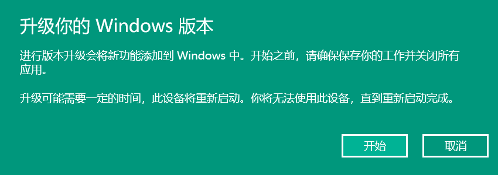
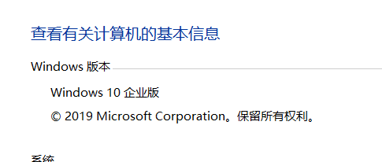
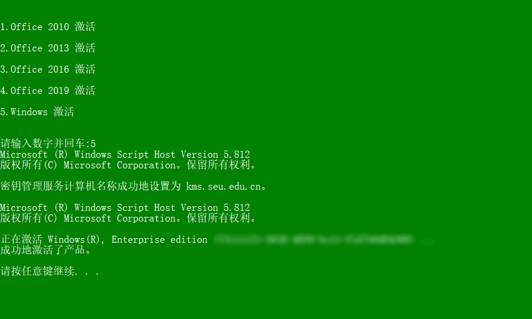

# Windows家庭版升级指南

**阅读前必知：本文不提供任何破解或者绕过Windows激活的方案，请通过依法依规的形式获得Windows正版授权，请支持正版以维护您和相关公司的利益，敬请知悉，谢谢**

*   情景概述

    目前，许多高校为学生购买了Windows kms正版授权，但是很多OEM给电脑预装的是家庭版授权，导致无法直接使用学校的kms激活。为了避免重装浪费时间，在此给出一些无需重装而升级到专业版/企业版的解决方案。

>   若您所在的学校没有购买kms，请参考[微软官方帮助文档](https://support.microsoft.com/zh-cn/help/12384/windows-10-upgrading-home-to-pro)，利用数字许可或者密钥进行升级

1.  在 设置>激活 中，选择 更改产品密钥，使用以下key将版本转换为企业版/企业版

    >   *   升级为**不可逆**过程，如有必要请事先进行系统备份以便于失败时快速回滚
    >
    >   *   此处key**不提供**激活功能，仅仅为转版本使用，使用前请先确认您有合法Windows专业版/企业版许可

家庭版升专业版key

<pre>
VK7JG-NPHTM-C97JM-9MPGT-3V66T
4N7JM-CV98F-WY9XX-9D8CF-369TT 
FMPND-XFTD4-67FJC-HDR8C-3YH26 
VK7JG-NPHTM-C97JM-9MPGT-3V66T
NPPR9-FWDCX-D2C8J-H872K-2YT43
W269N-WFGWX-YVC9B-4J6C9-T83GX
NYW94-47Q7H-7X9TT-W7TXD-JTYPM
NJ4MX-VQQ7Q-FP3DB-VDGHX-7XM87
MH37W-N47XK-V7XM9-C7227-GCQG9
VK7JG-NPHTM-C97JM-9MPGT-3V66T
</pre>

家庭版升企业版key

<pre>
NPPR9-FWDCX-D2C8J-H872K-2YT43
</pre>

2.  升级完成后，系统已经变更为专业版/企业版，此时可以使用学校/组织提供的kms服务器进行激活。您可以参照学校或组织提供的kms激活方案继续完成激活。

    >   东南大学kms许可操作说明：[https://nic.seu.edu.cn](https://nic.seu.edu.cn/)
    >
    >   

### 遇到其他问题

许可问题请请参阅[微软支持](https://support.microsoft.com/)，关于本文操作问题请[致函并说明问题](mailto:furude_hanyuu@outlook.com)以便笔者补充常见问题以帮助更多人。