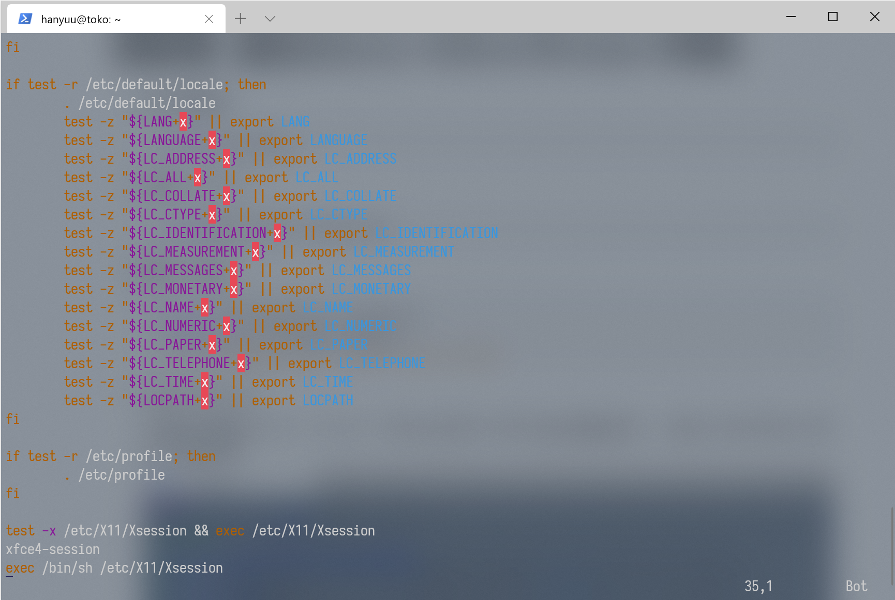
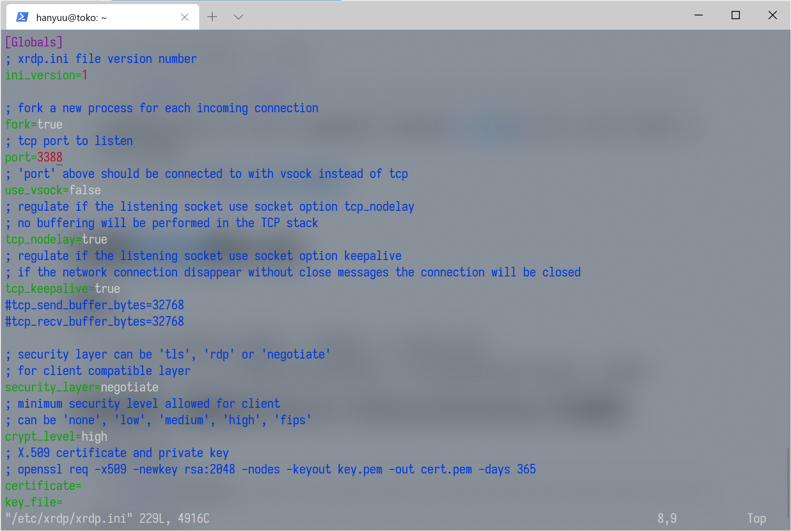
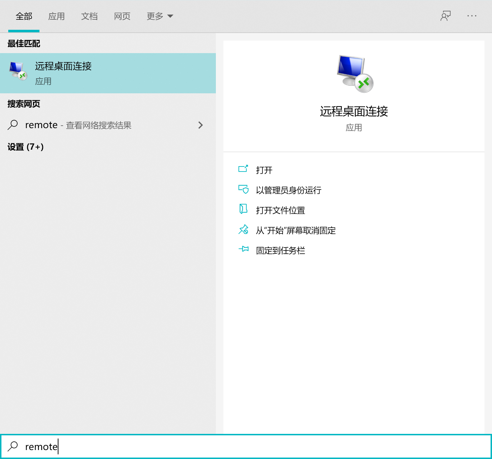
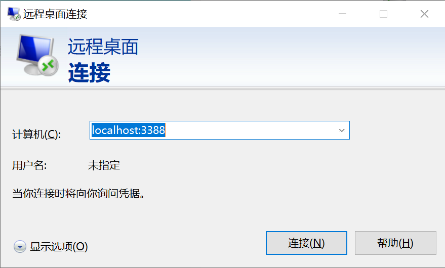
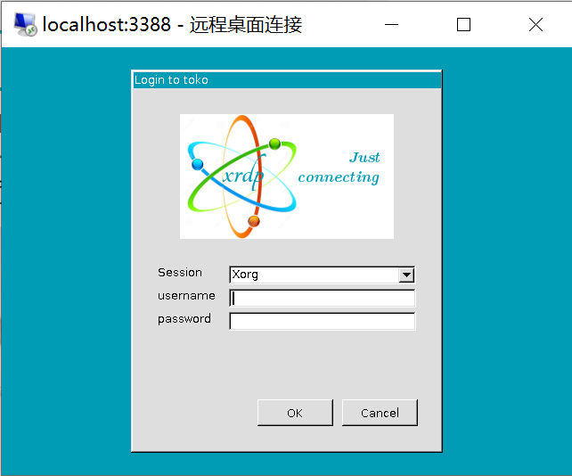
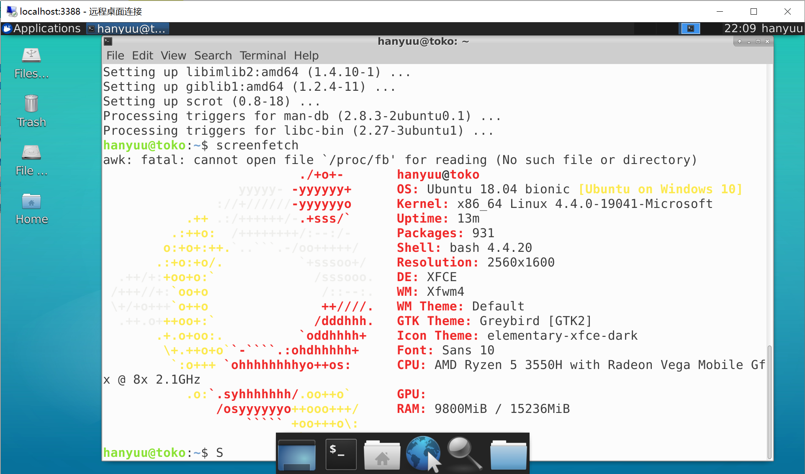

# 准备工作

1.  运行有wsl（笔者使用wsl2）的Windows 10电脑一台（必备）

    >   [安装wsl和wsl1升级到wsl2微软官方教程:](https://docs.microsoft.com/zh-cn/windows/wsl/install-win10)

2.  wsl里的文本编辑器（vim,nano等）（强烈推荐，笔者此处使用vim）

    >   e.g. (apt作为包管理器，Ubuntu等)
    >
    >   ```bash
    >   sudo apt install vim
    >   ```

3.  身居中国大陆并且没给wsl换源或者不知道换源的小伙伴请参阅[tuna镜像站](https://mirrors.tuna.tsinghua.edu.cn/)进行换源（非必须，但是可以大大加快安装速度）

    >   e.g. Ubuntu请参阅[Ubuntu 镜像使用帮助](https://mirrors.tuna.tsinghua.edu.cn/help/ubuntu/)


# 安装[Xfce4](https://xfce.org/)和xrdp

## 简介

*   Xfce4是一个轻量可高度定制的类-unix桌面环境，与wsl相性十分相符
*   xrdp支持rdp，是Windows原生支持的远程桌面协议，使用“远程桌面连接”即可连接到wsl桌面环境

## 安装步骤（此处以Ubuntu 18.04 on Windows 10为例）

1.  更新包管理器

    ```bash
    sudo apt update
    ```

2.  安装Xfce4和xrdp

    ```bash
    sudo apt install xfce4 xrdp
    ```

3.  更改xrdp配置

    

    ``` bash
    echo xfce4-session >~/.xsession
    sudo vim /etc/xrdp/startwm.sh
    #/etc/X11/Xsession 前一行插入 xfce4-session
    ```

4.  更改xrdp侦听端口

    rdp默认侦听端口为3389，Windows 10本身已经占用（如果开启远程桌面的话），此处为了避免冲突我们更换一下监听端口

    

    ```bash
    sudo vim /etc/xrdp/xdrp.ini
    #将port=3389更改为3388或者其他可用端口
    ```

5.  重启以使配置生效

    ``` bash
    sudo service xrdp restart
    ```

6.  锵锵！安装完成了。

### 使用步骤

1.  打开Windows的“远程桌面连接”

    

2.   地址填写localhost:3388，（显示选项中可以选择更多显示选项，分辨率，大小等）

    

3.  xrdp此时提示输入账户密码（wsl的）

    

4.  锵锵！你现在拥有了一个新的桌面环境！

    

# 后续可选内容

*   高分屏调整分辨率
*   安装中文字体
*   各种美化（
*   看心情更